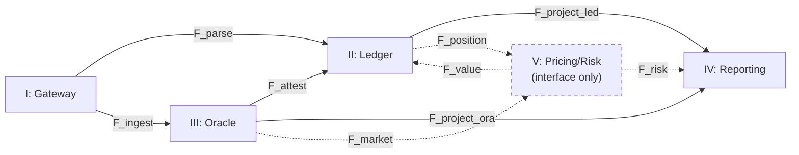
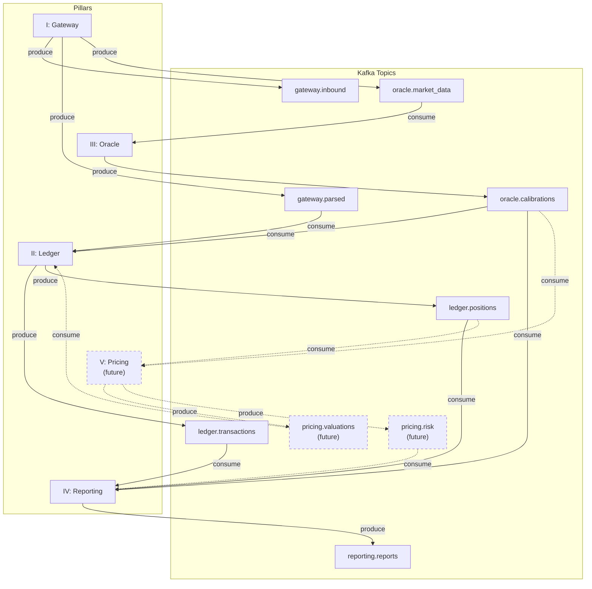

# ATTESTOR — Execution Plan

**Version:** 2.0
**Date:** 2026-02-15
**Status:** Committee-Approved (v2.0 -- consolidated single reference document)

**Committee:** Minsky (Chair), Formalis (Veto Authority), Grothendieck, Henri Cartan, Halmos, Noether, Dirac, Feynman, Gatheral, Geohot, Karpathy, Karpathy (Code Review), Chris Lattner, Jane Street CTO, FinOps Architect, Test Committee

---

## Table of Contents

1. [Manifesto Alignment Matrix](#1-manifesto-alignment-matrix)
2. [Existing Code Audit Summary](#2-existing-code-audit-summary)
3. [Category Diagram](#3-category-diagram)
4. [Type Universe](#4-type-universe)
5. [Invariant Registry](#5-invariant-registry)
6. [Notation System](#6-notation-system)
7. [Deliverable List](#7-deliverable-list)
8. [Phased Execution Plan](#8-phased-execution-plan)
9. [Simplicity Report](#9-simplicity-report)
10. [Testing Strategy](#10-testing-strategy)
11. [Module System & Infrastructure](#11-module-system--infrastructure)
12. [Consensus Record](#12-consensus-record)
13. [Formalis Certification](#13-formalis-certification)
14. [Minsky Certification](#14-minsky-certification)
15. [Financial Type Correctness (Gatheral + Henri Cartan)](#15-financial-type-correctness-gatheral--henri-cartan)

---

## 1. Manifesto Alignment Matrix

Every manifesto requirement is mapped to a deliverable, an invariant, and a phase. The architecture is organized into **five full pillars**, each with dedicated Kafka topics and Postgres tables. No pillar is demoted to "utility" or "supporting" status.

### 1.1 Founding Principles

| # | Principle | Deliverable(s) | Invariant(s) | Phase | Status |
|---|-----------|---------------|-------------|-------|--------|
| I | Regulatory Primacy | Pillar IV (Reporting & Attestation): regulatory projections, attestation verification, report registry | INV-07 (Regulatory Isomorphism), INV-21 (Projection Commutativity) | Every phase ships reporting for its scope | Planned |
| II | Attestation-First Epistemology | Attestation framework (core.py), Pillar IV attestation store | INV-06 (Attestation Immutability), INV-16 (Provenance) | 0 (Foundation) | Planned |
| III | Immutable Record | Pillar II append-only ledger, BitemporalEnvelope, Kafka event streams | INV-06, INV-19 (Bitemporal Consistency) | 0 (Foundation) | Planned |
| IV | Deterministic Computation | Result types, pure functions, content-addressed IDs, closed StateDelta algebra | INV-08 (Reproducibility), INV-12 (Idempotency) | 0 (Foundation) | Partial (Nexus) |
| V | Commutativity Invariant | Pillar IV dual-path verification: `Projection(Raw) == Projection(Normalized) == Projection(Attested)` | INV-05 (Commutativity), INV-05b (Distributional), INV-21 (Projection Commutativity) | Every phase | Partial (Nexus) |
| VI | Giry Epistemic Honesty | Pillar III confidence tagging (Firm/Quoted/Derived), Monte Carlo for distributional output via Pillar V interface | INV-05b | 2 (Listed Derivatives) | Planned |
| VII | Delegation Clause | Pillar boundaries enforced via Protocol-based interfaces; Pillar V defines contracts only | N/A (architectural) | 0 (Foundation) | Planned |
| VIII | Parametric Polymorphism | Generic instrument model within Pillar I normalization, CDM alignment | N/A (architectural) | 1 (Equity Cash) verified at 2+ | Partial (Nexus) |

### 1.2 Pillar Coverage (Five Full Pillars)

| Pillar | Manifesto Scope | Implementation Approach | Kafka Topics | Postgres Tables | Phase |
|--------|----------------|----------------------|--------------|----------------|-------|
| **I -- Gateway** (Ingestion & Normalization) | Order normalization, pre-trade compliance, SOR, raw-to-canonical translation | **Full pillar.** All external data enters exclusively through Gateway. Normalization functor: `raw -> Result[CanonicalEvent, ValidationError]`. Every rejection is an attestation. FIX/voice deferred to Phase 5. | `raw.orders`, `raw.executions`, `raw.market_data`, `normalized.orders`, `normalized.executions`, `gateway.rejections` | `gateway_events` (raw + normalized event log), `compliance_rules` (pre-trade rule registry) | 1 (basic), 5 (full) |
| **II -- Ledger** (Accounting Truth & Conservation) | Double-entry bookkeeping, chart of accounts, bitemporal state, settlement, corporate actions, conservation laws | **Full pillar.** Carries forward Ledger v0.1 architecture with Decimal, frozen types, Result-based errors (no exceptions). StateDelta uses closed value algebra (not `Any`). All mappings immutable (`MappingProxyType` or `frozendict`). | `ledger.transactions`, `ledger.state_deltas`, `attested.ledger_entries` | `ledger_entries` (bitemporal, append-only), `positions` (materialized view), `accounts` (chart of accounts), `transactions` (atomic batches) | 0-1 (foundation), 2+ (extensions) |
| **III -- Oracle** (Epistemic Layer / Market & Reference Truth) | Attestation ingestion, confidence tagging, calibrated models, provenance, arbitrage-freedom gates | **Full pillar.** Independent of Pricing/Risk. Owns all market data truth: observable prices, derived curves/surfaces, reference data. Every data point wrapped in Attestation with confidence class. Publishes calibrated snapshots as first-class attestations. | `raw.market_data` (consumed from Gateway), `normalized.market_data`, `attested.marketdata`, `oracle.calibrations`, `oracle.snapshots` | `market_data_attestations` (bitemporal), `calibration_store` (model configs + fit quality), `market_snapshots` (point-in-time observable state), `reference_data` (instruments, calendars, conventions) | 1 (basic), 3 (curves), 4 (vol surfaces) |
| **IV -- Reporting & Attestation** (Projection + Verifiability) | Regulatory projections (EMIR, MiFID II, SFTR, Dodd-Frank), attestation verification, commutativity enforcement, report registry | **Full pillar. NEW.** Reports are pure projections of attested state -- never transformations. This pillar makes commutativity executable: `Projection(Raw) == Projection(Normalized) == Projection(Attested)` (where appropriate). Recomputation from the event log yields the same outputs. Owns the attestation store and verification infrastructure. | `attested.reports`, `reporting.projections`, `reporting.verification_results`, `reporting.regulatory_submissions` | `attestation_store` (universal attestation registry, content-addressed), `report_registry` (generated reports with provenance chains), `projection_cache` (bitemporal projection snapshots), `verification_log` (commutativity check results) | 0 (attestation store), 1+ (reports per product scope) |
| **V -- Pricing & Risk Engine** (Theoretical Valuation & Sensitivity) | Pricing functor, Greeks, VaR, scenario analysis, model governance, Monte Carlo | **Interface-only. OUT OF SCOPE for implementation.** This pillar defines the contracts it will consume (positions, curves/surfaces, market snapshots with epistemic payloads, model configs) and the shape of its outputs (PV vectors, Greeks, scenario distributions) as attestations. No pricing code is implemented; only Protocol definitions and type contracts. | `pricing.requests` (interface), `pricing.results` (interface), `attested.valuations` (interface) | `valuation_contracts` (interface definitions only), `model_registry` (interface: model config schema) | Interface: 0. Implementation: deferred. |

### 1.3 Constraint Coverage

| # | Constraint | Implementation | Deliverable |
|---|-----------|---------------|-------------|
| C1 | No vendor products in core | Protocol-based interfaces; vendor adapters are external modules | Architecture (all phases) |
| C2 | Reproducibility non-optional | Deterministic execution, content-addressed IDs, `clone_at()` + replay from Kafka event log | INV-08, persistence module, Pillar IV verification |
| C3 | Every Attestation immutable | `frozen=True, slots=True` on all Attestation types; append-only Kafka topics; append-only Postgres tables | INV-06, core.py, Pillar IV attestation store |
| C4 | Commutativity is testable | Pillar IV enforces: `Projection(Raw) == Projection(Normalized) == Projection(Attested)`. Property-based tests for every commutative square. | Pillar IV verification_log, CI pipeline |
| C5 | Knowledge time tracked | BitemporalEnvelope from Phase 0; Postgres bitemporal tables; Kafka event timestamps | persistence.py, all pillar Postgres tables |
| C6 | Model configuration attested | ModelConfig type with versioning, calibration metrics; stored in `calibration_store` | Pillar III oracle.calibrations, INV-15 |
| C7 | No value deferred to completion | Each phase ships production-ready capability with Pillar IV reporting | Phased plan (Section 8) |
| C8 | StateDelta is not `Any` | Closed, serializable value algebra (`StateDeltaValue` sum type) replaces `Any`-typed fields | Pillar II ledger types, INV-08 |
| C9 | PrimitiveInstruction is a sum type | True tagged union (one variant per instruction kind), not product-of-optionals | Pillar I/II instrument + lifecycle types |
| C10 | No exceptions for domain validation | `Result` constructors and refined type parsers; `__post_init__` returns `Result`, not raises | All pillars, core.py |
| C11 | Immutable mappings everywhere | `MappingProxyType` or `frozendict` for all dict-typed fields in domain types | All pillars |

### 1.4 Gap Matrix: Manifesto x Existing Coverage

| Requirement | Nexus | Ledger v0.1 | Gap |
|-------------|-------|-------------|-----|
| Result[T,E] error handling | **Covered** | Missing (exceptions) | Nexus pattern carries forward |
| Decimal arithmetic | **Covered** | Missing (float) | Critical fix required |
| Frozen dataclasses | **Covered** | Partial (Unit mutable) | Critical fix required |
| CDM alignment | **Covered** | Missing | Nexus pattern carries forward |
| Lifecycle state machine | **Covered** (20 transitions) | Missing | Nexus carries forward |
| Double-entry bookkeeping | Missing | **Covered** | Ledger v0.1 pattern carries forward |
| Append-only event log | Partial | **Covered** | Ledger v0.1 carries forward |
| Clone + Unwind (time travel) | Missing | **Covered** | Ledger v0.1 carries forward |
| SmartContract protocol | Missing | **Covered** | Ledger v0.1 carries forward |
| LedgerView (read-only) | Missing | **Covered** | Ledger v0.1 carries forward |
| Position index | Missing | **Covered** | Ledger v0.1 carries forward |
| Black-Scholes Greeks | Missing | Missing (zero-rate, float) | Pillar V interface only; impl deferred |
| Attestation framework | Missing | Missing | **New build** (Pillar IV attestation store) |
| Confidence tagging | Missing | Missing | **New build** (Pillar III) |
| Arbitrage-freedom checks | Missing | Missing | **New build** (Pillar III) |
| Vol surface representation | Missing | Missing | **New build** (Pillar III) |
| Yield curve bootstrapping | Missing | Missing | **New build** (Pillar III) |
| P&L attribution | Missing | Missing | Pillar V interface only; impl deferred |
| Regulatory reporting | Stub only | Missing | **New build** (Pillar IV) |
| Model governance | Missing | Missing | Pillar V interface only; impl deferred |
| PrimitiveInstruction as sum type | Partial (product-of-optionals) | Missing | **Critical fix**: true tagged union |
| StateDelta closed algebra | Missing | Missing (`Any`) | **New build**: `StateDeltaValue` sum type |
| Immutable mappings | Missing | Missing (`dict`) | **Critical fix**: `MappingProxyType`/`frozendict` |
| Kafka event streaming | Missing | Missing | **New build** (all pillars) |
| Postgres bitemporal persistence | Missing | Missing | **New build** (all pillars) |
| Commutativity verification engine | Missing | Missing | **New build** (Pillar IV) |

### 1.5 Persistence Architecture: Kafka + Postgres

Every pillar uses both Kafka and Postgres with clearly separated concerns:

| Layer | Kafka (Event Streams) | Postgres (Queryable State & Attestations) |
|-------|----------------------|------------------------------------------|
| **Purpose** | Immutable event/attestation streams; pub/sub between pillars; replay source for reproducibility | Bitemporal queryable state; materialized views of current positions; attestation content-addressed store; report registry |
| **Ordering** | Per-partition ordering guarantees; idempotency keys on every message | Bitemporal timestamps (event_time, knowledge_time) on every row |
| **Retention** | Infinite retention for attested topics; compacted topics for latest-state | Append-only tables (no UPDATE/DELETE on core tables); soft-delete via supersession |
| **Schema** | Avro/Protobuf schemas registered in schema registry; backward-compatible evolution | Strict DDL migrations; every column typed (no JSON blobs for core fields) |

**Topic naming convention:** `{pillar}.{domain}.{entity}` -- e.g., `gateway.raw.orders`, `ledger.attested.entries`, `oracle.attested.marketdata`, `reporting.attested.reports`.

**Cross-pillar data flow (Kafka):**
```
Gateway                  Ledger                   Oracle                Reporting & Attestation
raw.orders          -->  ledger.transactions  <-- oracle.snapshots  --> reporting.projections
raw.executions      -->  ledger.state_deltas      oracle.calibrations   reporting.verification_results
raw.market_data     -->  attested.ledger_entries  attested.marketdata   attested.reports
normalized.orders        |                        |                     |
normalized.executions    |                        |                     |
gateway.rejections       +-- consumed by Pillar IV for commutativity --+
```

---

## 2. Existing Code Audit Summary

### 2.1 Nexus (Project Nexus — IRS Lifecycle Library)

**Scope:** 9 modules, 2,409 lines, 204 tests passing, mypy strict, 90.69% coverage.

**What was built:**
- Complete IRS lifecycle: execution, resets, amendments, partial termination, valuation
- CDM-compatible type system (cdm_compat.py, 487 lines)
- State machine with 20 transitions, 5 forbidden rules (lifecycle.py, 621 lines)
- Algebraic error handling with Result[T, E] (core.py, 423 lines)
- Workflow management with 5-variant WorkflowStep (workflow.py, 229 lines)
- Validation with 18 PI profiles, 6 structural rules (validation.py, 258 lines)
- Analytics: netting, valuation, cashflows, DV01 (analytics.py, 246 lines)

**What worked well (carry forward):**
- `Result[T, E]` — zero exceptions in domain logic
- Frozen dataclasses with `slots=True` — immutability by construction
- Decimal arithmetic everywhere — no float contamination
- State machine transition table — exhaustive, proven correct
- Dual-path verification (Feynman test) — caught 8 bug classes
- Conservation law test suite (CL-1 through CL-13)
- Code discipline — 2,400 lines for full IRS lifecycle

**What was wrong (fix in Attestor):**
- CDM compat layer too verbose (487 lines of stubs) — tighten to ~300
- `reporting.py` is a 1-line stub — implement or remove
- Workflow module duplicates some lifecycle logic — unify
- No ledger integration — analytics computed ad-hoc, not from ledger state
- No bitemporal storage beyond BitemporalEnvelope type
- Single-product scope (IRS only)

### 2.2 Ledger v0.1

**Scope:** 10 modules, 3,623 lines. Double-entry bookkeeping engine with lifecycle orchestration and Black-Scholes pricing.

**What was built:**
- Double-entry ledger with balance tracking across wallets and units (ledger.py, 955 lines)
- SmartContract protocol for pure lifecycle functions (lifecycle.py, 136 lines)
- LifecycleEngine for deterministic orchestration
- Clone + Unwind (UNWIND algorithm) for temporal state reconstruction
- Options with settlement, intrinsic value, moneyness (options.py, 346 lines)
- Black-Scholes with full Greek chain including vanna, volga, charm (black_scholes.py, 455 lines)
- Stocks with dividend scheduling (stocks.py, 203 lines)
- Forward contracts with physical delivery (forwards.py, 220 lines)
- PricingSource protocol with binary search (pricing_source.py, 220 lines)
- Delta hedge strategy with P&L tracking (delta_hedge_strategy.py, 519 lines)

**What worked well (carry forward):**
- LedgerView protocol — read-only interface, proven pattern
- SmartContract protocol — pure functions for lifecycle logic
- Clone + Unwind — proven correct for time travel and Monte Carlo
- Position index — O(1) position lookups
- bilateral_transfer_rule — enforces counterparty constraints
- Deterministic iteration — sorted wallet keys throughout

**What was wrong (fix in Attestor):**
- **CRITICAL: `float` everywhere** — must be Decimal. Financial arithmetic with float is unacceptable
- **CRITICAL: `Dict[str, Any]` for unit state** — no type safety. Must be frozen dataclasses per instrument type
- **CRITICAL: `set_balance()` bypasses conservation** — creates value from nothing, not logged. Must be replaced with Genesis transactions
- **HIGH: Mutable `Unit._state`** — must be immutable, replaced atomically
- **HIGH: Exceptions for control flow** — must be Result types
- **MEDIUM: `_deep_copy_state` called everywhere** — immutable state eliminates this
- **MEDIUM: 955-line ledger.py** — too large, split execution from state management
- **LOW: Unicode box-drawing `__repr__`** — 60+ lines of formatting code, duplicated

### 2.3 Key Lesson

Neither codebase alone is sufficient. Nexus has the type discipline and error handling but no ledger. Ledger v0.1 has the double-entry engine and lifecycle orchestration but uses float and mutable state. Attestor combines both, with Nexus's type discipline applied to Ledger v0.1's architecture.

---

## 3. Category Diagram

**Lead:** Grothendieck
**Reviewers:** Formalis (approved), Minsky (approved)

The five pillars are not organisational convenience; they are interfaces that make illegal states harder to construct. Each pillar is a category with its own objects and morphisms. The functors between them are the platform's API surface. The commutative diagrams are the platform's correctness invariants. Blurring pillar boundaries blurs the boundaries of auditability and epistemic hygiene.

The earlier three-pillar simplification (Geohot, Section 9 v1.0) is rescinded for architectural purposes. All five pillars are reinstated as full architectural pillars with crisp module boundaries. Each pillar owns its own invariants, its own persistence, and its own attestation streams. The manifesto's promise that truth is verifiable, reproducible, and localised depends on this separation.

**Scope note:** Pillar V (Pricing and Risk Engine) is out of scope for implementation in this project. Its interface contracts are fully specified here so that a future implementation can plug in without modifying Pillars I--IV.

### 3.1 The Five Pillar Categories

Each pillar is a category. A category requires: objects, morphisms, composition, and identity. Every pillar satisfies these axioms.

#### Pillar I -- Gateway (Ingestion and Normalisation)

**Job:** Take external inputs (custodian files, broker feeds, market data feeds, FIX messages, API calls) and output typed, validated internal messages. The boundary is where strings become refined types.

**Minsky requirement:** Parse, don't validate later. If a message passes the Gateway, it is well-formed by construction. If it does not parse, it is rejected with a structured error attestation. No raw string reaches any downstream pillar.

| Aspect | Definition |
|--------|-----------|
| **Category** | **Cat_Gateway** |
| **Objects** | Raw inputs (FIX messages, API calls, custodian files, voice transcripts) and their parsed canonical forms (`CanonicalOrder`, `MarketDataMessage`, `ReferenceDataMessage`) |
| **Morphisms** | Normalisation functions: `parse : Raw -> Result[Canonical, ParseError]` |
| **Identity** | The identity on a well-formed canonical message is the inclusion (already parsed) |
| **Composition** | Sequential parsing stages compose: `validate ; enrich ; canonicalise` |
| **Invariants** | Every output is well-typed. Every rejection is an Attestation. No raw data escapes. |

#### Pillar II -- Ledger (Accounting Truth and Conservation)

**Job:** Maintain the conservation laws. Double-entry bookkeeping, balance conservation, position tracking, idempotency, and the complete audit trail. The Ledger is the single source of positional truth.

| Aspect | Definition |
|--------|-----------|
| **Category** | **Cat_Ledger** |
| **Objects** | Ledger states: the full state of all accounts, positions, balances, and the append-only transaction log |
| **Morphisms** | Transactions: atomic batches of Moves (debit/credit pairs) that transition the ledger from one state to the next |
| **Identity** | The empty transaction (no moves) leaves ledger state unchanged |
| **Composition** | `tx1 ; tx2` applies two transactions in sequence; the result is associative |
| **Invariants** | INV-01 (Balance Conservation), INV-02 (Position Conservation), INV-10 (Settlement Conservation), INV-13 (Atomicity), INV-14 (Chart of Accounts Completeness), INV-17 (Sub-Ledger Projection), INV-19 (Bitemporal Consistency), INV-20 (Clone Independence) |

The Ledger is an endofunctor on account states. Every transaction preserves the fundamental accounting identity. `set_balance()` is forbidden; all value enters through Genesis transactions with full attestation.

#### Pillar III -- Oracle (Epistemic Layer / Market and Reference Truth)

**Job:** Publish attested facts about market data and reference data, together with their epistemic status. The Oracle does not merely tag confidence levels; it carries structured epistemic payloads that downstream consumers can inspect, propagate, and audit.

| Aspect | Definition |
|--------|-----------|
| **Category** | **Cat_Oracle** |
| **Objects** | Market data snapshots (prices, rates, spreads), calibrated model outputs (yield curves, vol surfaces, credit curves), reference data (calendars, conventions, identifiers), each wrapped in an `Attestation` with a structured epistemic payload |
| **Morphisms** | Time evolution (new snapshot), re-calibration (new model output), reference data updates |
| **Identity** | The identity on a snapshot is "no new observation" (stale data, explicitly marked) |
| **Composition** | Sequential observations compose temporally; re-calibration composes with prior calibration |
| **Invariants** | INV-06 (Attestation Immutability), INV-15 (Model Config Immutability), INV-16 (Provenance Completeness), arbitrage-freedom gates (Section 5.3) |

**Structured Epistemic Payloads:** Each Oracle attestation carries not just a confidence tag (Firm/Quoted/Derived) but a structured payload appropriate to its confidence class:

| Confidence | Payload Type | Contents | Example |
|------------|-------------|----------|---------|
| **Firm** | `FirmPayload` | `exchange: str, sequence_id: int` | Exchange fill: price is exact, provenance is the exchange's sequence number |
| **Quoted** | `QuotedPayload` | `bid: Decimal, ask: Decimal, depth: int, source: str` | Bloomberg quote: price is the mid, uncertainty is the half-spread, depth indicates liquidity |
| **Derived** | `DerivedPayload` | `model_config_id: str, input_attestation_ids: tuple[str, ...], fit_quality: dict[str, Decimal], posterior_summary: PosteriorSummary` | Calibrated yield curve: provenance chain, calibration metrics, posterior summary (mean, std, quantiles at key points) |

The `PosteriorSummary` type carries enough information for downstream consumers to propagate uncertainty without requiring the full posterior distribution object:

```python
@final @dataclass(frozen=True, slots=True)
class PosteriorSummary:
    mean: Decimal
    std: Decimal
    quantiles: dict[str, Decimal]  # e.g. {"0.01": ..., "0.05": ..., "0.95": ..., "0.99": ...}
```

#### Pillar IV -- Reporting and Attestation (Projection and Verifiability)

**Job:** Produce reports as pure projections from attested inputs. Produce new attestations about those projections. This is where the commutative diagram promise becomes executable: if reporting is a natural transformation (a projection), then it commutes with lifecycle events by construction.

| Aspect | Definition |
|--------|-----------|
| **Category** | **Cat_Report** |
| **Objects** | Regulatory reports (EMIR, MiFID II, SFTR, Dodd-Frank), internal reports (P&L, position, risk), attestations about report correctness |
| **Morphisms** | Report generation: `project : (LedgerState, OracleState) -> Report`. Report updates induced by lifecycle events. |
| **Identity** | The identity on a report is "no new events since last projection" |
| **Composition** | Incremental report updates compose: `R(f ; g) = R(f) ; R(g)` |
| **Invariants** | INV-07 (Regulatory Isomorphism: reporting is projection, not transformation), INV-08 (Reproducibility), INV-21 (Projection Commutativity) |

**Key property:** Reporting does not transform data. It projects. The regulatory schema is an isomorphism of the internal data model. To report is to select and format, not to compute new values. Every report is itself an Attestation, carrying the hashes of the input attestations from which it was derived.

#### Pillar V -- Pricing and Risk Engine (OUT OF SCOPE -- Interface Only)

**Job:** Consume positions from the Ledger (Pillar II), market state from the Oracle (Pillar III), and instrument definitions from the Gateway's canonical output. Produce valuations (NPV, Greeks, scenario P&L, VaR, stress tests) as attestations.

**Scope:** This pillar is out of scope for implementation in the current project. It is fully in scope for interface specification. Pillars I--IV must define their contracts such that Pillar V can be implemented later without modifying any existing pillar.

| Aspect | Definition |
|--------|-----------|
| **Category** | **Cat_Pricing** |
| **Objects** | Valuations (NPV, Greeks, risk measures, P&L attributions, scenario distributions) |
| **Morphisms** | Revaluation maps: market state change induces a new valuation |
| **Identity** | The identity is "same market state, same instrument state, same model config" |
| **Composition** | Revaluations compose: `reval(M1 -> M2) ; reval(M2 -> M3) = reval(M1 -> M3)` |
| **Invariants** | INV-05 (Commutativity), INV-05b (Distributional Commutativity), INV-08 (Reproducibility), INV-11 (P&L Conservation) |

The interface specification for Pillar V is given in Section 3.4 below.

#### Summary Table

| Category | Pillar | Objects | Morphisms | Key Invariants |
|----------|--------|---------|-----------|----------------|
| **Cat_Gateway** | I | Raw inputs, canonical forms | Normalisation functions | Well-typedness, rejection attestation |
| **Cat_Ledger** | II | Ledger states (positions, balances) | Transactions (atomic Move batches) | INV-01, INV-02, INV-13, INV-19, INV-20 |
| **Cat_Oracle** | III | Market snapshots, calibrated models, epistemic payloads | Time evolution, re-calibration | INV-06, INV-15, INV-16, arb-freedom |
| **Cat_Report** | IV | Reports, attestation certificates | Projection maps, report updates | INV-07, INV-08, INV-21 |
| **Cat_Pricing** | V (interface) | Valuations, Greeks, risk measures | Revaluation maps | INV-05, INV-05b, INV-11 |

### 3.2 Functors Between Pillars

The functors are the maps between pillar categories. Each functor preserves composition and identity. The functors define the platform's inter-pillar API surface.



*Dashed lines indicate interface-only functors (Pillar V not yet implemented).*

| Functor | Signature | Description | Status |
|---------|-----------|-------------|:---:|
| **F_parse** | Cat_Gateway -> Cat_Ledger | Parse raw trade input into a canonical lifecycle event, then book it as a double-entry transaction | Implemented |
| **F_ingest** | Cat_Gateway -> Cat_Oracle | Parse raw market/reference data into an attested market observation with structured epistemic payload | Implemented |
| **F_attest** | Cat_Oracle -> Cat_Ledger | Supply attested marks (mark-to-market) to the Ledger for valuation entries | Implemented |
| **F_project_led** | Cat_Ledger -> Cat_Report | Project ledger state (positions, balances, P&L) into regulatory and internal reports | Implemented |
| **F_project_ora** | Cat_Oracle -> Cat_Report | Project Oracle attestations (market data snapshots, model configs) into report data fields | Implemented |
| **F_position** | Cat_Ledger -> Cat_Pricing | Supply positions, balances, and portfolio structure to the Pricing Engine | Interface only |
| **F_market** | Cat_Oracle -> Cat_Pricing | Supply attested market data with epistemic payloads to the Pricing Engine | Interface only |
| **F_value** | Cat_Pricing -> Cat_Ledger | Write valuation attestations (NPV, Greeks) back to the Ledger as mark-to-market entries | Interface only |
| **F_risk** | Cat_Pricing -> Cat_Report | Supply risk metrics (VaR, scenario P&L, Greeks) to Reporting for risk reports | Interface only |

**Naturality condition (non-negotiable):** For every morphism `f : A -> B` in the source pillar, the induced morphism `F(f) : F(A) -> F(B)` in the target pillar must be well-defined and must satisfy: `F(f ; g) = F(f) ; F(g)` and `F(id) = id`.

### 3.3 The Commutative Diagram (Correctness Invariant)

The central correctness guarantee: **all paths through the five-pillar diagram yield the same result.** This is the manifesto's correctness invariant, made concrete and testable.

#### 3.3.1 Master Square (Booking-Valuation Commutativity)

For any instrument I, market state M, and lifecycle event f:

```
                      F_parse (book)
    Gateway(I,f) ─────────────────────> Ledger
         │                                 │
         │ (parse + price via V)           │ F_value (mark-to-market)
         │                                 │
         ▼                                 ▼
    Pricing(I,f,M) ──────────────────> Ledger(marked)
                      F_value              (must agree)
```

**Formal statement:**

```
F_value(price(parse(raw), oracle_state)) = mark_to_market(F_parse(raw), oracle_state)
```

Pricing an instrument after parsing and booking must agree with marking the booked position to market. Both paths end at the same Ledger state.

**Note on scope:** While Pillar V is out of scope for implementation, this square is testable from Phase 1 using observable prices (Firm attestations from the Oracle). The Oracle supplies the attested price; the Ledger records it as a mark-to-market entry. No pricing model is needed for Firm-confidence instruments. When Pillar V is implemented, the square extends to model-priced instruments without any change to the test infrastructure.

#### 3.3.2 Additional Commutative Squares

1. **Lifecycle-Booking Naturality (Gateway -> Ledger):**
   `F_parse(f ; g) = F_parse(f) ; F_parse(g)` -- booking the composition of two lifecycle events equals composing two bookings. This ensures the Ledger is a faithful functor from lifecycle events to transactions.

2. **Oracle-Ledger Consistency (Oracle -> Ledger):**
   `F_attest(update(M)) = mark_update(F_attest(M))` -- a new market observation updates the mark-to-market entry consistently whether you re-attest then mark, or mark then apply the delta.

3. **Reporting Naturality (Ledger -> Reporting):**
   `F_project_led(L(f)) = R_update(F_project_led(L), f)` -- reporting commutes with lifecycle events. A report generated after a lifecycle event equals the prior report updated by the event's projection. This is INV-07.

4. **Time-Travel Coherence (Ledger internal):**
   `clone_at(t).replay() = original_at(t)` -- the UNWIND algorithm is correct. This is INV-19.

5. **Ingestion-Attestation Coherence (Gateway -> Oracle -> Ledger):**
   The mark-to-market path through Oracle agrees with the enriched booking path when both consume the same raw market data. This is the three-pillar triangle: Gateway, Oracle, and Ledger must produce consistent state regardless of the order in which events are processed.

6. **Reporting Projection Completeness (Ledger + Oracle -> Reporting):**
   `F_project_led(L) + F_project_ora(M) = full_report(L, M)` -- a complete report is determined entirely by the Ledger state and the Oracle state. No hidden inputs. This ensures Reporting is a pure projection.

7. **Pricing Commutativity (future, when Pillar V is implemented):**
   `F_value(F_market(M), F_position(L)) = F_attest(M) applied to L` -- pricing from Oracle market state and Ledger positions must agree with the Oracle's own mark-to-market attestation for Firm-priced instruments. For Derived-priced instruments, agreement is within the posterior's tolerance.

### 3.4 Pillar V Interface Specification (Contracts Only)

Pillar V is out of scope for implementation but fully in scope for specification. The contracts defined here are binding: Pillars I--IV must produce data in the shapes specified, and Pillar V (when implemented) must consume and produce data in these shapes.

#### 3.4.1 Inputs Consumed by Pillar V

| Input | Source Pillar | Type | Description |
|-------|:---:|------|-------------|
| Positions | II (Ledger) | `list[Position]` | Current positions by account and instrument, with quantities as `Decimal` |
| Portfolio structure | II (Ledger) | `PortfolioView` | Hierarchical account structure, netting sets, legal entities |
| Instrument definitions | I (Gateway) | `Instrument` | Canonical product definitions (`EconomicTerms`, `Payout`, lifecycle state) |
| Market data snapshots | III (Oracle) | `Attestation[MarketDataSnapshot]` | Point-in-time observables with structured epistemic payloads |
| Yield curves | III (Oracle) | `Attestation[YieldCurve]` | Bootstrapped/calibrated curves with `DerivedPayload` (provenance, fit quality, posterior summary) |
| Vol surfaces | III (Oracle) | `Attestation[VolSurface]` | Calibrated surfaces with `DerivedPayload` and arbitrage-freedom certification |
| Credit curves | III (Oracle) | `Attestation[CreditCurve]` | Survival probabilities with `DerivedPayload` |
| Model configurations | III (Oracle) | `Attestation[ModelConfig]` | Versioned, immutable model parameters with calibration provenance |
| Scenario definitions | IV (Reporting) | `Scenario` | Stress test definitions: base snapshot ID + overrides |

#### 3.4.2 Outputs Produced by Pillar V

Every output is an `Attestation[T]` with `Derived` confidence and a `DerivedPayload` carrying the full provenance chain (input attestation IDs, model config ID, code version).

| Output | Target Pillar | Type | Description |
|--------|:---:|------|-------------|
| PV vectors | II (Ledger) | `Attestation[ValuationResult]` | NPV per position, with currency, components, and confidence |
| Greeks | IV (Reporting) | `Attestation[Greeks]` | First-order (delta, gamma, vega, theta, rho) and second-order (vanna, volga, charm) sensitivities |
| P&L attribution | II, IV | `Attestation[PnLAttribution]` | Decomposition: market + carry + trade + residual |
| Scenario P&L | IV (Reporting) | `Attestation[ScenarioResult]` | Valuation under stressed market states |
| VaR / CVaR | IV (Reporting) | `Attestation[RiskMeasure]` | Distributional risk measures with confidence level and horizon |
| Model-market gap | III (Oracle) | `Attestation[ModelMarketGap]` | Difference between model price and observed price, for model governance |

#### 3.4.3 Interface Protocols (Python)

```python
class PricingEngine(Protocol):
    """Protocol that Pillar V must implement.
    Every method returns Result, never raises.
    Every output is an Attestation with DerivedPayload."""

    def price(
        self,
        instrument: Instrument,
        market: Attestation[MarketDataSnapshot],
        model_config: Attestation[ModelConfig],
    ) -> Result[Attestation[ValuationResult], PricingError]: ...

    def greeks(
        self,
        instrument: Instrument,
        market: Attestation[MarketDataSnapshot],
        model_config: Attestation[ModelConfig],
    ) -> Result[Attestation[Greeks], PricingError]: ...

    def scenario_pnl(
        self,
        portfolio: list[Position],
        base_market: Attestation[MarketDataSnapshot],
        scenarios: list[Scenario],
        model_config: Attestation[ModelConfig],
    ) -> Result[list[Attestation[ScenarioResult]], PricingError]: ...

    def var(
        self,
        portfolio: list[Position],
        market_history: list[Attestation[MarketDataSnapshot]],
        confidence: Decimal,
        horizon_days: int,
        model_config: Attestation[ModelConfig],
    ) -> Result[Attestation[RiskMeasure], PricingError]: ...

    def pnl_attribution(
        self,
        portfolio: list[Position],
        market_t0: Attestation[MarketDataSnapshot],
        market_t1: Attestation[MarketDataSnapshot],
        model_config: Attestation[ModelConfig],
    ) -> Result[Attestation[PnLAttribution], PricingError]: ...
```

#### 3.4.4 Commutativity Contract

When Pillar V is implemented, the following must hold:

```
price(instrument, market, config) = revalue(position_from_ledger, market, config)
```

That is, pricing from the instrument definition and pricing from the ledger's position state must agree. This is the Master Square extended to model-priced instruments. The test infrastructure built for Firm-priced instruments in Phases 1--2 must extend unchanged to model-priced instruments when Pillar V is delivered.

### 3.5 Kafka/Postgres Event Flow

The five pillars communicate through two persistence layers: **Kafka** (append-only event transport) and **Postgres** (queryable bitemporal state). Kafka is the truth transport; Postgres is the query layer. Neither is optional.

#### 3.5.1 Kafka Topics

Every inter-pillar communication is an event on a Kafka topic. Events are immutable, ordered, and carry attestation metadata.



*Dashed lines indicate future flows (Pillar V not yet implemented).*

| Topic | Producer | Consumer(s) | Payload | Partitioning |
|-------|----------|-------------|---------|-------------|
| `gateway.inbound` | I (Gateway) | (audit only) | Raw messages with reception timestamp | By source |
| `gateway.parsed` | I (Gateway) | II (Ledger) | `CanonicalOrder`, `CanonicalLifecycleEvent` | By instrument ID |
| `oracle.market_data` | I (Gateway), III (Oracle) | III (Oracle), *(V: Pricing)* | `Attestation[MarketDataSnapshot]` with epistemic payload | By observable ID |
| `oracle.calibrations` | III (Oracle) | II (Ledger), IV (Reporting), *(V: Pricing)* | `Attestation[YieldCurve]`, `Attestation[VolSurface]`, `Attestation[ModelConfig]` | By curve/surface ID |
| `ledger.transactions` | II (Ledger) | IV (Reporting) | `BitemporalEnvelope[Transaction]` | By account |
| `ledger.positions` | II (Ledger) | IV (Reporting), *(V: Pricing)* | `BitemporalEnvelope[Position]` | By instrument ID |
| `reporting.reports` | IV (Reporting) | (audit, downstream) | `Attestation[Report]` | By report type |
| `pricing.valuations` | *(V: Pricing)* | II (Ledger) | `Attestation[ValuationResult]` | By instrument ID |
| `pricing.risk` | *(V: Pricing)* | IV (Reporting) | `Attestation[Greeks]`, `Attestation[RiskMeasure]` | By portfolio |

*Italicised consumers/producers are future (Pillar V).*

**Ordering guarantee:** Within a partition, events are strictly ordered. Cross-partition ordering is not guaranteed and is not needed: each pillar processes events for a given instrument/account in order.

**Idempotency:** Every event carries an `IdempotencyKey`. Consumers must be idempotent: processing the same event twice produces the same state (INV-12).

#### 3.5.2 Postgres Tables (Bitemporal)

Postgres holds the queryable, indexed projection of the event streams. Every table is bitemporal: `valid_time` (when the fact is true in the real world) and `system_time` (when the system recorded it).

| Table | Pillar | Key Columns | Purpose |
|-------|:---:|-------------|---------|
| `attestations` | All | `attestation_id`, `value_hash`, `confidence`, `source`, `provenance`, `valid_time`, `system_time` | Master attestation store. Append-only. Content-addressed. |
| `canonical_events` | I | `event_id`, `event_type`, `instrument_id`, `payload`, `valid_time`, `system_time` | Parsed Gateway output |
| `market_snapshots` | III | `snapshot_id`, `observable_id`, `value`, `confidence`, `epistemic_payload` (JSONB), `valid_time`, `system_time` | Oracle market data with structured payloads |
| `calibrations` | III | `calibration_id`, `model_config_id`, `curve_surface_id`, `fit_quality`, `valid_time`, `system_time` | Oracle calibration outputs |
| `transactions` | II | `tx_id`, `moves` (JSONB), `state_deltas` (JSONB), `idempotency_key`, `valid_time`, `system_time` | Ledger transactions. Append-only. |
| `positions` | II | `account`, `instrument`, `quantity`, `valid_time`, `system_time` | Current and historical positions |
| `balances` | II | `account`, `currency`, `amount`, `valid_time`, `system_time` | Current and historical balances |
| `reports` | IV | `report_id`, `report_type`, `payload`, `input_attestation_ids`, `valid_time`, `system_time` | Generated reports with provenance chains |
| `valuations` | V (future) | `valuation_id`, `instrument_id`, `npv`, `currency`, `model_config_id`, `valid_time`, `system_time` | Pricing outputs (future, schema defined now) |

**Bitemporal query pattern:**

```sql
-- "What did we think position X was at business-date D,
--  as known to the system at time T?"
SELECT * FROM positions
WHERE instrument = 'AAPL'
  AND valid_time <= '2026-03-15'
  AND system_time <= '2026-03-16T09:00:00Z'
ORDER BY valid_time DESC, system_time DESC
LIMIT 1;
```

**Append-only enforcement:** The `attestations` and `transactions` tables have no UPDATE or DELETE grants. Corrections are new rows that reference and reverse prior rows. This is enforced at the database level, not merely by convention.

#### 3.5.3 Event Flow: End-to-End Example (Equity Trade)

```
1. Custodian file arrives        -> gateway.inbound       (raw CSV row)
2. Gateway parses                -> gateway.parsed         (CanonicalOrder: BUY 100 AAPL)
3. Ledger consumes, books        -> ledger.transactions    (TX: debit cash, credit securities)
                                 -> ledger.positions       (Position: +100 AAPL)
4. Bloomberg quote arrives       -> oracle.market_data     (Attestation[155.00, Quoted,
                                                            QuotedPayload(bid=154.90,
                                                            ask=155.10, depth=500,
                                                            source="bloomberg")])
5. Oracle publishes to Postgres  -> market_snapshots row   (bitemporal)
6. Ledger marks to market        -> ledger.transactions    (TX: mark-to-market entry)
7. Reporting projects            -> reporting.reports      (EMIR trade report, position report)
8. (Future: Pricing computes)    -> pricing.valuations     (Attestation[ValuationResult])
```

### 3.6 Giry Monad Role (Structured Epistemic Payloads)

Per committee resolution (Section 10.2), the Giry monad is NOT implemented as a software abstraction. The distributional capability is achieved through structured epistemic payloads and concrete computational mechanisms.

**The three mechanisms:**

1. **Structured epistemic payloads on every attestation:** Every value carries not just a Confidence tag (Firm/Quoted/Derived) but a typed payload (Section 3.1, Pillar III) that makes the epistemic state inspectable and propagable. A `FirmPayload` carries exchange provenance. A `QuotedPayload` carries bid/ask/depth. A `DerivedPayload` carries the full provenance chain, fit quality metrics, and a `PosteriorSummary` (mean, std, quantiles).

2. **Monte Carlo with cloned ledgers:** For distributional risk measures (VaR, CVaR), clone the ledger N times, sample market states from the posterior summaries in the Oracle's `DerivedPayload`, run each scenario through the same deterministic computation path, collect the distribution of valuations. The cloned-ledger architecture (Ledger v0.1's Clone + Unwind) is the mechanism.

3. **Posterior propagation through functors:** When the Oracle produces a `DerivedPayload` with a `PosteriorSummary`, downstream consumers (Pricing, when implemented; Reporting, now) propagate that summary. A report that depends on a Derived attestation carries the uncertainty forward: the report's own attestation references the input attestation and inherits its epistemic status.

**Categorical property preserved:** `Giry(P(I, -)) : Giry(Mkt) -> Giry(Val)` is realised concretely as: sample market states from the `PosteriorSummary`, price each (or mark each, for Firm instruments), collect the distribution of valuations. The distributional commutativity invariant (INV-05b) is testable: two different sampling paths through the diagram must yield distributions that agree within KL-divergence tolerance.

**What the structured payloads buy over bare tags:** A bare `Confidence.DERIVED` tag tells you "this is uncertain." A `DerivedPayload` tells you *how* uncertain, *why* uncertain (which inputs, which model), and *what shape* the uncertainty takes (posterior quantiles). This is the difference between epistemic honesty and epistemic hand-waving. The manifesto demands the former.

---

## 4. Type Universe

**Lead:** Minsky
**Reviewers:** Formalis (approved), Geohot (approved -- 27 core types)

**Design Contract.** Every type in this section satisfies the following properties:

1. **Frozen and slotted.** All dataclasses use `frozen=True, slots=True`. No mutable domain objects exist.
2. **No `dict` fields.** Every associative mapping in a domain type is an immutable `FrozenMap` (see 4.1). No `dict[str, ...]` anywhere in the type universe.
3. **No `Any`.** Every field has a concrete, narrow type. `Any` is banned from domain types.
4. **No exceptions in constructors.** Domain types with validation constraints use `Result`-returning factory functions (`create` or `parse`), not `__post_init__` raising `ValueError`. The dataclass constructor is private-by-convention; all external construction goes through the parser/factory.
5. **Sum types, not product-of-optionals.** Where exactly one variant must be active, the type is a `Union` of frozen dataclass variants, not a single class with optional fields.
6. **Canonical serialization.** Every type has a deterministic, content-addressable serialization for hashing, Kafka publication, and Postgres storage (see 4.7).

### 4.1 Foundation Types (9)

```python
# ---------------------------------------------------------------------------
# FrozenMap — Immutable mapping for all domain types
# ---------------------------------------------------------------------------
# Replaces every dict[str, X] in the type universe.
# Wraps a tuple of (key, value) pairs, sorted by key for canonical ordering.
# Provides O(n) lookup (acceptable for small domain mappings; for hot paths,
# cache in a dict at the application boundary, outside the domain type).

K = TypeVar("K")
V = TypeVar("V")

@final @dataclass(frozen=True, slots=True)
class FrozenMap(Generic[K, V]):
    _entries: tuple[tuple[K, V], ...]  # Sorted by key, enforced at construction

    @staticmethod
    def create(items: dict[K, V] | Iterable[tuple[K, V]]) -> FrozenMap[K, V]:
        """Canonical constructor. Sorts entries by key for deterministic ordering."""
        if isinstance(items, dict):
            entries = tuple(sorted(items.items()))
        else:
            entries = tuple(sorted(items))
        return FrozenMap(_entries=entries)

    EMPTY: ClassVar[FrozenMap] = ...  # Singleton, initialized post-class

    def get(self, key: K, default: V | None = None) -> V | None: ...
    def __getitem__(self, key: K) -> V: ...  # Raises KeyError (boundary only)
    def __contains__(self, key: K) -> bool: ...
    def __iter__(self) -> Iterator[K]: ...
    def __len__(self) -> int: ...
    def items(self) -> tuple[tuple[K, V], ...]:
        return self._entries
    def to_dict(self) -> dict[K, V]:
        """Boundary conversion for serialization and hot-path caching."""
        return dict(self._entries)

# ---------------------------------------------------------------------------
# Result[T, E] — Algebraic error handling
# ---------------------------------------------------------------------------

T = TypeVar("T")
E = TypeVar("E")

@final @dataclass(frozen=True, slots=True)
class Ok(Generic[T]):
    value: T

@final @dataclass(frozen=True, slots=True)
class Err(Generic[E]):
    error: E

Result = Ok[T] | Err[E]

# ---------------------------------------------------------------------------
# Refined scalar types — constructed only via Result-returning factories
# ---------------------------------------------------------------------------

@final @dataclass(frozen=True, slots=True)
class PositiveDecimal:
    """Decimal guaranteed > 0. Private constructor; use PositiveDecimal.parse()."""
    value: Decimal

    @staticmethod
    def parse(raw: Decimal) -> Result[PositiveDecimal, str]:
        if not isinstance(raw, Decimal):
            return Err(f"PositiveDecimal requires Decimal, got {type(raw).__name__}")
        if raw <= 0:
            return Err(f"PositiveDecimal requires value > 0, got {raw}")
        return Ok(PositiveDecimal(value=raw))

@final @dataclass(frozen=True, slots=True)
class NonZeroDecimal:
    """Decimal guaranteed != 0. Private constructor; use NonZeroDecimal.parse()."""
    value: Decimal

    @staticmethod
    def parse(raw: Decimal) -> Result[NonZeroDecimal, str]:
        if not isinstance(raw, Decimal):
            return Err(f"NonZeroDecimal requires Decimal, got {type(raw).__name__}")
        if raw == 0:
            return Err("NonZeroDecimal requires value != 0")
        return Ok(NonZeroDecimal(value=raw))

@final @dataclass(frozen=True, slots=True)
class NonEmptyStr:
    """String guaranteed non-empty. Use NonEmptyStr.parse()."""
    value: str

    @staticmethod
    def parse(raw: str) -> Result[NonEmptyStr, str]:
        if not raw:
            return Err("NonEmptyStr requires non-empty string")
        return Ok(NonEmptyStr(value=raw))

# ---------------------------------------------------------------------------
# Money — Decimal-only, same-currency arithmetic
# ---------------------------------------------------------------------------

@final @dataclass(frozen=True, slots=True)
class Money:
    amount: Decimal
    currency: NonEmptyStr
    # __add__, __sub__ enforce same currency via Result, not exception
    # __mul__ by Decimal/int only

    @staticmethod
    def create(amount: Decimal, currency: str) -> Result[Money, str]:
        if not isinstance(amount, Decimal):
            return Err(f"Money amount must be Decimal, got {type(amount).__name__}")
        match NonEmptyStr.parse(currency):
            case Err(e):
                return Err(f"Money currency: {e}")
            case Ok(cur):
                return Ok(Money(amount=amount, currency=cur))

# ---------------------------------------------------------------------------
# Confidence — Structured epistemic payloads, not bare tags
# ---------------------------------------------------------------------------
# Each confidence class carries structured metadata describing the
# epistemic provenance and uncertainty of the attested value.
# A bare enum tag is insufficient: downstream consumers need the
# provenance and uncertainty structure to make informed decisions.

@final @dataclass(frozen=True, slots=True)
class FirmConfidence:
    """Exact value from an authoritative source (exchange fill, confirmed settlement)."""
    source: str              # e.g. "NYSE", "LCH"
    timestamp: datetime      # When the source produced the value
    attestation_ref: str     # Hash/ID of the source attestation

@final @dataclass(frozen=True, slots=True)
class QuotedConfidence:
    """Bounded value from a quoted market (bid/ask or mid/spread)."""
    bid: Decimal
    ask: Decimal
    venue: str               # e.g. "Bloomberg", "ICE"
    size: Decimal | None     # Quoted size (None if not available)
    conditions: str          # e.g. "Indicative", "Firm", "RFQ"

@final @dataclass(frozen=True, slots=True)
class DerivedConfidence:
    """Model output with quantified uncertainty."""
    method: str              # e.g. "BlackScholes", "SVI", "GPRegression"
    config_ref: str          # Hash/ID of the ModelConfig attestation
    fit_quality: FrozenMap[str, Decimal]  # e.g. {"rmse": ..., "r2": ...}
    confidence_interval: tuple[Decimal, Decimal] | None  # (lower, upper) at stated level
    confidence_level: Decimal | None  # e.g. Decimal("0.95")

# The sum type: exactly one variant, exhaustive match/case required.
Confidence = FirmConfidence | QuotedConfidence | DerivedConfidence

# ---------------------------------------------------------------------------
# Attestation — Every value has provenance
# ---------------------------------------------------------------------------

@final @dataclass(frozen=True, slots=True)
class Attestation(Generic[T]):
    value: T
    confidence: Confidence
    source: str
    timestamp: datetime
    provenance: tuple[str, ...]    # Input attestation hashes (content-addressed)
    content_hash: str              # SHA-256 of canonical serialization (see 4.7)

# ---------------------------------------------------------------------------
# BitemporalEnvelope — Event time + knowledge time
# ---------------------------------------------------------------------------

@final @dataclass(frozen=True, slots=True)
class BitemporalEnvelope(Generic[T]):
    payload: T
    event_time: datetime       # When the event occurred
    knowledge_time: datetime   # When the system learned about it

# ---------------------------------------------------------------------------
# IdempotencyKey — Dedup key (non-empty by construction)
# ---------------------------------------------------------------------------

@final @dataclass(frozen=True, slots=True)
class IdempotencyKey:
    value: NonEmptyStr

    @staticmethod
    def create(raw: str) -> Result[IdempotencyKey, str]:
        match NonEmptyStr.parse(raw):
            case Err(e):
                return Err(f"IdempotencyKey: {e}")
            case Ok(v):
                return Ok(IdempotencyKey(value=v))

# ---------------------------------------------------------------------------
# EventTime — Wrapper for temporal ordering
# ---------------------------------------------------------------------------

@final @dataclass(frozen=True, slots=True)
class EventTime:
    value: datetime
```

### 4.2 Instrument Model Types (7)

```python
# ---------------------------------------------------------------------------
# Instrument — CDM-aligned product definition
# ---------------------------------------------------------------------------

@final @dataclass(frozen=True, slots=True)
class Instrument:
    product: Product  # CDM Product with EconomicTerms
    parties: tuple[Party, ...]
    trade_date: date

# ---------------------------------------------------------------------------
# Product — Parametric over asset class
# ---------------------------------------------------------------------------

@final @dataclass(frozen=True, slots=True)
class Product:
    economic_terms: EconomicTerms

@final @dataclass(frozen=True, slots=True)
class EconomicTerms:
    payout: Payout
    effective_date: date
    termination_date: date

# ---------------------------------------------------------------------------
# Payout — TRUE SUM TYPE over asset-class-specific payouts
# ---------------------------------------------------------------------------
# The Payout is a Union (tagged union / sum type), NOT a product of optionals.
# Exactly one variant is active. Pattern matching is exhaustive.
# Adding a new asset class means adding a new variant to this Union and
# fixing every match/case site — the type checker enforces completeness.

@final @dataclass(frozen=True, slots=True)
class InterestRatePayoutSpec:
    payouts: tuple[InterestRatePayout, ...]

@final @dataclass(frozen=True, slots=True)
class EquityPayoutSpec:
    payout: EquityPayout

@final @dataclass(frozen=True, slots=True)
class OptionPayoutSpec:
    payout: OptionPayout

@final @dataclass(frozen=True, slots=True)
class FXPayoutSpec:
    payout: FXPayout

@final @dataclass(frozen=True, slots=True)
class CreditPayoutSpec:
    payout: CreditPayout

Payout = (
    InterestRatePayoutSpec
    | EquityPayoutSpec
    | OptionPayoutSpec
    | FXPayoutSpec
    | CreditPayoutSpec
)

# ---------------------------------------------------------------------------
# LifecycleState — Status
# ---------------------------------------------------------------------------

class PositionStatusEnum(Enum):
    PROPOSED = "Proposed"
    FORMED = "Formed"
    SETTLED = "Settled"
    CANCELLED = "Cancelled"
    CLOSED = "Closed"

# ---------------------------------------------------------------------------
# Party
# ---------------------------------------------------------------------------

@final @dataclass(frozen=True, slots=True)
class Party:
    party_id: str
    name: str
    lei: str  # 20-char LEI, validated at boundary via LEI.parse()

# ---------------------------------------------------------------------------
# PrimitiveInstruction — TRUE SUM TYPE
# ---------------------------------------------------------------------------
# Each variant is exactly one lifecycle action.
# This replaces the product-of-optionals anti-pattern. The old design
# permitted "none set" (meaningless instruction) and "multiple set"
# (ambiguous instruction). Both are now structurally impossible.

@final @dataclass(frozen=True, slots=True)
class ExecutePI:
    """Lifecycle instruction: execute a new trade."""
    instruction: ExecutionInstruction

@final @dataclass(frozen=True, slots=True)
class TermsChangePI:
    """Lifecycle instruction: amend economic terms."""
    instruction: TermsChangeInstruction

@final @dataclass(frozen=True, slots=True)
class QuantityChangePI:
    """Lifecycle instruction: partial termination or increase."""
    instruction: QuantityChangeInstruction

@final @dataclass(frozen=True, slots=True)
class ResetPI:
    """Lifecycle instruction: apply a rate reset."""
    instruction: ResetInstruction

@final @dataclass(frozen=True, slots=True)
class TransferPI:
    """Lifecycle instruction: settlement transfer."""
    instruction: TransferInstruction

@final @dataclass(frozen=True, slots=True)
class PartyChangePI:
    """Lifecycle instruction: novation."""
    instruction: PartyChangeInstruction

@final @dataclass(frozen=True, slots=True)
class SplitPI:
    """Lifecycle instruction: allocation/clearing split."""
    instruction: SplitInstruction

@final @dataclass(frozen=True, slots=True)
class ExercisePI:
    """Lifecycle instruction: option exercise."""
    instruction: ExerciseInstruction

@final @dataclass(frozen=True, slots=True)
class IndexTransitionPI:
    """Lifecycle instruction: benchmark index transition."""
    instruction: IndexTransitionInstruction

PrimitiveInstruction = (
    ExecutePI
    | TermsChangePI
    | QuantityChangePI
    | ResetPI
    | TransferPI
    | PartyChangePI
    | SplitPI
    | ExercisePI
    | IndexTransitionPI
)

# ---------------------------------------------------------------------------
# BusinessEvent — Timestamped lifecycle event
# ---------------------------------------------------------------------------

@final @dataclass(frozen=True, slots=True)
class BusinessEvent:
    instruction: tuple[PrimitiveInstruction, ...]
    timestamp: datetime | None = None
    attestation: Attestation | None = None
```

### 4.3 Ledger Types (7)

```python
# ---------------------------------------------------------------------------
# DistinctAccountPair — Debit != Credit enforced by construction
# ---------------------------------------------------------------------------
# Opaque refined type. Cannot be constructed except via the factory.
# Eliminates the __post_init__ ValueError for "debit == credit".

@final @dataclass(frozen=True, slots=True)
class DistinctAccountPair:
    debit: str
    credit: str

    @staticmethod
    def create(debit: str, credit: str) -> Result[DistinctAccountPair, str]:
        if debit == credit:
            return Err(f"Debit and credit accounts must differ, both are '{debit}'")
        if not debit or not credit:
            return Err("Account IDs must be non-empty")
        return Ok(DistinctAccountPair(debit=debit, credit=credit))

# ---------------------------------------------------------------------------
# Move — Atomic balance transfer
# ---------------------------------------------------------------------------

@final @dataclass(frozen=True, slots=True)
class Move:
    source: str         # Account ID
    destination: str    # Account ID
    unit: str           # Instrument/currency ID
    quantity: PositiveDecimal  # Enforced > 0 by type
    contract_id: str    # Links to instrument

# ---------------------------------------------------------------------------
# StateDelta — For unwind/replay, NO Any
# ---------------------------------------------------------------------------
# old_value and new_value are DeltaValue, a closed union of types
# that can appear in ledger unit state. No Any, no open-ended types.

@final @dataclass(frozen=True, slots=True)
class DeltaDecimal:
    value: Decimal

@final @dataclass(frozen=True, slots=True)
class DeltaStr:
    value: str

@final @dataclass(frozen=True, slots=True)
class DeltaBool:
    value: bool

@final @dataclass(frozen=True, slots=True)
class DeltaDate:
    value: date

@final @dataclass(frozen=True, slots=True)
class DeltaDatetime:
    value: datetime

@final @dataclass(frozen=True, slots=True)
class DeltaNull:
    """Represents absence of a value (field was/became unset)."""
    pass

DeltaValue = DeltaDecimal | DeltaStr | DeltaBool | DeltaDate | DeltaDatetime | DeltaNull

@final @dataclass(frozen=True, slots=True)
class StateDelta:
    unit: str
    field: str
    old_value: DeltaValue
    new_value: DeltaValue

# ---------------------------------------------------------------------------
# Transaction — Atomic batch of moves
# ---------------------------------------------------------------------------

@final @dataclass(frozen=True, slots=True)
class Transaction:
    tx_id: str
    moves: tuple[Move, ...]
    timestamp: datetime
    state_deltas: tuple[StateDelta, ...] = ()

# ---------------------------------------------------------------------------
# Account — Structured, not bare string
# ---------------------------------------------------------------------------

@final @dataclass(frozen=True, slots=True)
class Account:
    account_id: str
    account_type: AccountType

class AccountType(Enum):
    TRADING = "trading"
    SETTLEMENT = "settlement"
    COLLATERAL = "collateral"
    MARGIN = "margin"
    PNL = "pnl"
    ACCRUAL = "accrual"
    SUSPENSE = "suspense"

# ---------------------------------------------------------------------------
# Position — Account x Instrument x Quantity
# ---------------------------------------------------------------------------

@final @dataclass(frozen=True, slots=True)
class Position:
    account: str
    instrument: str
    quantity: Decimal

# ---------------------------------------------------------------------------
# LedgerEntry — Double-entry enforced by construction, no exceptions
# ---------------------------------------------------------------------------
# The DistinctAccountPair type guarantees debit != credit.
# The PositiveDecimal type guarantees amount > 0.
# No __post_init__, no ValueError. Illegal states are unrepresentable.

@final @dataclass(frozen=True, slots=True)
class LedgerEntry:
    accounts: DistinctAccountPair  # debit != credit by construction
    instrument: str
    amount: PositiveDecimal        # > 0 by construction
    timestamp: datetime
    attestation: Attestation | None = None

    # Convenience accessors
    @property
    def debit_account(self) -> str:
        return self.accounts.debit
    @property
    def credit_account(self) -> str:
        return self.accounts.credit

# ---------------------------------------------------------------------------
# ExecuteResult — Outcome of transaction execution
# ---------------------------------------------------------------------------

class ExecuteResult(Enum):
    APPLIED = "Applied"
    ALREADY_APPLIED = "AlreadyApplied"
    REJECTED = "Rejected"
```

### 4.4 Valuation Types (5)

All `dict` fields replaced with `FrozenMap`. All valuation types are designed for canonical serialization to Kafka (append-only event stream) and Postgres (bitemporal queryable store).

```python
# ---------------------------------------------------------------------------
# MarketDataSnapshot — Point-in-time observables
# ---------------------------------------------------------------------------

@final @dataclass(frozen=True, slots=True)
class MarketDataSnapshot:
    snapshot_id: str
    as_of: datetime
    observables: FrozenMap[str, Decimal]  # Immutable, canonically ordered
    confidence: Confidence

    @staticmethod
    def create(
        snapshot_id: str,
        as_of: datetime,
        observables: dict[str, Decimal],
        confidence: Confidence,
    ) -> MarketDataSnapshot:
        return MarketDataSnapshot(
            snapshot_id=snapshot_id,
            as_of=as_of,
            observables=FrozenMap.create(observables),
            confidence=confidence,
        )

# ---------------------------------------------------------------------------
# ValuationResult — NPV + components
# ---------------------------------------------------------------------------

@final @dataclass(frozen=True, slots=True)
class ValuationResult:
    npv: Decimal
    currency: str
    fixed_leg_pv: Decimal = Decimal("0")
    floating_leg_pv: Decimal = Decimal("0")
    components: FrozenMap[str, Decimal] = FrozenMap.EMPTY  # Never None; empty map = no components

# ---------------------------------------------------------------------------
# Greeks
# ---------------------------------------------------------------------------

@final @dataclass(frozen=True, slots=True)
class Greeks:
    delta: Decimal = Decimal("0")
    gamma: Decimal = Decimal("0")
    vega: Decimal = Decimal("0")
    theta: Decimal = Decimal("0")
    rho: Decimal = Decimal("0")
    # Second-order
    vanna: Decimal = Decimal("0")
    volga: Decimal = Decimal("0")
    charm: Decimal = Decimal("0")

# ---------------------------------------------------------------------------
# Scenario — Attestation substitution for stress testing
# ---------------------------------------------------------------------------

@final @dataclass(frozen=True, slots=True)
class Scenario:
    label: str
    overrides: FrozenMap[str, Decimal]  # Observable -> stressed value, immutable
    base_snapshot_id: str
    attestation: Attestation | None = None

    @staticmethod
    def create(
        label: str,
        overrides: dict[str, Decimal],
        base_snapshot_id: str,
        attestation: Attestation | None = None,
    ) -> Scenario:
        return Scenario(
            label=label,
            overrides=FrozenMap.create(overrides),
            base_snapshot_id=base_snapshot_id,
            attestation=attestation,
        )

# ---------------------------------------------------------------------------
# ModelConfig — Versioned model parameters
# ---------------------------------------------------------------------------

@final @dataclass(frozen=True, slots=True)
class ModelConfig:
    model_id: str
    model_class: str  # "BlackScholes" | "Heston" | "SABR" | "GP" | ...
    parameters: FrozenMap[str, Decimal]        # Immutable, canonically ordered
    code_version: str
    calibration_timestamp: datetime
    fit_quality: FrozenMap[str, Decimal]        # Never None; empty map = no metrics yet
    attestation: Attestation | None = None

    @staticmethod
    def create(
        model_id: str,
        model_class: str,
        parameters: dict[str, Decimal],
        code_version: str,
        calibration_timestamp: datetime,
        fit_quality: dict[str, Decimal] | None = None,
        attestation: Attestation | None = None,
    ) -> ModelConfig:
        return ModelConfig(
            model_id=model_id,
            model_class=model_class,
            parameters=FrozenMap.create(parameters),
            code_version=code_version,
            calibration_timestamp=calibration_timestamp,
            fit_quality=FrozenMap.create(fit_quality or {}),
            attestation=attestation,
        )
```

### 4.5 Error Hierarchy

All error types are values. No function in the domain layer raises exceptions. Every function that can fail returns `Result[T, AttestorError]`.

```python
@dataclass(frozen=True, slots=True)
class AttestorError:
    message: str
    code: str
    timestamp: datetime
    source: str  # Module.function that produced this error

@dataclass(frozen=True, slots=True)
class ValidationError(AttestorError):
    fields: tuple[FieldViolation, ...] = ()

@dataclass(frozen=True, slots=True)
class IllegalTransitionError(AttestorError):
    from_state: str = ""
    to_state: str = ""

@dataclass(frozen=True, slots=True)
class ConservationViolationError(AttestorError):
    law_name: str = ""
    expected: str = ""
    actual: str = ""

@dataclass(frozen=True, slots=True)
class MissingObservableError(AttestorError):
    observable: str = ""
    as_of: str = ""

@dataclass(frozen=True, slots=True)
class CalibrationError(AttestorError):
    model: str = ""

@dataclass(frozen=True, slots=True)
class PricingError(AttestorError):
    instrument: str = ""
    reason: str = ""

@dataclass(frozen=True, slots=True)
class PersistenceError(AttestorError):
    operation: str = ""
```

### 4.6 Illegal State Prevention (Minsky Audit)

| # | Constraint | Mechanism | Location | Audit Status |
|---|-----------|-----------|----------|--------------|
| 1 | Money amount must be Decimal | `Money.create()` returns `Result`, not exception | `Money` | ENFORCED |
| 2 | LedgerEntry amount must be positive | `PositiveDecimal` refined type; `PositiveDecimal.parse()` returns `Result` | `LedgerEntry.amount` | ENFORCED |
| 3 | Debit != Credit in same entry | `DistinctAccountPair` opaque refined type; `DistinctAccountPair.create()` returns `Result` | `LedgerEntry.accounts` | ENFORCED |
| 4 | No float in financial paths | `Decimal` everywhere, mypy strict mode | All modules | ENFORCED |
| 5 | No mutable domain objects | `frozen=True, slots=True` on every dataclass | All modules | ENFORCED |
| 6 | No mutable dicts in domain types | `FrozenMap` replaces every `dict` field; canonical key ordering for hashing | All types with associative data | ENFORCED |
| 7 | Confidence carries structured payload | `Confidence` is a 3-variant sum type (`FirmConfidence`, `QuotedConfidence`, `DerivedConfidence`), each with structured epistemic metadata | `Attestation.confidence` | ENFORCED |
| 8 | Transaction is atomic | All-or-nothing execution in `Ledger.execute()` | `ledger.py` | ENFORCED |
| 9 | State machine transitions validated | `check_transition()` before every lifecycle event | `lifecycle.py` | ENFORCED |
| 10 | PrimitiveInstruction is exactly one action | True sum type (`Union` of 9 `*PI` variants); `match/case` is exhaustive; "none set" and "multiple set" are structurally impossible | `PrimitiveInstruction` | ENFORCED |
| 11 | Payout is exactly one asset class | True sum type (`Union` of 5 `*PayoutSpec` variants); no product-of-optionals | `Payout` | ENFORCED |
| 12 | StateDelta values are typed, not Any | `DeltaValue` closed union of 6 variants; every `match/case` is exhaustive | `StateDelta` | ENFORCED |
| 13 | No exceptions in domain constructors | All constrained types use `Result`-returning factory methods; `__post_init__` with `raise` is banned in domain types | All refined types | ENFORCED |
| 14 | No `Any` in domain types | Banned. mypy `disallow_any_explicit = True` | All modules | ENFORCED |

**Previously Deferred, Now Resolved:**

| Old Item | Old Status | Resolution |
|----------|-----------|------------|
| PrimitiveInstruction "future refactor to true sum type" | Deferred | Done. True sum type in 4.2. |
| Payout product-of-optionals | Noted by Formalis | Done. True sum type in 4.2. |
| LedgerEntry `__post_init__` raising ValueError | Hidden partial function | Done. `DistinctAccountPair.create()` + `PositiveDecimal.parse()` return `Result`. |
| `dict[str, Decimal]` fields | Mutable interior | Done. `FrozenMap` everywhere. |
| `StateDelta` with `Any` | Untyped | Done. `DeltaValue` closed union. |
| Confidence as bare enum | Insufficient epistemic payload | Done. Three structured variants with full provenance metadata. |

### 4.7 Determinism Policy

Every Attestor output must be reproducible: given the same inputs and the same code version, any observer must compute the same result. This subsection specifies the mechanisms that guarantee determinism.

#### 4.7.1 Decimal Context

All Decimal arithmetic uses a single, attested Decimal context:

```python
ATTESTOR_DECIMAL_CONTEXT = Context(
    prec=28,                        # 28 significant digits
    rounding=ROUND_HALF_EVEN,       # Banker's rounding (IEEE 754)
    Emin=-999999,
    Emax=999999,
    capitals=1,
    clamp=0,
    flags=[],
    traps=[InvalidOperation, DivisionByZero, Overflow],
)
```

**Rules:**
- The Decimal context is set once at process startup and never changed.
- The context parameters are themselves stored as an attested configuration. Changing precision or rounding mode requires a new configuration attestation and a new code version.
- All intermediate arithmetic uses `ATTESTOR_DECIMAL_CONTEXT`. No function may create a local `Context` with different parameters.
- Quantization (rounding to currency minor units) happens only at the boundary (display, reporting, settlement), never in intermediate calculations.

#### 4.7.2 Canonical Serialization

Every domain type has a single canonical serialization used for:
- Content-addressed hashing (`Attestation.content_hash`)
- Kafka message payloads
- Postgres JSONB storage
- Deterministic comparison in commutativity tests

**Rules:**
- Serialization format: JSON with the following canonical rules:
  - Keys sorted lexicographically (guaranteed by `FrozenMap._entries` ordering)
  - No whitespace between tokens (compact form)
  - Decimal values serialized as strings (`"123.45"`, not `123.45`) to preserve precision
  - `datetime` serialized as ISO 8601 with explicit UTC offset (`"2026-03-18T16:00:00+00:00"`)
  - `None` serialized as JSON `null`
  - `tuple` serialized as JSON array
  - `Enum` serialized as its `.value` string
  - `FrozenMap` serialized as a JSON object with sorted keys
  - Sum type variants serialized as `{"_type": "VariantName", ...fields}`
- Hashing algorithm: SHA-256 over the canonical JSON bytes (UTF-8 encoded).
- The `content_hash` field on `Attestation` is computed at construction time and is part of the attestation's identity.
- Round-trip invariant: `deserialize(serialize(x)) == x` for all valid `x`.

#### 4.7.3 Seed Derivation for Derived Artifacts

When a computation involves randomness (Monte Carlo, stochastic simulation), the seed is derived deterministically from the inputs:

```python
def derive_seed(attestation_refs: tuple[str, ...], code_version: str) -> int:
    """Deterministic seed from input attestation hashes and code version.

    The seed is the first 8 bytes of SHA-256(canonical(attestation_refs) || code_version),
    interpreted as a big-endian unsigned integer.
    """
    ...
```

**Rules:**
- No `random.seed()` or `numpy.random.seed()` with wall-clock or PID-based seeds.
- Every stochastic computation takes an explicit `seed: int` parameter derived from `derive_seed`.
- The seed derivation inputs (attestation refs, code version) are recorded in the output attestation's provenance.
- Oracle-derived series (calibrated curves, vol surfaces) that involve any stochastic component (MCMC sampling, bootstrap resampling) must use `derive_seed` even though Pillar V (Pricing & Risk) is out of scope for implementation. The Oracle layer must produce deterministic outputs from the same inputs.

#### 4.7.4 Persistence Targets

Types are designed for two persistence backends:

| Backend | Role | Serialization | Ordering |
|---------|------|--------------|----------|
| **Kafka** | Append-only event/attestation streams | Canonical JSON (4.7.2) as message value; `content_hash` as message key for dedup | Partition by instrument/account; offset ordering within partition |
| **Postgres** | Bitemporal queryable state and attestations | Canonical JSON in JSONB columns; `content_hash` as unique index | `(event_time, knowledge_time)` bitemporal index |

**Rules:**
- Every domain type must be round-trippable: `deserialize(serialize(x)) == x` for all valid `x`.
- The `content_hash` is the primary identity for deduplication across both backends.
- Kafka consumers must be idempotent: processing the same message twice produces the same state (INV-12).
- Postgres queries over bitemporal data use `AS OF` semantics: `WHERE event_time <= ? AND knowledge_time <= ?`.

### 4.8 Five-Pillar Type Ownership

Per manifesto directive, all five pillars are full architectural pillars, not "3 core + 2 supporting modules." The manifesto states: "The platform is decomposed into five composable pillars. Each pillar is a category in its own right." Gateway and Oracle are full pillars with their own type ownership and interfaces.

Pillar V (Pricing & Risk) is **out of scope for implementation** in the current plan but its interfaces are fully defined here so that downstream consumers can code against them.

| Pillar | Owns These Types | Interface Module |
|--------|-----------------|-----------------|
| **I -- Gateway** | `CanonicalOrder`, `RoutingDecision`, `ComplianceCheck` | `gateway.py` |
| **II -- Instrument Model** | `Instrument`, `Product`, `EconomicTerms`, `Payout` (sum type), `PrimitiveInstruction` (sum type), `BusinessEvent`, `Party`, `PositionStatusEnum` | `instrument.py`, `lifecycle.py` |
| **III -- Oracle Layer** | `MarketDataSnapshot`, `ModelConfig`, `Confidence` (sum type), `Attestation`, calibration types | `oracle.py`, `market.py` |
| **IV -- Ledger** | `Move`, `Transaction`, `StateDelta`, `LedgerEntry`, `Account`, `Position`, `DistinctAccountPair` | `ledger.py` |
| **V -- Pricing & Risk** (interfaces only) | `ValuationResult`, `Greeks`, `Scenario`, risk measure types | `valuation.py` (Protocol definitions; implementation deferred) |

**Cross-pillar types** (owned by `core.py`): `Result`, `Ok`, `Err`, `FrozenMap`, `Money`, `PositiveDecimal`, `NonZeroDecimal`, `NonEmptyStr`, `BitemporalEnvelope`, `IdempotencyKey`, `EventTime`, `AttestorError` and subclasses, `DeltaValue` variants.

---

## 5. Invariant Registry

**Lead:** Formalis + Noether
**Reviewers:** Minsky (approved), Test Committee (test mapping approved), Gatheral (arbitrage conditions approved)
**Version:** 2.0 -- Expanded from 20 to 38 invariants, organized by pillar. Determinism policy elevated to first-class section.

**Cross-Reference: v1.0 → v2.0 Invariant IDs**

Sections 1-4 and 6-8 reference the v1.0 invariant IDs (INV-01 through INV-21). The mapping to v2.0 pillar-based IDs is:

| v1.0 ID | Name | v2.0 ID |
|---------|------|---------|
| INV-01 | Balance Conservation | INV-L01 |
| INV-02 | Position Conservation | INV-L02 |
| INV-03 | Temporal Monotonicity | INV-X01 |
| INV-04 | Knowledge Monotonicity | INV-X02 |
| INV-05 | Commutativity (Point) | INV-R02 |
| INV-05b | Commutativity (Distributional) | INV-R03 |
| INV-06 | Attestation Immutability | INV-O01 |
| INV-07 | Regulatory Isomorphism | INV-R01 |
| INV-08 | Reproducibility | INV-R04 |
| INV-09 | Notional Conservation | INV-L03 |
| INV-10 | Settlement Conservation | INV-L04 |
| INV-11 | P&L Conservation (Zero-Sum) | INV-V03 |
| INV-12 | Idempotency | INV-X03 |
| INV-13 | Transaction Atomicity | INV-L05 |
| INV-14 | Chart of Accounts Completeness | INV-L06 |
| INV-15 | Model Config Immutability | INV-O02 |
| INV-16 | Provenance Completeness | INV-O03 |
| INV-17 | Sub-Ledger Projection | INV-L07 |
| INV-18 | Smart Contract Purity | INV-L08 |
| INV-19 | Bitemporal Consistency | INV-P04 |
| INV-20 | Clone Independence | INV-L09 |
| INV-21 | Projection Commutativity | INV-R01 (merged) |

### 5.1 System Invariants (38 Total)

All invariants are organized by pillar ownership. Every invariant has a formal property, a Noether symmetry, an owner module, and a named test.

#### Pillar I -- Gateway (Ingestion & Normalization)

| ID | Name | Formal Property | Symmetry (Noether) | Owner | Test |
|----|------|----------------|--------------------| ------|------|
| INV-G01 | Parse Idempotency | `parse(parse(raw)) == parse(raw)` for all raw inputs | Idempotent endomorphism | gateway.py | `test_inv_g01_parse_idempotency` |
| INV-G02 | Parse Totality | For all raw inputs: `parse(raw)` returns `Ok(canonical)` or `Err(rejection)`, never panics | Total function symmetry | gateway.py | `test_inv_g02_parse_totality` |
| INV-G03 | Rejection Attestation | Every rejected message produces an `Attestation[RejectionRecord]` stored in the attestation store | Information monotonicity | gateway.py | `test_inv_g03_rejection_attestation` |

#### Pillar II -- Ledger (Accounting Truth & Conservation)

| ID | Name | Formal Property | Symmetry (Noether) | Owner | Test |
|----|------|----------------|--------------------| ------|------|
| INV-L01 | Balance Conservation | For all units U: `sigma(U, t_after) = sigma(U, t_before)` for every transaction | Translation symmetry in value space | ledger.py | `test_inv_l01_balance_conservation` |
| INV-L02 | Position Conservation | No position created or destroyed without an Attestation | Gauge symmetry of position space | ledger.py | `test_inv_l02_position_conservation` |
| INV-L03 | Notional Conservation | `notional_before - delta = notional_after` for partial termination | Quantity conservation | lifecycle.py | `test_inv_l03_notional_conservation` |
| INV-L04 | Settlement Conservation | `cash_transferred + securities_transferred = 0` (net) per settlement | Double-entry symmetry | ledger.py | `test_inv_l04_settlement_conservation` |
| INV-L05 | Transaction Atomicity | A transaction either fully applies (all moves) or fully rejects (no moves) | All-or-nothing symmetry | ledger.py | `test_inv_l05_atomicity` |
| INV-L06 | Chart of Accounts Completeness | Every instrument maps to exactly one account in the chart | Surjectivity of account mapping | ledger.py | `test_inv_l06_coa_completeness` |
| INV-L07 | Sub-Ledger Projection | Sub-ledger totals equal general ledger totals for every account | Projection consistency | ledger.py | `test_inv_l07_subledger_projection` |
| INV-L08 | Smart Contract Purity | SmartContract functions have no side effects (given same LedgerView + inputs, same output) | Referential transparency | lifecycle.py | `test_inv_l08_contract_purity` |
| INV-L09 | Clone Independence | Cloned ledger mutations do not affect the original | Independence symmetry | ledger.py | `test_inv_l09_clone_independence` |
| INV-L10 | Domain Function Totality | No domain function raises an exception. All fallible operations return `Result[T, E]`. Enforced by AST scan in CI. | Total function symmetry | All domain modules | `test_inv_l10_no_raise_in_domain` |

#### Pillar III -- Oracle (Epistemic Layer / Market & Reference Truth)

| ID | Name | Formal Property | Symmetry (Noether) | Owner | Test |
|----|------|----------------|--------------------| ------|------|
| INV-O01 | Attestation Immutability | No Attestation is ever modified after creation. Append-only. | Shift symmetry of the event log | core.py | `test_inv_o01_attestation_immutability` |
| INV-O02 | Model Config Immutability | ModelConfig attestations are never modified after creation | Same as INV-O01 for models | oracle.py | `test_inv_o02_model_config_immutability` |
| INV-O03 | Provenance Completeness | Every Derived attestation references its input attestations. DAG is closed. | Closure of the provenance DAG | core.py | `test_inv_o03_provenance_completeness` |
| INV-O04 | Confidence Exhaustiveness | Every attestation carries exactly one of Firm, Quoted, Derived | Partition of epistemic space | core.py | `test_inv_o04_confidence_exhaustive` |
| INV-O05 | Firm Payload Completeness | Every Firm attestation carries: `source: str`, `observed_at: datetime`, `attestation_ref: str` | Firm epistemic contract | core.py | `test_inv_o05_firm_payload` |
| INV-O06 | Quoted Payload Completeness | Every Quoted attestation carries: `bid: Decimal`, `ask: Decimal`, `mid: Decimal`, `spread: Decimal`, `venue: str` | Quoted epistemic contract | core.py | `test_inv_o06_quoted_payload` |
| INV-O07 | Derived Payload Completeness | Every Derived attestation carries: `method: str`, `config_ref: str`, `fit_quality: dict[str, Decimal]`, `confidence_interval: tuple[Decimal, Decimal]`, `confidence_level: Decimal` | Derived epistemic contract | core.py | `test_inv_o07_derived_payload` |

#### Pillar IV -- Reporting & Attestation (Projection + Verifiability)

| ID | Name | Formal Property | Symmetry (Noether) | Owner | Test |
|----|------|----------------|--------------------| ------|------|
| INV-R01 | Regulatory Isomorphism | Reporting is projection, not transformation. `R(f(I)) = R_f(R(I))` | Naturality of the reporting functor | reporting.py | `test_inv_r01_regulatory_isomorphism` |
| INV-R02 | Commutativity (Point) | All paths through pillar diagram yield same result within tolerance | Path independence symmetry | All pillars | `test_inv_r02_commutativity` |
| INV-R03 | Commutativity (Distributional) | Distributional paths yield same distribution (KL-divergence < epsilon) | Measure-theoretic path independence | valuation.py | `test_inv_r03_distributional_commutativity` |
| INV-R04 | Reproducibility | Same Attestations + same code version + same DecimalContext = same output | Deterministic execution symmetry | All modules | `test_inv_r04_reproducibility` |
| INV-R05 | Content-Addressing | `attestation_id = SHA256(canonical_serialize(payload))`. Identical content = identical ID. | Content-identity symmetry | core.py | `test_inv_r05_content_addressing` |

#### Pillar V -- Pricing & Risk Engine (Interface Only)

| ID | Name | Formal Property | Symmetry (Noether) | Owner | Test |
|----|------|----------------|--------------------| ------|------|
| INV-V01 | Pricing Determinism | `price(I, M, V) = price(I, M, V)` for all instruments I, market M, model V. No hidden state. | Phase-space volume preservation | Pillar V interface | `test_inv_v01_pricing_determinism` |
| INV-V02 | Valuation Attestation | Every valuation output is an Attestation with full provenance chain | Provenance closure | Pillar V interface | `test_inv_v02_valuation_attestation` |
| INV-V03 | P&L Conservation (Zero-Sum) | `PnL_receiver + PnL_payer = 0` for every bilateral instrument | Bilateral symmetry | Pillar V interface | `test_inv_v03_pnl_conservation` |
| INV-V04 | Greeks Consistency | `delta = d(price)/d(spot)` verified against finite-difference within tolerance | Derivative consistency | Pillar V interface | `test_inv_v04_greeks_consistency` |

#### Cross-Pillar Invariants

| ID | Name | Formal Property | Symmetry (Noether) | Owner | Test |
|----|------|----------------|--------------------| ------|------|
| INV-X01 | Temporal Monotonicity (Event) | `event_time(e_i) <= event_time(e_{i+1})` for all consecutive events | Time translation symmetry | persistence.py | `test_inv_x01_temporal_monotonicity` |
| INV-X02 | Temporal Monotonicity (Knowledge) | `knowledge_time(e_i) <= knowledge_time(e_{i+1})` for all consecutive entries | Knowledge ordering symmetry | persistence.py | `test_inv_x02_knowledge_monotonicity` |
| INV-X03 | Idempotency | `f(f(x)) = f(x)` for idempotent operations; `execute(tx); execute(tx) -> AlreadyApplied` | Idempotent endomorphism | All modules | `test_inv_x03_idempotency` |

#### Persistence Layer Invariants (Kafka + Postgres)

| ID | Name | Formal Property | Symmetry (Noether) | Owner | Test |
|----|------|----------------|--------------------| ------|------|
| INV-P01 | Kafka Per-Partition Ordering | Messages in same partition consumed in offset order. Partition key = instrument/account ID. | Causal ordering symmetry | persistence.py | `test_inv_p01_kafka_ordering` |
| INV-P02 | Kafka Idempotent Consumer | `process(m) ; process(m) = process(m)`. Via IdempotencyKey dedup. | Idempotent endomorphism | persistence.py | `test_inv_p02_kafka_idempotent_consumer` |
| INV-P03 | Kafka-Ledger Consistency | `ledger_state = fold(apply_event, initial_state, kafka_log)`. Any replica replaying same log = same state. | Deterministic fold symmetry | persistence.py | `test_inv_p03_kafka_ledger_consistency` |
| INV-P04 | Postgres Bitemporal Consistency | Every row carries `(valid_time, system_time)`. `clone_at(t).state = replay_to(t).state` for all t. | Bitemporal coherence | persistence.py | `test_inv_p04_pg_bitemporal_consistency` |
| INV-P05 | Postgres Content-Addressed IDs | `attestation_id = SHA-256(canonical_serialize(payload))`. UPSERT / ON CONFLICT DO NOTHING. | Content-identity symmetry | persistence.py | `test_inv_p05_pg_content_addressing` |
| INV-P06 | Postgres Append-Only Attestations | No UPDATE or DELETE on attestation tables. Enforced by database trigger. | Information monotonicity | persistence.py | `test_inv_p06_pg_append_only` |

#### Invariant Count Summary

| Pillar | Count | IDs |
|--------|-------|-----|
| I -- Gateway | 3 | INV-G01 through INV-G03 |
| II -- Ledger | 10 | INV-L01 through INV-L10 |
| III -- Oracle | 7 | INV-O01 through INV-O07 |
| IV -- Reporting | 5 | INV-R01 through INV-R05 |
| V -- Pricing (Interface) | 4 | INV-V01 through INV-V04 |
| Cross-Pillar | 3 | INV-X01 through INV-X03 |
| Persistence | 6 | INV-P01 through INV-P06 |
| **Total** | **38** | |

### 5.2 Conservation Laws (Noether)

| Law | Symmetry | Noether Current | Discrete Check | CI Stage |
|-----|----------|----------------|----------------|----------|
| CL-A1: Unit Conservation | Value translation `beta -> beta + c` | `J = sigma(U) = sum_W beta(W, U)` | `sigma(U)_before == sigma(U)_after` for every `execute()` | Pre-commit |
| CL-A2: Double-Entry | Bilateral symmetry `debit = credit` | `J = sum(debits) - sum(credits) = 0` per tx | Every Transaction: `sum(debit qty) == sum(credit qty)` | Pre-commit |
| CL-A3: Temporal Ordering | Time translation `t -> t + dt` | `J = min(t_{i+1} - t_i) >= 0` | All event timestamps non-decreasing | Every PR |
| CL-A4: State Machine | Transition group closure | `J = |valid_transitions(state)|` | Every lifecycle event checked against transition table | Every PR |
| CL-A5: Deterministic Execution | Phase space volume preservation | `J = H(output | input) = 0` | Same inputs produce same outputs across 1000 runs | Every PR |
| CL-A6: Append-Only Log | Information monotonicity | `J = |log(t)|` non-decreasing | `log_after[:len(log_before)] == log_before` | Pre-commit |
| CL-A7: Commutativity | Path independence | `J = |P1(x) - P2(x)| = 0` | Two independent paths yield same result | Every PR |
| CL-A8: Kafka Log Determinism | Replay invariance | `J = |fold(log_1) - fold(log_2)| = 0` | Two replays from offset 0 produce identical state | Nightly |
| CL-A9: P&L Zero-Sum | Bilateral value conservation | `J = PnL_receiver + PnL_payer = 0` | Sum of all P&L across counterparties is zero | Every PR |

### 5.3 Arbitrage-Freedom Conditions (Gatheral)

The Oracle (Pillar III) MUST NOT publish any attested market data object that violates these conditions. A failed gate produces a `RejectedCalibrationAttestation` with full diagnostics. Conditions organized by market data type.

#### 5.3.1 Yield Curves

| ID | Condition | Formal Property | Severity |
|----|-----------|----------------|----------|
| AF-YC-01 | Positive discount factors | `D(t) > 0` for all `t >= 0` | CRITICAL |
| AF-YC-02 | Unit discount at zero | `D(0) = 1` | CRITICAL |
| AF-YC-03 | Monotone discount factors | `D(t2) <= D(t1)` for all `t2 > t1` | CRITICAL |
| AF-YC-04 | Forward rate floor | `f(t1, t2) >= governed_floor` (configurable per currency) | HIGH |
| AF-YC-05 | Smoothness | `|f''(t)| < smoothness_bound` (prevents oscillatory splines) | MEDIUM |

#### 5.3.2 Volatility Surfaces

| ID | Condition | Formal Property | Severity |
|----|-----------|----------------|----------|
| AF-VS-01 | No calendar spread arbitrage | `w(k, T2) >= w(k, T1)` for `T2 > T1` (total variance non-decreasing) | CRITICAL |
| AF-VS-02 | No butterfly arbitrage (Durrleman) | `g(k) = (1 - k*w'/(2*w))^2 - w'^2/4*(1/w + 1/4) + w''/2 >= 0` | CRITICAL |
| AF-VS-03 | Roger Lee (right wing) | `lim sup_{k->+inf} w(k)/k <= 2` | CRITICAL |
| AF-VS-04 | Roger Lee (left wing) | `lim sup_{k->-inf} w(k)/|k| <= 2` | CRITICAL |
| AF-VS-05 | Positive implied variance | `w(k, T) > 0` for all `k, T` | CRITICAL |
| AF-VS-06 | ATM variance monotonicity | `w(0, T)` non-decreasing in `T` | CRITICAL |
| AF-VS-07 | ATM skew term structure | `|psi(T)|` finite and consistent with model's Hurst exponent | HIGH |

**SVI parameter constraints:** `a + b*sigma*sqrt(1 - rho^2) >= 0`, `b >= 0`, `|rho| < 1`, `sigma > 0`, `b*(1 + |rho|) <= 2`.

**SSVI constraints:** `theta(T)` non-decreasing, `theta*phi(theta)*(1 + |rho|) < 4`, `theta*phi^2(theta)*(1 + |rho|) <= 4`.

#### 5.3.3 Credit Curves

| ID | Condition | Formal Property | Severity |
|----|-----------|----------------|----------|
| AF-CR-01 | Survival probability bounds | `0 <= Q(t) <= 1` for all `t >= 0` | CRITICAL |
| AF-CR-02 | Unit survival at zero | `Q(0) = 1` | CRITICAL |
| AF-CR-03 | Monotone survival | `Q(t2) <= Q(t1)` for `t2 > t1` | CRITICAL |
| AF-CR-04 | Non-negative hazard rate | `lambda(t) = -Q'(t)/Q(t) >= 0` | CRITICAL |
| AF-CR-05 | ISDA standard model consistency | CDS spread re-pricing error < 0.5 bps | HIGH |

#### 5.3.4 FX Consistency

| ID | Condition | Formal Property | Severity |
|----|-----------|----------------|----------|
| AF-FX-01 | Triangular arbitrage | `|FX(A/B) * FX(B/C) * FX(C/A) - 1| < tolerance` | CRITICAL |
| AF-FX-02 | Covered interest rate parity | `|F(T)/S - D_domestic(T)/D_foreign(T)| < basis_tolerance` | HIGH |
| AF-FX-03 | Spot-forward consistency | `F(0) = S` | CRITICAL |
| AF-FX-04 | Vol smile symmetry | `sigma_call(K, T) = sigma_put(S^2/K, T)` for log-normal FX vol | HIGH |

#### 5.3.5 Cross-Asset Consistency

| ID | Condition | Formal Property | Severity |
|----|-----------|----------------|----------|
| AF-XA-01 | Dividend-rate consistency | `F(T) = S * exp((r - q) * T)` for equity forwards | HIGH |
| AF-XA-02 | Put-call parity | `C - P = S*exp(-q*T) - K*D(T)` within tolerance | CRITICAL |
| AF-XA-03 | Bond-CDS basis bound | `|CDS spread - asset swap spread| < basis_bound` | MEDIUM |

#### 5.3.6 Gate Execution Protocol

1. Calibration produces candidate market data object
2. Gate evaluation runs all applicable checks
3. Outcome routing: CRITICAL fail = reject + fallback to last valid + StalenessAttestation; HIGH fail = publish with ConstraintWarning; MEDIUM fail = publish + log diagnostic
4. Gate results are themselves attested and stored in provenance graph

### 5.4 Determinism Policy

All Attestor computation must be exactly reproducible. This section specifies the mandatory determinism guarantees.

#### 5.4.1 Decimal Context

| Parameter | Value | Rationale |
|-----------|-------|-----------|
| precision | 28 | Sufficient for financial arithmetic (15 sig digits + margin) |
| rounding | ROUND_HALF_EVEN | Banker's rounding; eliminates systematic bias |
| emin | -999999 | Sufficient for all financial quantities |
| emax | 999999 | Sufficient for all financial quantities |
| clamp | 0 | No clamping |
| traps | InvalidOperation, DivisionByZero, Overflow | Fail loudly on mathematical errors |

The DecimalContext is set once at process startup, never changed, and included in every attestation's provenance chain via its content hash.

#### 5.4.2 Canonical Serialization

Content-addressed attestation IDs require canonical serialization:
- **Format:** JSON, sorted keys, no whitespace, UTF-8
- **Decimals:** Serialized as normalized strings (`"1.2"` not `"1.20"`)
- **Datetimes:** ISO 8601 UTC with `Z` suffix, microsecond precision
- **Hashing:** SHA-256 over canonical JSON bytes. No salt.

#### 5.4.3 Deterministic Seed Derivation

All stochastic computations derive seeds from: `SHA-256(canonical(sorted(attestation_ids)) + canonical(config_hash) + code_version)[:8]`. No `random.seed()` with wall-clock time. Every seed is reconstructible from the attestation provenance chain.

#### 5.4.4 Numeric Stability Requirements

1. **Decimal everywhere** in domain logic. `float` only at I/O boundaries, immediately converted via `Decimal(str(f))`.
2. **Summation order is canonical** -- sorted by key before summation. Prevents accumulation-order rounding differences.
3. **No dict iteration without sorting** -- applies to Kafka processing, ledger enumeration, position aggregation.
4. **Tolerance is stated, not assumed** -- every comparison specifies explicit `Decimal` tolerance declared in config.
5. **Platform independence** -- Python `decimal` module implements General Decimal Arithmetic specification.

#### 5.4.5 Determinism Verification in CI

| Check | CI Stage |
|-------|----------|
| Seed reproducibility: same inputs = identical outputs | Every PR |
| Canonical serialization round-trip: `deserialize(serialize(x)) == x` | Every PR |
| Content-address stability across processes | Nightly |
| Decimal context isolation: different contexts = different attestation IDs | Every PR |
| Dictionary iteration order: shuffled insertion = identical output | Every PR |
| Kafka replay determinism: replay from offset 0 = same state | Nightly |

---

## 6. Notation System

**Lead:** Halmos
**Reviewers:** All committee members (approved)
**Full reference:** `NOTATION.md` contains the complete notation system with worked
examples, conservation law naming scheme, and categorical vocabulary with three-layer
definitions. This section is the summary for the PLAN.

### 6.1 Symbol Table

The following table is exhaustive for the PLAN. If a symbol appears anywhere in this
document and is not listed here, that is a defect to be corrected.

#### 6.1.1 The Five Pillar Categories

| Symbol | Pillar | Objects | Morphisms |
|--------|--------|---------|-----------|
| **Cat_Gateway** | I -- Gateway (Ingestion & Normalisation) | Raw inputs (FIX messages, API calls, voice transcripts) | Ingestion and normalisation functions |
| **Cat_Ledger** | II -- Ledger (Accounting Truth & Conservation) | Ledger states (positions, balances, accounts, unit states) | Transactions (atomic batches of Moves) |
| **Cat_Oracle** | III -- Oracle (Epistemic Layer / Market & Reference Truth) | Market data snapshots, calibrated models, epistemic payloads | Time evolution, re-calibration, attestation ingestion |
| **Cat_Report** | IV -- Reporting & Attestation (Projection + Verifiability) | Report-ready projections, attestation certificates | Format conversions, projection maps |
| **Cat_Pricing** | V -- Pricing & Risk Engine (Interface Only) | Valuations (NPV, Greeks, risk measures) | Revaluation maps |

Short forms in running text: **Gw**, **Led**, **Orc**, **Rep**, **Prc**.

#### 6.1.2 Functors

| Symbol | Signature | Description |
|--------|-----------|-------------|
| **F_ingest** | Cat_Gateway --> Cat_Ledger | Normalise raw input into canonical instruction, book to ledger |
| **F_book** | PrimitiveInstruction --> Cat_Ledger | Map a lifecycle instruction to a ledger transaction |
| **F_price** | Cat_Ledger x Cat_Oracle --> Cat_Pricing | Price positions given market state |
| **F_report** | Cat_Ledger --> Cat_Report | Project ledger state to regulatory format |
| **F_observe** | Cat_Oracle --> Cat_Pricing | Supply market observables to pricing |
| **F_pnl** | Cat_Ledger x Cat_Pricing --> Cat_Report | Compute P&L from positions and valuations |

#### 6.1.3 Morphisms and Composition

| Symbol | Meaning | Example |
|--------|---------|---------|
| *f*, *g*, *h* | Morphisms (lifecycle events, state transitions) | *f*: pending --> executed |
| *f ; g* | Composition in diagrammatic order ("do *f*, then *g*") | execute ; settle |

#### 6.1.4 Ledger and Domain Quantities

| Symbol | Meaning | Code Type | Example |
|--------|---------|-----------|---------|
| *W* | Account (wallet) | `str` (account ID) | "alice", "treasury" |
| *U* | Unit (tradeable asset type) | `str` (instrument ID) | USD, AAPL, OPT_AAPL_150 |
| *q* | Quantity (always `Decimal`) | `Decimal` | Decimal("100"), Decimal("15500.00") |
| *t* | A point in time | `datetime` | 2026-06-15T16:00:00Z |
| S(*t*) | Spot price at time *t* | `Decimal` | S(t) = Decimal("155.00") |
| beta(*W*, *U*) | Balance of unit *U* in account *W* | `ledger.get_balance(W, U)` | beta(alice, USD) = 50000 |
| sigma(*U*) | Total supply of *U* across all accounts | `ledger.total_supply(U)` | sigma(USD) = 1000000 |

#### 6.1.5 Persistence and Bitemporality (Kafka/Postgres)

| Symbol | Meaning | Example |
|--------|---------|---------|
| valid_time | When the event occurred in the real world | Trade execution timestamp |
| system_time | When the system recorded the event | Kafka ingestion timestamp |
| content_hash | SHA-256 of the serialised payload; used for idempotency and content-addressing | `sha256(canonical_bytes(tx))` |
| topic | A Kafka topic carrying events for one domain | `ledger.transactions`, `oracle.market_data` |
| partition | A Kafka partition within a topic; ordering guaranteed within a partition | Partition by instrument ID |

#### 6.1.6 Attestation and Epistemic Types

Attestations carry structured epistemic payloads, not bare tags. Each confidence level
has a distinct payload type encoding what is known and how precisely.

| Symbol | Meaning | Structured Payload |
|--------|---------|-------------------|
| **A** | An attestation: timestamped record with provenance | `Attestation[T]` wrapping any payload *T* |
| **A_firm** | Firm attestation (Dirac delta -- value is exact) | `FirmPayload(value: Decimal)` |
| **A_quoted** | Quoted attestation (bounded -- bid/ask spread) | `QuotedPayload(bid: Decimal, ask: Decimal, mid: Decimal)` |
| **A_derived** | Derived attestation (posterior -- model output with uncertainty) | `DerivedPayload(value: Decimal, std_error: Decimal, model_id: str, provenance: tuple[str, ...])` |
| **O** | An oracle (external source of truth) | Bloomberg, exchange matching engine, curve service |
| **V** | A verifiable truth (derived deterministically from attestations) | Net position, ledger balance |
| **M** | A model configuration attestation | `ModelConfig(model_id, parameters, code_version, ...)` |

#### 6.1.7 PrimitiveInstruction (Sum Type)

The `PrimitiveInstruction` is a tagged union. Each variant is exactly one lifecycle
action; illegal combinations are unrepresentable by construction.

| Variant | Meaning |
|---------|---------|
| `Execution(...)` | New trade execution |
| `TermsChange(...)` | Amendment to economic terms |
| `QuantityChange(...)` | Partial termination or increase |
| `Reset(...)` | Floating rate or index reset |
| `Transfer(...)` | Novation or assignment |

#### 6.1.8 StateDelta (Explicit Variants)

The `StateDelta` type carries typed before/after pairs. No `Any` fields.

| Variant | Fields |
|---------|--------|
| `BalanceDelta` | `account: str, unit: str, old_qty: Decimal, new_qty: Decimal` |
| `LifecycleDelta` | `instrument: str, old_status: PositionStatusEnum, new_status: PositionStatusEnum` |
| `ConfigDelta` | `key: str, old_value: str, new_value: str` |

#### 6.1.9 Probability and Distributions

| Symbol | Meaning | Example |
|--------|---------|---------|
| **Giry**(*X*) | Distributions over *X* | Giry(R) = probability distributions on the reals |
| mu | A specific distribution | LogNormal(155, 0.20) |
| mu >>= *f* | Kleisli bind | Compose uncertain computations |
| delta(*x*) | Dirac delta at *x* | Exact value, no uncertainty |
| E[mu] | Expectation | Mean of distribution |

#### 6.1.10 Labels

| Symbol | Meaning | Example |
|--------|---------|---------|
| CL-*Pnn* | Conservation law *nn* in pillar *P* | CL-IV01 = Unit Conservation (Ledger) |
| CL-X*nn* | Cross-pillar conservation law | CL-X01 = Pricing Commutativity |
| INV-*nn* | System invariant *nn* | INV-05 = Commutativity |

### 6.2 Naming Conventions (Code)

#### 6.2.1 Modules

| Convention | Pattern | Examples |
|------------|---------|----------|
| Core types | `core.py` | Result, Money, Attestation, Confidence, errors |
| Pillar modules | `<pillar_noun>.py` | `gateway.py`, `ledger.py`, `oracle.py`, `reporting.py`, `pricing.py` |
| Instrument modules | `<instrument_plural>.py` | `options.py`, `forwards.py`, `stocks.py`, `swaps.py` |
| Pure computation | `<domain>_<noun>.py` | `black_scholes.py`, `pricing_source.py` |
| Persistence | `persistence.py` | Store protocols, Kafka/Postgres adapters |
| Test modules | `test_<module>.py` | `test_ledger.py`, `test_oracle.py` |

**Pillar prefixes** (for namespacing within the five-pillar architecture):

| Pillar | Prefix | Example Modules |
|--------|--------|-----------------|
| I -- Gateway | `gw_` | `gw_ingest.py`, `gw_normalize.py` |
| II -- Ledger | `ledger_` or no prefix | `ledger.py`, `core.py`, `lifecycle.py` |
| III -- Oracle | `oracle_` | `oracle_store.py`, `oracle_curve.py` |
| IV -- Reporting & Attestation | `report_` | `report_emir.py`, `report_attestation.py` |
| V -- Pricing & Risk (Interface) | `pricing_` | `pricing_interface.py`, `pricing_greeks.py` |

#### 6.2.2 Types, Functions, Variables

| Entity | Convention | Examples |
|--------|-----------|----------|
| Types | `PascalCase` + role suffix | `TradeState`, `ValuationResult`, `LedgerView`, `FirmPayload` |
| Functions | `snake_case`, verb prefix | `compute_cashflow`, `create_transaction`, `ingest_order` |
| Tests | `test_inv<id>_<name>` or `test_cl_<pillar><seq>_<name>` | `test_inv01_balance_conservation`, `test_cl_iv01_unit_conservation` |
| Attestation IDs | `<oracle>:<subject>:<timestamp>:<seq>` | `bloomberg:AAPL:2026-06-15T16:00Z:001` |
| Type variables | Single uppercase letter | `T` (value), `E` (error), `S` (state), `I` (instrument) |
| Content hashes | `hash_<entity>` | `hash_tx`, `hash_attestation` |

### 6.3 Categorical Vocabulary (Reference Only)

Every categorical term used in this plan, with its plain-English equivalent.
For the full three-layer definitions (formal, operational, example), see `NOTATION.md` Section 6.3.

| Term | Plain English | In Attestor |
|------|--------------|-------------|
| Category | A typed collection of things and the operations between them | One of five pillars: Gateway, Ledger, Oracle, Report, Pricing |
| Object | A thing in a category | A ledger state, a market snapshot, a regulatory report |
| Morphism | An operation that transforms one thing into another | A lifecycle event, a transaction, a re-calibration |
| Functor | A structure-preserving map between categories | F_book: instruction --> ledger transaction |
| Natural transformation | A systematic way to convert between functors | Regulatory projection (consistent across instrument types) |
| Commutative diagram | Multiple paths that must yield the same result | The Master Square (Section 3.3) |
| Initial object | The starting point in a category | An empty ledger is the initial object in Cat_Ledger |
| Monad | A pattern for composing computations with context | Giry for distributions; Result for errors |

---

## 7. Deliverable List

**Lead:** FinOps Architect
**Reviewers:** All committee members

**Architecture:** Python + Kafka + Postgres. Every deliverable specifies its Kafka topics and Postgres tables. Kafka is the immutable event/attestation stream and inter-pillar communication bus. Postgres is the bitemporal queryable state store and attestation registry.

**Minsky enforcement (non-negotiable for all deliverables):**
- `PrimitiveInstruction` is a **sum type** (tagged union via `@dataclass` per variant + `type PrimitiveInstruction = ExecutionInstruction | TermsChangeInstruction | QuantityChangeInstruction | ResetInstruction | TransferInstruction`), not a product of optionals.
- `StateDelta` uses a **closed, serializable value algebra** (`StateDeltaValue = Decimal | str | date | datetime | bool | None | tuple['StateDeltaValue', ...]`), not `Any`.
- **No exceptions** for domain validation. All validation returns `Result[T, E]`. Factory functions (`parse_money`, `parse_lei`, `validate_ledger_entry`) return `Result`, never raise.
- **Immutable mappings** everywhere: `MappingProxyType` or `frozendict` for all dict-typed fields. No bare `dict` in domain types.

### 7.1 Foundation Deliverables

| ID | Component | Interface | Invariants | Owner | Complexity | Phase |
|----|-----------|-----------|------------|-------|-----------|-------|
| F-01 | Core types (Result, Money, Attestation, Confidence) | `core.py` -- 400 lines. `Money` arithmetic returns `Result[Money, CurrencyMismatchError]`. `Attestation` content-addressed by SHA-256 of serialized payload. | INV-06, INV-12 | Minsky | M | 0 |
| F-02 | Error hierarchy (values, not exceptions) | `core.py` -- `AttestorError` subclasses. Every domain function returns `Result[T, AttestorError]`. No `raise` in domain logic. No `except: pass` anywhere. | C10 (no exceptions for validation) | Minsky | S | 0 |
| F-03 | BitemporalEnvelope + EventTime | `core.py` -- Generic wrapper. All timestamps explicitly UTC (`datetime` with `tzinfo=timezone.utc`). | INV-03, INV-04 | Formalis | S | 0 |
| F-04 | Persistence protocols (TradeStore, EventStore) | `persistence.py` -- Protocol definitions + in-memory impls + Kafka producer/consumer base + Postgres connection pool base. | INV-06, INV-19 | Lattner | M | 0 |
| F-05 | StateDeltaValue closed algebra | `core.py` -- `StateDeltaValue = Decimal | str | date | datetime | bool | None | tuple['StateDeltaValue', ...]`. Replaces `Any` in `StateDelta.old_value` and `StateDelta.new_value`. Serializable to JSON/Avro by construction. | INV-08 (Reproducibility), C8 | Minsky | S | 0 |
| F-06 | PrimitiveInstruction sum type | `core.py` -- True tagged union. Each variant is a separate frozen dataclass: `ExecutionInstruction`, `TermsChangeInstruction`, `QuantityChangeInstruction`, `ResetInstruction`, `TransferInstruction`. Union type alias enforced by mypy. Exhaustive `match/case` required. | C9 | Minsky | S | 0 |
| F-07 | Immutable mapping wrappers | `core.py` -- `FrozenMap[K, V]` wrapper over `MappingProxyType`. All domain types that previously used `dict` now use `FrozenMap`. `__post_init__` freezes any `dict` passed to constructor. | C11 | Minsky | S | 0 |

**Kafka:** `attested.system_events` (platform lifecycle: startup, schema migration, config changes).
**Postgres:** `schema_versions` (migration tracking), `system_config` (immutable config snapshots).

### 7.2 Pillar I -- Gateway (Ingestion & Normalization)

**Responsibility:** The boundary between the external world and Attestor's internal categories. Every external message -- orders, execution reports, market data feeds, corporate action notices -- enters exclusively through Gateway. Gateway validates, normalizes, and publishes canonical events. Every rejection is itself an attestation.

**Kafka topics:**
- `gateway.raw.orders` -- raw inbound order messages (FIX, API, manual), unmodified
- `gateway.raw.executions` -- raw execution reports from venues
- `gateway.raw.market_data` -- raw market data ticks from feeds
- `gateway.raw.corporate_actions` -- raw corporate action notices
- `gateway.normalized.orders` -- canonical order representation after normalization
- `gateway.normalized.executions` -- canonical execution reports
- `gateway.normalized.market_data` -- canonical market data ticks (forwarded to Pillar III)
- `gateway.rejections` -- rejected messages with validation error attestations

**Postgres tables:**
- `gateway_events` -- all raw + normalized events, bitemporal (event_time, knowledge_time), append-only
- `compliance_rules` -- pre-trade rule definitions (credit limits, restricted lists, position limits)
- `gateway_sources` -- registered external source metadata (feed IDs, protocol types, auth configs)

| ID | Component | Interface | Invariants | Phase |
|----|-----------|-----------|------------|-------|
| I-01 | Raw message ingestion | `ingest_raw(source_id: str, raw: bytes, protocol: Protocol) -> Result[RawEvent, IngestError]`. Publishes to `gateway.raw.*`. Every raw message persisted before processing. | INV-06 (append-only raw log) | 1 |
| I-02 | Normalization functor | `normalize(raw: RawEvent) -> Result[CanonicalEvent, NormalizationError]`. Maps heterogeneous inputs onto canonical types. Publishes to `gateway.normalized.*`. Pure function: same raw input always produces same canonical output. | INV-08 (Reproducibility) | 1 |
| I-03 | Pre-trade compliance guards | `check_compliance(order: CanonicalOrder, rules: FrozenMap[str, ComplianceRule]) -> Result[CanonicalOrder, ComplianceError]`. Guard morphisms: rejects before state mutation. Every rejection published to `gateway.rejections`. | INV-12 (Idempotency) | 2 |
| I-04 | FIX protocol adapter | `parse_fix(msg: bytes) -> Result[RawEvent, ParseError]`. FIX 4.2/4.4/5.0 tag parsing. | N/A | 5 |
| I-05 | Smart order router | `route(order: CanonicalOrder, venues: tuple[Venue, ...], market: MarketState) -> Result[RoutingDecision, RoutingError]`. Deterministic given inputs. | INV-08 | 5 |
| I-06 | Gateway Kafka producer/consumer | Produces to all `gateway.*` topics. Consumes nothing (Gateway is a source). Idempotency keys on every message. Exactly-once semantics via Kafka transactions. | INV-12 | 1 |

### 7.3 Pillar II -- Ledger (Accounting Truth & Conservation)

**Responsibility:** The platform's single source of positional truth. Strict double-entry bookkeeping. Append-only, immutable, bitemporal. Every economic event produces a balanced set of debits and credits. StateDelta uses the closed `StateDeltaValue` algebra (F-05), not `Any`. All internal mappings are immutable (`FrozenMap`). This pillar also owns the instrument model (CDM types, lifecycle state machine, payout definitions) because instrument state is inseparable from ledger state -- a lifecycle event IS a ledger transaction.

**Kafka topics:**
- `ledger.transactions` -- committed transaction batches (atomic, all-or-nothing)
- `ledger.state_deltas` -- state change events for replay/unwind
- `attested.ledger_entries` -- attested double-entry records with full provenance

**Postgres tables:**
- `ledger_entries` -- bitemporal, append-only. Columns: `entry_id`, `debit_account`, `credit_account`, `instrument`, `amount` (NUMERIC), `event_time`, `knowledge_time`, `attestation_hash`, `tx_id`. No UPDATE/DELETE.
- `transactions` -- atomic transaction batches. Columns: `tx_id`, `moves` (JSONB, frozen after write), `state_deltas` (JSONB with StateDeltaValue schema), `timestamp`, `idempotency_key`.
- `positions` -- materialized view of current positions (account x instrument x quantity). Rebuilt from `ledger_entries` on demand. Indexed by (account, instrument).
- `accounts` -- chart of accounts registry. Columns: `account_id`, `account_type` (enum: TRADING, SETTLEMENT, COLLATERAL, MARGIN, PNL, ACCRUAL, SUSPENSE), `created_at`.
- `instruments` -- instrument registry (CDM Product definitions). Columns: `instrument_id`, `product_type`, `economic_terms` (JSONB), `trade_date`, `attestation_hash`. Immutable.
- `lifecycle_events` -- lifecycle state transitions. Columns: `event_id`, `instrument_id`, `instruction_type` (enum matching PrimitiveInstruction variants), `from_state`, `to_state`, `timestamp`, `tx_id`.
- `state_snapshots` -- periodic ledger state snapshots for fast `clone_at()` without full replay.

| ID | Component | Interface | Invariants | Phase |
|----|-----------|-----------|------------|-------|
| II-01 | Double-entry bookkeeping engine | `execute(tx: Transaction) -> Result[ExecuteResult, LedgerError]`. Every `Transaction.moves` must balance: `sum(debits) == sum(credits)` per unit. Publishes to `ledger.transactions` and `attested.ledger_entries`. | INV-01 (Balance Conservation), INV-02 (Position Conservation), INV-13 (Atomicity) | 0-1 |
| II-02 | Chart of accounts | `AccountType` enum (7 variants). `register_account(account: Account) -> Result[Account, ValidationError]`. Account-to-instrument mapping is surjective (INV-14). Stored in `accounts` table. | INV-14 (CoA Completeness) | 1 |
| II-03 | Append-only bitemporal store | `AppendOnlyLog[T]` generic wrapper. Kafka-backed (`ledger.state_deltas`) + Postgres-backed (`ledger_entries`). BitemporalEnvelope on every entry. `append(entry) -> Result[None, PersistenceError]`. No update. No delete. | INV-06, INV-03, INV-04 | 0 |
| II-04 | Deterministic state machine | Single-writer, sorted iteration (`SortedDict` or equivalent), content-addressed transaction IDs (SHA-256 of serialized moves). Same ordered inputs produce identical state. | INV-08 (Reproducibility) | 0-1 |
| II-05 | Clone + Unwind (time travel) | `clone_at(t: datetime) -> Result[Ledger, PersistenceError]`. `replay(events: tuple[Transaction, ...]) -> Result[Ledger, ReplayError]`. Uses `state_snapshots` table for performance; falls back to full replay from `ledger_entries`. | INV-19 (Bitemporal Consistency), INV-20 (Clone Independence) | 1 |
| II-06 | Settlement and clearing | `settle(trade: Trade, accounts: SettlementAccounts) -> Result[Transaction, SettlementError]`. T+2 (equities), T+1 (FX), T+0 (crypto). Generates balanced debit/credit across TRADING and SETTLEMENT accounts. | INV-10 (Settlement Conservation) | 1 |
| II-07 | Corporate actions processing | `process_corporate_action(action: CorporateAction) -> Result[tuple[Transaction, ...], CorporateActionError]`. Dividends, splits, mergers, spin-offs. Each action produces one or more balanced transactions. | INV-01, INV-09 | 1 |
| II-08 | Sub-ledger to GL projection | `project_to_gl(sub_ledger: SubLedger) -> Result[GLView, ProjectionError]`. Sub-ledger totals must equal GL totals. Pure projection, not transformation. | INV-17 (Sub-Ledger Projection) | 2 |
| II-09 | Collateral management | `process_margin_call(call: MarginCall) -> Result[Transaction, CollateralError]`. Margin calls, variation margin, initial margin. Balanced movements between TRADING and COLLATERAL accounts. | INV-01, INV-13 | 4 |
| II-10 | Ledger Kafka producer/consumer | Produces to `ledger.*` and `attested.ledger_entries`. Consumes from `gateway.normalized.orders`, `gateway.normalized.executions`. Idempotency keys on every transaction. | INV-12 | 0-1 |
| II-11 | CDM core data model | Product, EconomicTerms, Payout (parametric). Payout as union type with `__post_init__` enforcing exactly-one-variant (interim) or true sum type (target). All fields frozen. All dict fields use `FrozenMap`. | C9, C11 | 0 |
| II-12 | Lifecycle state machine | `check_transition(state: PositionStatusEnum, instruction: PrimitiveInstruction) -> Result[PositionStatusEnum, IllegalTransitionError]`. 20 transitions, 5 forbidden rules. `PrimitiveInstruction` is a sum type (F-06). Exhaustive match/case. | INV-18 (Contract Purity) | 0 |
| II-13 | Lifecycle event handlers | `apply_execution(state, instruction, date) -> Result[tuple[PositionStatusEnum, BusinessEvent], LifecycleError]`. One handler per `PrimitiveInstruction` variant. Match/case exhaustiveness enforced by mypy. Returns `Result`, never raises. | C9, C10 | 0-1 |
| II-14 | Equity payout type | `EquityPayout`: cash equity, ETF. Frozen dataclass with Decimal notional, currency, settlement convention. | C11 | 1 |
| II-15 | Option payout type | `OptionPayout`: vanilla calls/puts, European/American. Strike as Decimal, expiry as date, underlier reference. | C11 | 2 |
| II-16 | FX payout type | `FXPayout`: spot, forward, NDF. Currency pair, notional per leg, settlement date, fixing source. | C11 | 3 |
| II-17 | Rates payout types | `IRSwapPayout`, `SwaptionPayout`. Fixed/float leg definitions, day count fractions, payment frequency, reset dates. | C11 | 3 |
| II-18 | Credit payout type | `CreditDefaultSwapPayout`. Reference entity, spread, recovery rate, ISDA standard model alignment. | C11 | 4 |

### 7.4 Pillar III -- Oracle (Epistemic Layer / Market & Reference Truth)

**Responsibility:** Independent full pillar (not "within Valuation"). Owns all market data truth: observable prices, derived curves/surfaces, reference data, calendars, conventions. Every data point wrapped in an Attestation with confidence class (Firm/Quoted/Derived). Publishes calibrated snapshots as first-class attestations with full provenance. Enforces arbitrage-freedom gates on all derived observables before release.

**Kafka topics:**
- `oracle.raw.market_data` -- consumed from `gateway.normalized.market_data`
- `oracle.normalized.market_data` -- Oracle-validated and timestamped market data
- `attested.marketdata` -- attested market data points with confidence tagging
- `oracle.calibrations` -- model calibration events (input attestations, model config, fit quality)
- `oracle.snapshots` -- point-in-time market state snapshots (consumed by Pillar II for mark-to-market, Pillar IV for reporting, Pillar V interface for pricing)
- `oracle.arbitrage_failures` -- failed arbitrage-freedom checks (gates that blocked a release)
- `oracle.reference_data` -- instrument reference data, calendar updates, convention changes

**Postgres tables:**
- `market_data_attestations` -- bitemporal. Columns: `attestation_hash`, `observable_id`, `value` (NUMERIC), `bid` (NUMERIC, nullable), `ask` (NUMERIC, nullable), `confidence` (enum: FIRM, QUOTED, DERIVED), `source_id`, `event_time`, `knowledge_time`. Append-only.
- `calibration_store` -- model configuration attestations. Columns: `calibration_id`, `model_class`, `parameters` (JSONB with Decimal-serialized values), `input_attestation_hashes` (array), `fit_quality` (JSONB), `code_version`, `calibration_time`. Immutable after write.
- `market_snapshots` -- point-in-time observable state. Columns: `snapshot_id`, `as_of`, `observables` (JSONB), `confidence`, `attestation_hash`. Immutable.
- `reference_data` -- instruments, calendars, conventions. Bitemporal, append-only.
- `arbitrage_check_log` -- every arbitrage-freedom gate execution result. Columns: `check_id`, `check_type`, `input_snapshot_id`, `passed` (boolean), `details` (JSONB), `timestamp`.

| ID | Component | Interface | Invariants | Phase |
|----|-----------|-----------|------------|-------|
| III-01 | Attestation ingestion + validation | `ingest_market_data(source_id: str, raw: NormalizedMarketData) -> Result[Attestation[MarketDataPoint], ValidationError]`. Validates: numeric range, staleness, source trust. Publishes to `attested.marketdata`. Stores in `market_data_attestations`. | INV-06, INV-16 (Provenance) | 1 |
| III-02 | Confidence class tagging | `tag_confidence(source: SourceMetadata, data: MarketDataPoint) -> Confidence`. Rules: exchange fills = Firm; bid-ask with spread = Quoted; model output = Derived. Deterministic mapping from source metadata. | INV-08 | 1 |
| III-03 | Market data streaming (equities, FX) | `subscribe(observable_id: str) -> AsyncIterator[Attestation[MarketDataPoint]]`. Kafka consumer on `attested.marketdata` filtered by observable. Back-pressure handling. | INV-03 (Temporal Monotonicity) | 1 |
| III-04 | Derived observable computation (yield curves) | `bootstrap_curve(instruments: tuple[Attestation[RateInstrument], ...], config: ModelConfig) -> Result[Attestation[YieldCurve], CalibrationError]`. Full provenance: input attestation hashes + model config hash. Publishes to `oracle.calibrations`. | INV-15 (Model Config Immutability), INV-16 | 3 |
| III-05 | Vol surface calibration (SVI/SSVI) | `calibrate_vol_surface(options: tuple[Attestation[OptionQuote], ...], config: ModelConfig) -> Result[Attestation[VolSurface], CalibrationError]`. SVI parametrization with SSVI extension. Full provenance chain. | INV-15, INV-16 | 4 |
| III-06 | Model Configuration Attestation | `ModelConfig` type: `model_id`, `model_class`, `parameters` (FrozenMap[str, Decimal]), `code_version`, `calibration_timestamp`, `fit_quality` (FrozenMap[str, Decimal]). Stored in `calibration_store`. Immutable after creation. | INV-15 | 3 |
| III-07 | Arbitrage-freedom gates | `check_arbitrage_freedom(surface_or_curve: Attestation, check_type: ArbitrageCheckType) -> Result[Attestation, ArbitrageFreedomError]`. Yield curves: positive discount factors, monotonicity, non-negative forwards. Vol surfaces: calendar spread, Durrleman condition, Roger Lee bounds. Credit curves: survival probability bounds, monotonicity, non-negative hazard. FX: triangular arbitrage, CIP. Publishes failures to `oracle.arbitrage_failures`. Stores all results in `arbitrage_check_log`. **Gate: no curve/surface released without passing.** | INV-05 (Commutativity -- arbitrage-free inputs required for pricing commutativity) | 3 |
| III-08 | Calibration failure handling + fallback | `handle_calibration_failure(error: CalibrationError, last_good: Attestation) -> Result[Attestation[FallbackMarketState], StalenessError]`. Publishes `FailedCalibrationAttestation`. Staleness threshold configurable per observable. Falls back to last-good snapshot with degraded confidence (Derived -> Derived-Stale). | INV-06 | 3 |
| III-09 | Market snapshot assembly | `assemble_snapshot(as_of: datetime) -> Result[Attestation[MarketDataSnapshot], SnapshotError]`. Assembles a consistent, point-in-time market state from individual attestations. Published to `oracle.snapshots`. Stored in `market_snapshots`. | INV-08 | 1 |
| III-10 | Oracle Kafka producer/consumer | Consumes from `gateway.normalized.market_data`. Produces to all `oracle.*` and `attested.marketdata` topics. Idempotency keys on every attestation. | INV-12 | 1 |

### 7.5 Pillar IV -- Reporting & Attestation (Projection + Verifiability)

**Responsibility:** NEW full pillar. Reports are pure projections of attested state -- never transformations. This pillar makes commutativity executable: it verifies that `Projection(Raw) == Projection(Normalized) == Projection(Attested)` where appropriate, and that recomputation from the event log yields the same outputs. Owns the universal attestation store and the verification infrastructure. Every report is itself an attestation with a complete provenance chain back to source attestations.

**The commutativity enforcement protocol:**
1. For every report R generated from attested state A, Pillar IV can independently recompute R from the raw event log.
2. `recompute(event_log, code_version) == R` must hold. If it does not, a `CommutativityBreak` attestation is published.
3. This is the operational test of the manifesto's correctness guarantee.

**Kafka topics:**
- `reporting.projections` -- generated report projections (EMIR, MiFID II, SFTR, Dodd-Frank, etc.)
- `reporting.verification_results` -- commutativity verification outcomes (pass/fail with details)
- `attested.reports` -- attested report documents with full provenance chains
- `reporting.regulatory_submissions` -- reports submitted to regulators (with submission attestation)
- `reporting.commutativity_breaks` -- commutativity violations detected (build-breaking severity)

**Postgres tables:**
- `attestation_store` -- universal attestation registry. Columns: `attestation_hash` (PK, SHA-256), `payload_type`, `payload` (JSONB), `confidence` (enum), `source_id`, `timestamp`, `provenance_hashes` (array of parent attestation hashes), `created_at`. Content-addressed. Append-only. Immutable. Every attestation from every pillar is registered here.
- `report_registry` -- generated reports. Columns: `report_id`, `report_type` (enum: EMIR, MIFID2, SFTR, DODD_FRANK, MAS, HKMA, INTERNAL_PNL, INTERNAL_RISK), `as_of_date`, `content` (JSONB), `source_attestation_hashes` (array), `projection_function_version`, `attestation_hash`, `created_at`. Immutable.
- `projection_cache` -- bitemporal projection snapshots for fast re-verification. Columns: `cache_id`, `projection_type`, `input_hash` (hash of all input attestation hashes), `output_hash`, `event_time`, `knowledge_time`. Append-only.
- `verification_log` -- commutativity check results. Columns: `verification_id`, `check_type` (enum: PROJECTION_COMMUTATIVITY, REPLAY_CONSISTENCY, CROSS_PILLAR_AGREEMENT), `input_description`, `expected_hash`, `actual_hash`, `passed` (boolean), `details` (JSONB), `timestamp`. Append-only.

| ID | Component | Interface | Invariants | Phase |
|----|-----------|-----------|------------|-------|
| IV-01 | Universal attestation store | `store_attestation(attestation: Attestation[T]) -> Result[str, PersistenceError]` (returns hash). `retrieve(hash: str) -> Result[Attestation, NotFoundError]`. `verify_provenance(hash: str) -> Result[ProvenanceChain, ProvenanceError]`. Content-addressed (SHA-256). Backed by `attestation_store` table. Every pillar registers its attestations here. | INV-06 (Attestation Immutability), INV-16 (Provenance Completeness) | 0 |
| IV-02 | Regulatory projection: EMIR | `project_emir(trade: Attestation[Trade], positions: Attestation[PositionSnapshot]) -> Result[Attestation[EMIRReport], ProjectionError]`. Pure projection -- no transformation. Same attested inputs always produce same report. Stored in `report_registry`. | INV-07 (Regulatory Isomorphism), INV-08 | 1 |
| IV-03 | Regulatory projection: MiFID II | `project_mifid2(trade: Attestation[Trade], execution: Attestation[ExecutionReport]) -> Result[Attestation[MiFID2Report], ProjectionError]`. Transaction reporting + best execution. | INV-07 | 2 |
| IV-04 | Regulatory projection: SFTR | `project_sftr(repo_trade: Attestation[Trade]) -> Result[Attestation[SFTRReport], ProjectionError]`. Securities financing transaction reporting. | INV-07 | 5 |
| IV-05 | Regulatory projection: Dodd-Frank | `project_dodd_frank(swap: Attestation[Trade]) -> Result[Attestation[DoddFrankReport], ProjectionError]`. Swap data reporting. | INV-07 | 3 |
| IV-06 | Commutativity verification engine | `verify_commutativity(report: Attestation[Report], event_log: EventLog, code_version: str) -> Result[VerificationResult, VerificationError]`. Replays event log, recomputes report, compares. Publishes to `reporting.verification_results`. Failures published to `reporting.commutativity_breaks`. Stored in `verification_log`. **A commutativity break is a build-breaking defect.** | INV-05 (Commutativity), INV-21 (Projection Commutativity) | 1 |
| IV-07 | Projection commutativity: Raw vs Normalized vs Attested | `verify_projection_paths(raw_events: EventLog, normalized_events: EventLog, attested_state: AttestedState, projection: ProjectionFn) -> Result[VerificationResult, VerificationError]`. Tests: `Projection(Raw) == Projection(Normalized) == Projection(Attested)` where "==" is equality of the projected output up to the information available at each stage. | INV-21 | 1 |
| IV-08 | Report provenance chain | `build_provenance(report: Attestation[Report]) -> Result[ProvenanceDAG, ProvenanceError]`. Traces every report back through its source attestations to the original Oracle attestations. Verifies DAG closure (no dangling references). | INV-16 | 1 |
| IV-09 | Sub-ledger to GL projection verification | `verify_gl_projection(sub_ledger: SubLedger, gl: GLView) -> Result[VerificationResult, ProjectionError]`. Verifies INV-17: sub-ledger totals equal GL totals for every account. | INV-17 (Sub-Ledger Projection) | 2 |
| IV-10 | Reporting Kafka producer/consumer | Consumes from `attested.ledger_entries`, `attested.marketdata`, `oracle.snapshots`. Produces to all `reporting.*` and `attested.reports` topics. | INV-12 | 1 |
| IV-11 | Simulation/what-if report generation | `project_whatif(scenario: Scenario, event_log: EventLog) -> Result[Attestation[Report], ProjectionError]`. Attestation substitution: fork the event log at a timestamp, inject synthetic attestations, replay downstream functors, generate report. The production code path IS the simulation code path. | INV-08 | 2 |

### 7.6 Pillar V -- Pricing & Risk Engine (Interface-Only)

**Responsibility:** OUT OF SCOPE for implementation. This section defines the contracts that Pillar V will consume and the shape of its outputs, as Protocol definitions and type contracts. No pricing code, no model implementations, no Monte Carlo engine. Implementation is deferred entirely.

**Rationale:** Pillar V is the most computationally intensive and mathematically complex pillar. Defining its interfaces now ensures that Pillars I-IV are built with the correct data shapes, while avoiding premature implementation of pricing logic before the underlying data infrastructure (market data, positions, curves) is stable.

**Kafka topics (interface definitions -- topics created but not populated by Attestor):**
- `pricing.requests` -- pricing request messages. Schema: `{instrument_id, snapshot_id, model_config_id, request_type: PRICE | GREEKS | SCENARIO | VAR}`.
- `pricing.results` -- pricing result messages. Schema: `{request_id, instrument_id, valuation: ValuationResult | Greeks | ScenarioResult | VaRResult, attestation_hash}`.
- `attested.valuations` -- attested valuation outputs with full provenance (input attestations + model config).

**Postgres tables (schema definitions -- tables created but not populated by Attestor):**
- `valuation_contracts` -- interface registry. Columns: `contract_id`, `input_schema` (JSONB), `output_schema` (JSONB), `version`, `created_at`. Documents what Pillar V implementations must provide.
- `model_registry` -- model configuration schema. Columns: `model_class` (enum: BLACK_SCHOLES, HESTON, SABR, GP, LOCAL_VOL, ...), `required_parameters` (JSONB), `required_inputs` (JSONB), `output_shape` (JSONB), `version`.

#### 7.6.1 Input Contracts (What Pillar V Consumes)

These are the types that Pillars II and III must produce for Pillar V to function.

```python
# --- Position snapshot (from Pillar II) ---
@final @dataclass(frozen=True, slots=True)
class PositionSnapshot:
    """What Pillar V needs from the Ledger."""
    positions: tuple[Position, ...]           # Account x Instrument x Quantity (Decimal)
    as_of: datetime                            # Point-in-time
    attestation: Attestation[None]             # Provenance of the position state

# --- Market state with epistemic payload (from Pillar III) ---
@final @dataclass(frozen=True, slots=True)
class PricingMarketState:
    """What Pillar V needs from the Oracle."""
    snapshot: MarketDataSnapshot               # Point-in-time observables (FrozenMap[str, Decimal])
    yield_curves: FrozenMap[str, Attestation[YieldCurve]]      # Currency -> attested curve
    vol_surfaces: FrozenMap[str, Attestation[VolSurface]]      # Underlier -> attested surface
    credit_curves: FrozenMap[str, Attestation[CreditCurve]]    # Entity -> attested curve
    fx_rates: FrozenMap[str, Attestation[Decimal]]             # Pair -> attested rate
    confidence: Confidence                     # Aggregate epistemic quality
    attestation: Attestation[None]             # Provenance of the assembled state

# --- Model configuration (from Pillar III) ---
# Reuses ModelConfig from III-06 (already defined).
# Pillar V receives ModelConfig as an Attestation[ModelConfig].
```

#### 7.6.2 Output Contracts (What Pillar V Produces)

These are the types that Pillar V implementations must return, as attestations consumed by Pillar IV (Reporting).

```python
# --- Valuation result ---
@final @dataclass(frozen=True, slots=True)
class ValuationResult:
    """Point valuation for a single instrument."""
    instrument_id: str
    npv: Decimal
    currency: str
    components: FrozenMap[str, Decimal]         # Decomposition (e.g., fixed_leg, float_leg)
    model_config_id: str
    market_snapshot_id: str

# --- Greeks (full chain) ---
@final @dataclass(frozen=True, slots=True)
class Greeks:
    """First and second order sensitivities."""
    delta: Decimal
    gamma: Decimal
    vega: Decimal
    theta: Decimal
    rho: Decimal
    # Second-order
    vanna: Decimal       # d(delta)/d(vol)
    volga: Decimal       # d(vega)/d(vol)
    charm: Decimal       # d(delta)/d(time)

# --- Scenario result ---
@final @dataclass(frozen=True, slots=True)
class ScenarioResult:
    """Portfolio valuation under a stressed market state."""
    scenario_label: str
    base_npv: Decimal
    stressed_npv: Decimal
    pnl_impact: Decimal
    instrument_impacts: FrozenMap[str, Decimal]  # Per-instrument P&L

# --- VaR result ---
@final @dataclass(frozen=True, slots=True)
class VaRResult:
    """Value-at-Risk computation output."""
    confidence_level: Decimal                    # e.g., 0.99
    horizon_days: int
    var_amount: Decimal
    currency: str
    method: str                                  # "delta_normal" | "historical" | "monte_carlo"
    component_var: FrozenMap[str, Decimal]        # Per-instrument contribution

# --- P&L Attribution ---
@final @dataclass(frozen=True, slots=True)
class PnLAttribution:
    """Decomposed P&L between two dates."""
    total_pnl: Decimal
    market_pnl: Decimal          # Due to market moves
    carry_pnl: Decimal           # Due to time decay / accruals
    trade_pnl: Decimal           # Due to new trades
    residual_pnl: Decimal        # Unexplained (must be < threshold)
    currency: str

# --- Pricing Protocol (the contract any Pillar V implementation must satisfy) ---
class PricingEngine(Protocol):
    def price(
        self,
        instrument: Instrument,
        market: PricingMarketState,
        config: Attestation[ModelConfig],
    ) -> Result[Attestation[ValuationResult], PricingError]: ...

    def greeks(
        self,
        instrument: Instrument,
        market: PricingMarketState,
        config: Attestation[ModelConfig],
    ) -> Result[Attestation[Greeks], PricingError]: ...

    def scenario(
        self,
        portfolio: tuple[Position, ...],
        base_market: PricingMarketState,
        scenarios: tuple[Scenario, ...],
        config: Attestation[ModelConfig],
    ) -> Result[tuple[Attestation[ScenarioResult], ...], PricingError]: ...

    def var(
        self,
        portfolio: tuple[Position, ...],
        market: PricingMarketState,
        confidence: Decimal,
        horizon_days: int,
        method: str,
    ) -> Result[Attestation[VaRResult], PricingError]: ...

    def pnl_attribution(
        self,
        portfolio: tuple[Position, ...],
        market_t0: PricingMarketState,
        market_t1: PricingMarketState,
    ) -> Result[Attestation[PnLAttribution], PricingError]: ...

# --- Model Governance Protocol ---
class ModelGovernance(Protocol):
    def validate_model(
        self,
        config: Attestation[ModelConfig],
        test_data: tuple[Attestation[MarketDataPoint], ...],
    ) -> Result[Attestation[ModelValidationReport], ModelGovernanceError]: ...

    def backtest(
        self,
        config: Attestation[ModelConfig],
        historical_data: tuple[Attestation[MarketDataSnapshot], ...],
    ) -> Result[Attestation[BacktestReport], ModelGovernanceError]: ...
```

#### 7.6.3 Interface-Only Deliverables

| ID | Component | Interface | Invariants | Phase |
|----|-----------|-----------|------------|-------|
| V-01 | PricingEngine Protocol | `Protocol` class defining `price()`, `greeks()`, `scenario()`, `var()`, `pnl_attribution()`. All return `Result[Attestation[T], PricingError]`. | INV-08 (Reproducibility), INV-05 (Commutativity) | 0 |
| V-02 | ModelGovernance Protocol | `Protocol` class defining `validate_model()`, `backtest()`. | INV-15 (Model Config Immutability) | 0 |
| V-03 | Input contract types | `PositionSnapshot`, `PricingMarketState` frozen dataclasses. Defines what Pillars II and III must produce. | C11 (Immutable mappings) | 0 |
| V-04 | Output contract types | `ValuationResult`, `Greeks`, `ScenarioResult`, `VaRResult`, `PnLAttribution` frozen dataclasses. All fields Decimal. All mappings FrozenMap. | C8 (no Any), C11 | 0 |
| V-05 | Kafka topic schemas | Avro/Protobuf schema definitions for `pricing.requests`, `pricing.results`, `attested.valuations`. Registered in schema registry. | N/A (schema only) | 0 |
| V-06 | Postgres table DDL | DDL for `valuation_contracts`, `model_registry`. Schema only, not populated. | N/A (DDL only) | 0 |
| V-07 | Stub implementation (test double) | `StubPricingEngine` returning hard-coded `Result.Ok` values for integration testing of Pillars I-IV. Not production code. | N/A (test only) | 1 |

### 7.7 Cross-Cutting Deliverables

| ID | Component | Interface | Kafka / Postgres | Phase |
|----|-----------|-----------|------------------|-------|
| X-01 | Observability and telemetry | `TraceContext` propagated across all Kafka messages. Structured logging (JSON). Metrics: Prometheus-compatible counters/histograms per pillar. | Kafka: `telemetry.traces`, `telemetry.metrics`. Postgres: none (use external time-series DB). | 1 |
| X-02 | Security model | `Principal` (authenticated identity), `Authorizer` (role-based access). Every Kafka message carries `principal_id`. Every Postgres write attributes to a principal. | Kafka: SASL/SCRAM authentication. Postgres: row-level security policies. | 2 |
| X-03 | Audit trail | Every state transition attributable to a Principal + source Attestation. Queryable audit log. | Kafka: all `attested.*` topics serve as audit stream. Postgres: `audit_log` table (principal, action, target, timestamp, attestation_hash). | 1 |
| X-04 | CI/CD pipeline | Invariant checks on every PR. Property-based tests (Hypothesis). Commutativity tests. Mutation testing weekly. mypy strict. ruff clean. | N/A (CI infrastructure). | 0 |
| X-05 | AppendOnlyLog wrapper | `AppendOnlyLog[T]`: blocks mutation operations except `append()`. Wraps both Kafka topic (for streaming) and Postgres table (for queryable state). | Kafka: enforced by topic ACLs (produce-only, no delete). Postgres: enforced by table triggers (reject UPDATE/DELETE). | 0 |
| X-06 | Characterisation tests (Ledger v0.1) | Pin current Ledger v0.1 behavior before rebuild. Golden-file tests for balance conservation, position tracking, clone/unwind. | N/A (test infrastructure). | 0 |
| X-07 | Kafka schema registry | Avro/Protobuf schema management. Backward-compatible evolution enforced. Every topic has a registered schema. | Confluent Schema Registry or equivalent. | 0 |
| X-08 | Postgres migration framework | Versioned DDL migrations. Every table change is a numbered migration. Rollback support. Audit of schema changes. | Postgres: `schema_versions` table. | 0 |

---

## 8. Phased Execution Plan

**Lead:** Karpathy
**Reviewers:** All committee members
**Version:** 2.0 (revised 2026-02-15)

### 8.0 Architectural Preamble

**Five-Pillar Architecture.** All five pillars are full architectural pillars. The v1.0 decision to collapse Gateway and Oracle into "supporting modules" is reversed. Each pillar owns its own Kafka topics, Postgres tables, and acceptance criteria.

| Pillar | Role | Status |
|--------|------|--------|
| I -- Gateway | Ingestion and Normalisation | Implemented |
| II -- Ledger | Accounting Truth and Conservation | Implemented |
| III -- Oracle | Epistemic Layer: Market and Reference Truth | Implemented |
| IV -- Reporting and Attestation | Projection and Verifiability | Implemented |
| V -- Pricing and Risk Engine | Theoretical Valuation and Sensitivity | **OUT OF SCOPE** |

**Pillar V (Pricing and Risk Engine) is out of scope for this project.** This project defines the contracts Pillar V will consume and produce, but does not implement valuation models, Greeks, VaR, Monte Carlo, or any risk analytics. Phases define Pillar V interface types and verify that those contracts are well-defined and consumable. The commutativity invariant is tested with STUB implementations of Pillar V that return hard-coded or identity values.

**Infrastructure Stack.** Every phase is implemented in Python with Kafka and Postgres.

- **Kafka** = append-only truth transport. Event log of normalized messages and attestations. Enables replay and reproducible recomputation.
- **Postgres** = queryable, bitemporal, indexed state. Attestations table (content hash, signature, provenance pointers). Projections and materialized views (positions, balances, report outputs). Bitemporal fields: `valid_time`, `system_time`.

**Pillar IV (Reporting and Attestation)** is where the commutative diagram promise becomes executable:
- `Projection(Raw) == Projection(Normalized) == Projection(Attested)`
- Recomputation from the event log yields the same outputs.

Every phase ships Pillar IV coverage for its product scope. No phase is complete until its reporting projections commute.

---

### Phase 0 -- Foundation

**Scope:** Core types with Minsky type discipline. Attestation framework with structured epistemic payloads. Pillar V interface types (stubs only). CI pipeline. Characterisation tests pinning Ledger v0.1.

**Products:** None (infrastructure only).

**Lifecycle stages:** None.

**Deliverables:** F-01, F-02, F-03, F-04, II-01, II-02, IV-03, X-05, X-06, X-07, plus Pillar V interface types.

**Kafka topics created:**

| Topic | Purpose | Schema |
|-------|---------|--------|
| `attestor.events.raw` | All raw inbound events before normalisation | `RawEvent` envelope |
| `attestor.events.normalized` | Normalised events after Gateway processing | `NormalizedEvent` envelope |
| `attestor.attestations` | Immutable attestation log (append-only truth) | `BitemporalEnvelope[Attestation[T]]` |

**Postgres tables created:**

| Table | Purpose | Key columns |
|-------|---------|-------------|
| `attestations` | Content-addressed attestation store | `content_hash PK`, `confidence`, `source`, `payload JSONB`, `provenance_refs TEXT[]`, `valid_time`, `system_time` |
| `event_log` | Append-only ordered event log | `sequence_id BIGSERIAL PK`, `event_type`, `payload JSONB`, `valid_time`, `system_time` |
| `schema_registry` | Tracks type versions for replay compatibility | `type_name PK`, `version`, `schema_hash`, `registered_at` |

**Minsky type fixes (non-negotiable in Phase 0):**

1. **PrimitiveInstruction as sum type.** Not a product of optionals. Each variant is exactly one instruction kind. Implementation: a union of `@final` dataclass variants. Pattern matching via `match/case` is exhaustive.

```python
# WRONG (v1.0 -- product of optionals, allows illegal states):
@dataclass(frozen=True, slots=True)
class PrimitiveInstruction:
    execution: ExecutionInstruction | None = None
    terms_change: TermsChangeInstruction | None = None
    # ... multiple fields can be non-None simultaneously

# CORRECT (v2.0 -- true sum type):
PrimitiveInstruction = (
    ExecutionInstruction
    | TermsChangeInstruction
    | QuantityChangeInstruction
    | ResetInstruction
    | TransferInstruction
)
# Each variant is a @final @dataclass(frozen=True, slots=True)
# match/case enforces exhaustive handling
```

2. **No exceptions in domain constructors.** Constructors are private. Public API is Result-returning parser functions.

```python
# WRONG (v1.0 -- raises in __post_init__):
class LedgerEntry:
    def __post_init__(self):
        if self.amount <= 0:
            raise ValueError(...)

# CORRECT (v2.0 -- Result-returning parser):
def parse_ledger_entry(
    debit: str, credit: str, instrument: str,
    amount: Decimal, timestamp: datetime
) -> Result[LedgerEntry, ValidationError]:
    if amount <= 0:
        return Err(ValidationError(...))
    if debit == credit:
        return Err(ValidationError(...))
    return Ok(LedgerEntry(...))
```

3. **StateDelta with explicit variants.** No `Any` fields. Each delta variant is typed.

```python
# WRONG (v1.0):
class StateDelta:
    old_value: Any
    new_value: Any

# CORRECT (v2.0):
StateDeltaValue = Decimal | str | date | PositionStatusEnum | None

@final @dataclass(frozen=True, slots=True)
class StateDelta:
    unit: str
    field: str
    old_value: StateDeltaValue
    new_value: StateDeltaValue
```

4. **Immutable mappings.** No mutable dicts anywhere in domain types. Use `types.MappingProxyType` or frozen dict wrappers.

```python
# WRONG (v1.0):
observables: dict[str, Decimal]

# CORRECT (v2.0):
from types import MappingProxyType
observables: MappingProxyType[str, Decimal]
# Constructed via MappingProxyType({"AAPL": Decimal("155.0"), ...})
```

5. **Structured epistemic payloads in Confidence classes.** Each confidence level carries a typed payload describing what it knows and how it knows it.

```python
@final @dataclass(frozen=True, slots=True)
class FirmPayload:
    """Dirac delta: exact value from authoritative source."""
    source: str                    # e.g. "NYSE", "DTCC"
    timestamp: datetime            # When the source observed it
    attestation_ref: str           # Content hash of source attestation

@final @dataclass(frozen=True, slots=True)
class QuotedPayload:
    """Bounded distribution: bid/ask with observable spread."""
    bid: Decimal
    ask: Decimal
    venue: str                     # e.g. "CBOE", "Bloomberg"
    conditions: str                # e.g. "indicative", "firm", "last"

@final @dataclass(frozen=True, slots=True)
class DerivedPayload:
    """Posterior distribution: model output with uncertainty."""
    method: str                    # e.g. "BlackScholes", "GPR", "Bootstrap"
    config_ref: str                # Content hash of ModelConfig attestation
    fit_quality: Decimal           # e.g. RMSE, log-likelihood
    confidence_interval_lower: Decimal
    confidence_interval_upper: Decimal
    confidence_level: Decimal      # e.g. 0.95

# Attestation carries the appropriate payload:
ConfidencePayload = FirmPayload | QuotedPayload | DerivedPayload

@final @dataclass(frozen=True, slots=True)
class Attestation(Generic[T]):
    value: T
    confidence: Confidence           # Enum: FIRM | QUOTED | DERIVED
    confidence_payload: ConfidencePayload  # Structured, not stringly-typed
    provenance: tuple[str, ...]      # Input attestation content hashes
    content_hash: str                # SHA-256 of canonical serialisation
```

6. **Pillar V interface types (stubs only).** Define the contracts that Pillar V will consume and produce. No implementation.

```python
# --- Pillar V interface types (OUT OF SCOPE for implementation) ---

class PricingEngine(Protocol):
    """Contract for Pillar V. NOT implemented in this project."""
    def price(
        self, instrument: Instrument, market: MarketDataSnapshot
    ) -> Result[ValuationResult, PricingError]: ...

    def greeks(
        self, instrument: Instrument, market: MarketDataSnapshot
    ) -> Result[Greeks, PricingError]: ...

class RiskEngine(Protocol):
    """Contract for Pillar V. NOT implemented in this project."""
    def scenario(
        self, portfolio: tuple[Position, ...],
        scenario: Scenario, market: MarketDataSnapshot
    ) -> Result[tuple[ValuationResult, ...], PricingError]: ...

# Stub implementation for commutativity testing:
@final
class StubPricingEngine:
    """Returns identity/hard-coded values. For commutativity tests only."""
    def price(self, instrument, market):
        return Ok(ValuationResult(npv=Decimal("0"), currency="USD"))
    def greeks(self, instrument, market):
        return Ok(Greeks())
```

**Dependencies:** None (this is the foundation).

**Acceptance criteria:**
- All core types defined with `frozen=True, slots=True`
- PrimitiveInstruction is a true sum type (union of `@final` variants)
- Zero exceptions in domain constructors; all constructors are Result-returning parsers
- StateDelta uses explicit `StateDeltaValue` union, not `Any`
- All domain mappings are immutable (`MappingProxyType`)
- Attestation carries structured `ConfidencePayload` (Firm/Quoted/Derived)
- Pillar V Protocol types defined with stub implementations
- BitemporalEnvelope wrapping all persisted events
- Lifecycle state machine with 20 transitions, 5 forbidden rules
- Characterisation tests pinning Ledger v0.1 behavior (before rebuild)
- Kafka topics created and producing/consuming in integration test
- Postgres tables created with bitemporal schema
- CI pipeline: mypy strict, ruff, pytest, invariant checks on every PR
- Content-addressed attestation hashing verified (same input = same hash)

**Correctness proof:**
- Types compile under mypy strict with no `Any` escapes in domain types
- Characterisation tests pass against Ledger v0.1
- Round-trip test: write attestation to Kafka, consume, store in Postgres, retrieve, verify content hash matches
- Stub Pillar V satisfies the PricingEngine and RiskEngine protocols (mypy verifies)
- CI green with zero warnings

**Estimated complexity:** M (3-4 weeks)

---

### Phase 1 -- Equity Cash (Full Lifecycle)

**Scope:** Buy/sell cash equity through all five pillars. Full lifecycle: order entry (Gateway), instrument creation (Ledger/Instrument), market data capture (Oracle), trade booking and settlement (Ledger), EMIR reporting (Reporting and Attestation). Pillar V produces stub valuations consumed by Pillar IV reports.

**Products:** Cash equities, ETFs.

**Lifecycle stages:** Order, Execution, Booking, Settlement (T+2), Dividend, Position query.

**Deliverables:** I-01, II-03, II-04, II-09 (EMIR), III-01, III-02, III-03, IV-01, IV-02, IV-04, IV-05, IV-06, IV-07, X-02, X-04

**Pillar-by-pillar scope:**

| Pillar | What ships | What does NOT ship |
|--------|-----------|-------------------|
| I -- Gateway | `parse_order(raw) -> Result[CanonicalOrder, ValidationError]` for equity orders (JSON/dict input). Normalisation functor. | FIX adapter, voice, SOR |
| II -- Ledger | Double-entry engine, chart of accounts (7 account types), Move/Transaction execution, Clone + Unwind, settlement T+2, dividend processing, position index | Sub-ledger to GL projection, collateral |
| III -- Oracle | Attestation ingestion for equity prices, confidence tagging (Firm for fills, Quoted for market data), market data streaming for equities | Derived observables, yield curves, vol surfaces |
| IV -- Reporting | EMIR trade report projection from canonical instrument state. Commutativity test: `Projection(Raw) == Projection(Normalized) == Projection(Attested)` for equity trades | MiFID II, SFTR, Dodd-Frank |
| V -- Pricing (STUB) | StubPricingEngine returns last-traded price from Oracle as "valuation". Commutativity tested with stubs. Interface contract verified. | Real pricing, Greeks, scenarios |

**Kafka topics created:**

| Topic | Purpose | Schema |
|-------|---------|--------|
| `attestor.gateway.orders` | Normalised equity orders from Gateway | `CanonicalOrder` |
| `attestor.ledger.transactions` | Committed transactions (double-entry) | `BitemporalEnvelope[Transaction]` |
| `attestor.oracle.equity_prices` | Equity price attestations (Firm/Quoted) | `BitemporalEnvelope[Attestation[Decimal]]` |
| `attestor.reporting.emir` | EMIR report events | `BitemporalEnvelope[EMIRReport]` |
| `attestor.lifecycle.events` | Lifecycle state transitions | `BitemporalEnvelope[BusinessEvent]` |

**Postgres tables created:**

| Table | Purpose | Key columns |
|-------|---------|-------------|
| `accounts` | Chart of accounts | `account_id PK`, `account_type`, `owner_party_id` |
| `positions` | Materialized position view | `account_id`, `instrument_id`, `quantity DECIMAL`, `valid_time`, `system_time` |
| `transactions` | Committed transaction log | `tx_id PK`, `moves JSONB`, `state_deltas JSONB`, `valid_time`, `system_time` |
| `instruments` | Instrument definitions | `instrument_id PK`, `product JSONB`, `parties JSONB`, `trade_date`, `valid_time`, `system_time` |
| `market_data` | Oracle price snapshots | `snapshot_id PK`, `observable`, `value DECIMAL`, `confidence`, `confidence_payload JSONB`, `valid_time`, `system_time` |
| `reports_emir` | EMIR report outputs | `report_id PK`, `trade_ref`, `report_payload JSONB`, `valid_time`, `system_time` |

**Dependencies:** Phase 0 complete.

**Acceptance criteria:**
- Gateway: raw dict in, `CanonicalOrder` out, published to Kafka topic
- Ledger: equity trade booked as balanced double-entry transaction
- Ledger: T+2 settlement with cash and securities transfer (4 moves: cash debit/credit, securities debit/credit)
- Ledger: dividend processing (ex-date record, cash payment as transaction)
- Ledger: position queries by account and instrument in O(1) via position index
- Ledger: Clone + Unwind produces identical state at any historical point
- Oracle: equity price attestations ingested with Firm (fill) or Quoted (market) confidence payload
- Reporting: EMIR trade report generated as projection from canonical instrument state
- Reporting commutativity: `report(normalize(raw)) == report(attest(normalize(raw)))` for all test trades
- All conservation laws (INV-01 through INV-13) tested with property-based tests
- Master Square commutativity tested with stub Pillar V: `stub_price(book(trade)) == book(stub_price(trade))`
- Every Kafka message is content-hash verified end-to-end
- Performance: full lifecycle (order to EMIR report) < 500ms excluding network
- Replay test: wipe Postgres, replay Kafka log, arrive at identical state

**Correctness proof:**
- Conservation laws hold at every ledger state transition (property-based, 1000+ cases)
- Master Square commutes for equity cash (with stub Pillar V)
- EMIR projection is idempotent: `report(report(x)) == report(x)`
- Replay determinism: same Kafka log produces bit-identical Postgres state
- Dual-path P&L agreement (using stub valuations)

**Estimated complexity:** L (5-7 weeks)

---

### Phase 2 -- Listed Derivatives (Instrument and Ledger Scope)

**Scope:** Equity options (calls/puts) and listed futures. Instrument model, lifecycle, ledger booking, margin accounting, and reporting. NO pricing implementation -- Pillar V stubs return hard-coded or Oracle-observed values. Reporting extended to MiFID II.

**Products:** Vanilla equity options (European/American calls and puts), listed equity futures.

**Lifecycle stages:** Trade, Premium exchange, Exercise/Assignment, Expiry, Margin call, Settlement.

**Deliverables:** II-05, IV-08, X-01, X-03

**Pillar-by-pillar scope:**

| Pillar | What ships | What does NOT ship |
|--------|-----------|-------------------|
| I -- Gateway | Option/futures order normalisation | FIX, SOR |
| II -- Ledger | Option premium booking, exercise/assignment flows, margin account movements, futures daily settlement, sub-ledger to GL projection | Collateral optimisation |
| III -- Oracle | Option price attestations (Quoted: bid/ask/venue), futures settlement prices (Firm) | Vol surface calibration, implied vol |
| IV -- Reporting | MiFID II reporting for listed derivatives. Scenario analysis via Attestation substitution (what-if = fork attestation stream). Projection commutativity for options lifecycle. | SFTR, Dodd-Frank |
| V -- Pricing (STUB) | StubPricingEngine extended: returns last-traded price or mid for options. Greeks stub returns zero. Contract verified for option/futures types. | Black-Scholes, real Greeks, VaR |

**Kafka topics created:**

| Topic | Purpose | Schema |
|-------|---------|--------|
| `attestor.gateway.derivatives_orders` | Normalised option/futures orders | `CanonicalOrder` (extended for derivatives) |
| `attestor.oracle.option_prices` | Option price attestations (Quoted with bid/ask) | `BitemporalEnvelope[Attestation[OptionQuote]]` |
| `attestor.oracle.futures_settlements` | Daily futures settlement prices (Firm) | `BitemporalEnvelope[Attestation[Decimal]]` |
| `attestor.reporting.mifid2` | MiFID II report events | `BitemporalEnvelope[MiFIDIIReport]` |
| `attestor.ledger.margin` | Margin call and settlement events | `BitemporalEnvelope[MarginEvent]` |

**Postgres tables created:**

| Table | Purpose | Key columns |
|-------|---------|-------------|
| `margin_accounts` | Margin balances per account | `account_id`, `margin_type`, `balance DECIMAL`, `valid_time`, `system_time` |
| `gl_projection` | General ledger materialized view | `gl_account`, `instrument_id`, `debit_total DECIMAL`, `credit_total DECIMAL`, `valid_time`, `system_time` |
| `reports_mifid2` | MiFID II report outputs | `report_id PK`, `trade_ref`, `report_payload JSONB`, `valid_time`, `system_time` |
| `scenarios` | Stored what-if scenarios | `scenario_id PK`, `label`, `overrides JSONB`, `base_snapshot_id`, `attestation_ref` |

**Dependencies:** Phase 1 complete.

**Acceptance criteria:**
- Option trade execution with premium exchange booked as balanced transaction
- Exercise and assignment produce correct ledger entries (securities delivery + cash settlement)
- Expiry of OTM options produces zero-value close-out transaction
- Futures daily settlement: variation margin movements booked correctly
- Sub-ledger to GL projection: sub-ledger totals equal GL totals (INV-17)
- Scenario analysis works via Attestation substitution (fork Oracle stream, replay)
- MiFID II report generated as projection from canonical instrument state
- Pillar V stub contract extended for OptionPayout and FuturesPayout types
- Commutativity tested with stubs: booking then "pricing" equals "pricing" then booking
- Security model: Principal and Authorizer protocols enforced on all state mutations
- Replay test: Kafka log replay produces identical Postgres state for derivatives

**Correctness proof:**
- Conservation laws hold through option lifecycle (premium, exercise, expiry)
- Sub-ledger projection invariant (INV-17) verified with property-based tests
- Scenario analysis via Attestation substitution produces deterministic results
- MiFID II projection commutes with lifecycle events
- Margin accounting conserves total value across trading and margin accounts

**Estimated complexity:** L (4-6 weeks)

---

### Phase 3 -- FX and Rates (Multi-Currency Ledger)

**Scope:** FX spot/forward and vanilla IRS instrument models, lifecycle, and ledger booking. Oracle extended with yield curve bootstrapping and derived observables. Multi-currency ledger support. NO pricing models -- yield curves are Oracle (Pillar III) outputs consumed by Pillar V stubs.

**Products:** FX spot, FX forward, NDF, vanilla IRS (fixed-float).

**Lifecycle stages:** Trade, Fixing (FX/rate resets), Netting, Settlement, Maturity.

**Deliverables:** II-06, II-07, III-04, III-06, III-07, III-08

**Pillar-by-pillar scope:**

| Pillar | What ships | What does NOT ship |
|--------|-----------|-------------------|
| I -- Gateway | FX and rates order normalisation | FIX, SOR |
| II -- Ledger | Multi-currency double-entry, FX settlement, IRS cashflow booking, rate reset processing, netting | Collateral optimisation |
| III -- Oracle | Yield curve bootstrapping with arbitrage-freedom gates, FX rate attestations, Model Configuration Attestation, calibration failure handling with fallback, Derived confidence payloads with fit quality | Vol surfaces, credit curves |
| IV -- Reporting | Cross-currency position reporting, IRS regulatory reporting, P&L attribution reporting (using stub valuations). Recomputation from event log verified. | FRTB, Dodd-Frank |
| V -- Pricing (STUB) | Stub returns par value for IRS, spot rate for FX. Contract extended for FXPayout and IRSwapPayout. Yield curve consumed from Oracle but not used for discounting (stub). | Real IRS pricing, DV01, VaR |

**Kafka topics created:**

| Topic | Purpose | Schema |
|-------|---------|--------|
| `attestor.oracle.fx_rates` | FX rate attestations (Firm/Quoted) | `BitemporalEnvelope[Attestation[FXRate]]` |
| `attestor.oracle.yield_curves` | Bootstrapped yield curve attestations (Derived) | `BitemporalEnvelope[Attestation[YieldCurve]]` |
| `attestor.oracle.rate_fixings` | Rate fixing attestations (Firm: e.g. SOFR) | `BitemporalEnvelope[Attestation[RateFixing]]` |
| `attestor.oracle.calibration_events` | Calibration success/failure events | `CalibrationEvent` |
| `attestor.oracle.model_configs` | Model Configuration Attestations | `BitemporalEnvelope[Attestation[ModelConfig]]` |

**Postgres tables created:**

| Table | Purpose | Key columns |
|-------|---------|-------------|
| `yield_curves` | Bootstrapped yield curve store | `curve_id PK`, `currency`, `as_of`, `tenors DECIMAL[]`, `discount_factors DECIMAL[]`, `confidence_payload JSONB`, `model_config_ref`, `valid_time`, `system_time` |
| `fx_rates` | FX rate history | `pair`, `rate DECIMAL`, `confidence`, `valid_time`, `system_time` |
| `model_configs` | Model configuration attestation store | `config_id PK`, `model_class`, `parameters JSONB`, `code_version`, `calibration_timestamp`, `fit_quality JSONB`, `attestation_ref` |
| `calibration_failures` | Failed calibration log with fallback records | `failure_id PK`, `model_class`, `reason`, `fallback_config_ref`, `valid_time`, `system_time` |
| `cashflows` | Scheduled and realised cashflows (IRS, FX) | `cashflow_id PK`, `instrument_id`, `direction`, `amount DECIMAL`, `currency`, `payment_date`, `status`, `valid_time`, `system_time` |

**Dependencies:** Phase 2 complete.

**Acceptance criteria:**
- FX spot and forward trade lifecycle: booking, fixing, settlement
- Multi-currency ledger: balances tracked per currency, no implicit FX conversion
- IRS lifecycle: trade, rate resets (SOFR fixings from Oracle), cashflow exchange, maturity
- Yield curve bootstrapping produces arbitrage-free curves:
  - `D(t) > 0` for all `t >= 0`, `D(0) = 1`
  - `D(t2) <= D(t1)` for `t2 > t1`
  - `f(t1, t2) >= governed_floor`
- Model Configuration Attestation created for every calibrated curve
- Calibration failure produces `FailedCalibrationAttestation` with fallback to last good curve
- Derived confidence payload populated: method, config_ref, fit_quality, confidence_interval
- FX consistency: triangular arbitrage check `|FX(A/B) * FX(B/C) * FX(C/A) - 1| < tolerance`
- Pillar V stub contract extended for FX and IRS product types
- Commutativity: lifecycle then stub-price equals stub-price then lifecycle (for FX and IRS)
- Replay test: wipe state, replay from Kafka, identical yield curves and positions

**Correctness proof:**
- Yield curves satisfy all arbitrage-freedom conditions (Section 5.3)
- Triangular arbitrage condition holds for all FX crosses in test data
- Model Configuration Attestation provenance is complete: every derived curve traces back to input attestations and model config
- Conservation laws hold through FX settlement (cash in currency A debited, cash in currency B credited, balanced at spot rate)
- IRS cashflow conservation: fixed leg payments + floating leg payments net to zero over life (modulo NPV)
- Replay determinism for yield curve calibration: same inputs produce same curve

**Estimated complexity:** XL (6-8 weeks)

---

### Phase 4 -- Credit and Structured Products (Instrument Scope)

**Scope:** Credit instrument model (CDS), swaption instrument model, Oracle extended with credit curves and vol surface calibration (SVI/SSVI). Collateral management in the Ledger. NO pricing -- no CDS pricing, no swaption pricing, no Monte Carlo. Pillar V stubs extended for credit and vol surface types.

**Products:** CDS (single-name), swaptions (European), collateral (cash and securities).

**Lifecycle stages:** CDS: trade, credit event, auction, settlement. Swaption: trade, exercise, underlying IRS lifecycle. Collateral: margin call, delivery, substitution, return.

**Deliverables:** II-08, III-05, IV-09

**Pillar-by-pillar scope:**

| Pillar | What ships | What does NOT ship |
|--------|-----------|-------------------|
| I -- Gateway | CDS and swaption order normalisation | FIX, SOR |
| II -- Ledger | CDS premium/protection leg booking, credit event settlement, swaption exercise into IRS, collateral management (margin calls, collateral movements, substitution) | Portfolio margining |
| III -- Oracle | Vol surface calibration (SVI/SSVI) with Durrleman condition and Roger Lee bounds, credit curve bootstrapping with survival probability monotonicity, Derived payloads for vol surfaces and credit curves | Stochastic vol model calibration |
| IV -- Reporting | Full regulatory reporting for CDS (EMIR, Dodd-Frank fields), swaption reporting, collateral reporting, model governance reporting | FRTB internal models |
| V -- Pricing (STUB) | Stub extended for CDS and swaption types. Credit curve and vol surface consumed from Oracle but not used for pricing (stub returns par/intrinsic). Contract verified. | CDS pricing, SABR, Heston, Monte Carlo, Greeks, VaR |

**Kafka topics created:**

| Topic | Purpose | Schema |
|-------|---------|--------|
| `attestor.oracle.vol_surfaces` | Calibrated vol surface attestations (Derived) | `BitemporalEnvelope[Attestation[VolSurface]]` |
| `attestor.oracle.credit_curves` | Credit curve attestations (Derived) | `BitemporalEnvelope[Attestation[CreditCurve]]` |
| `attestor.ledger.collateral` | Collateral movement events | `BitemporalEnvelope[CollateralEvent]` |
| `attestor.lifecycle.credit_events` | Credit event declarations | `BitemporalEnvelope[CreditEvent]` |

**Postgres tables created:**

| Table | Purpose | Key columns |
|-------|---------|-------------|
| `vol_surfaces` | Calibrated vol surface store | `surface_id PK`, `underlying`, `as_of`, `strikes DECIMAL[]`, `expiries DECIMAL[]`, `vols DECIMAL[][]`, `model_config_ref`, `confidence_payload JSONB`, `valid_time`, `system_time` |
| `credit_curves` | Credit curve store | `curve_id PK`, `reference_entity`, `as_of`, `tenors DECIMAL[]`, `survival_probs DECIMAL[]`, `model_config_ref`, `valid_time`, `system_time` |
| `collateral_balances` | Collateral positions per agreement | `agreement_id`, `account_id`, `collateral_type`, `quantity DECIMAL`, `valid_time`, `system_time` |
| `credit_events` | Credit event history | `event_id PK`, `reference_entity`, `event_type`, `determination_date`, `auction_price DECIMAL`, `valid_time`, `system_time` |

**Dependencies:** Phase 3 complete.

**Acceptance criteria:**
- CDS trade booked with premium and protection legs
- Credit event triggers settlement (auction price from Oracle, recovery payment booked)
- Swaption exercise produces IRS instrument and lifecycle continues from Phase 3
- Vol surface calibration produces arbitrage-free surface:
  - Calendar spread: `w(k, T2) >= w(k, T1)` for `T2 > T1`
  - Butterfly: Durrleman condition `g(k) >= 0` for all k
  - Wing bounds: Roger Lee moment formula `lim sup w(k)/|k| <= 2`
- Credit curve bootstrapping produces valid survival probabilities:
  - `0 <= Q(t) <= 1`, `Q(0) = 1`
  - `Q(t2) <= Q(t1)` for `t2 > t1`
  - `lambda(t) >= 0` (non-negative hazard rates)
- Collateral management: margin calls produce collateral transfer transactions
- Collateral substitution: old collateral returned, new collateral delivered, balanced
- Pillar V stub contract verified for CDS and swaption types
- Derived confidence payloads complete for vol surfaces and credit curves
- Model Configuration Attestation for every calibrated surface and credit curve
- Replay test: Kafka log replay reproduces identical vol surfaces and credit curves

**Correctness proof:**
- Vol surfaces satisfy all arbitrage-freedom conditions (Section 5.3)
- Credit curves satisfy all arbitrage-freedom conditions (Section 5.3)
- Collateral conservation: total collateral value is preserved across margin calls and substitutions
- CDS settlement conservation: protection payment + recovery = notional (within auction mechanics)
- Swaption exercise produces valid IRS that passes all Phase 3 IRS invariants
- All Derived attestations have complete provenance (INV-16)

**Estimated complexity:** XL (6-8 weeks)

---

### Phase 5 -- Securities Financing and Front Office

**Scope:** Repo, securities lending, prime brokerage instruments and lifecycle. Gateway extended with FIX protocol adapter and smart order router. Full cross-asset regulatory reporting. Pillar V stubs extended for all remaining product types. This phase completes the instrument universe -- Pillar V remains out of scope.

**Products:** Repo (classic, tri-party), securities lending, prime brokerage margin loans.

**Lifecycle stages:** Repo: open, close, roll, repricing. SecLend: borrow, return, recall, rebate. Prime: margin loan, interest accrual, close-out.

**Deliverables:** I-02, I-03, I-04, plus repo/sec lending instrument types and lifecycle handlers

**Pillar-by-pillar scope:**

| Pillar | What ships | What does NOT ship |
|--------|-----------|-------------------|
| I -- Gateway | FIX protocol adapter, smart order router, pre-trade compliance (credit limits, restricted lists, position limits) | Voice-brokered instructions |
| II -- Ledger | Repo booking (cash leg + collateral leg), securities lending with fee accruals, prime brokerage margin loans, cross-product netting | Portfolio margining optimisation |
| III -- Oracle | Repo rate attestations, securities lending fee attestations, collateral valuation attestations | No new calibration models |
| IV -- Reporting | Full regulatory reporting for all jurisdictions: EMIR, MiFID II, SFTR, Dodd-Frank, MAS, HKMA. Cross-asset P&L attribution reporting (using stub valuations). Complete audit trail. | FRTB internal models approach |
| V -- Pricing (STUB) | Stub extended for repo, sec lending, margin loan types. Full interface contract verified across all product types. Ready for Pillar V implementation by a separate project. | All real pricing, risk analytics |

**Kafka topics created:**

| Topic | Purpose | Schema |
|-------|---------|--------|
| `attestor.gateway.fix` | Raw FIX messages (before normalisation) | `RawFIXMessage` |
| `attestor.gateway.routing` | SOR routing decisions | `RoutingDecision` |
| `attestor.oracle.repo_rates` | Repo rate attestations | `BitemporalEnvelope[Attestation[RepoRate]]` |
| `attestor.oracle.lending_fees` | Securities lending fee attestations | `BitemporalEnvelope[Attestation[LendingFee]]` |
| `attestor.reporting.sftr` | SFTR report events | `BitemporalEnvelope[SFTRReport]` |
| `attestor.reporting.dodd_frank` | Dodd-Frank report events | `BitemporalEnvelope[DoddFrankReport]` |

**Postgres tables created:**

| Table | Purpose | Key columns |
|-------|---------|-------------|
| `repo_trades` | Repo trade lifecycle | `trade_id PK`, `repo_type`, `collateral_instrument`, `cash_amount DECIMAL`, `repo_rate DECIMAL`, `start_date`, `end_date`, `status`, `valid_time`, `system_time` |
| `sec_lending` | Securities lending positions | `loan_id PK`, `security_id`, `quantity DECIMAL`, `fee_rate DECIMAL`, `lender_id`, `borrower_id`, `status`, `valid_time`, `system_time` |
| `fix_messages` | Raw and parsed FIX message log | `message_id PK`, `raw_message BYTEA`, `parsed JSONB`, `direction`, `valid_time`, `system_time` |
| `routing_decisions` | SOR audit trail | `decision_id PK`, `order_ref`, `venue`, `algorithm`, `rationale JSONB`, `valid_time`, `system_time` |
| `reports_sftr` | SFTR report outputs | `report_id PK`, `trade_ref`, `report_payload JSONB`, `valid_time`, `system_time` |
| `reports_dodd_frank` | Dodd-Frank report outputs | `report_id PK`, `trade_ref`, `report_payload JSONB`, `valid_time`, `system_time` |
| `compliance_checks` | Pre-trade compliance audit log | `check_id PK`, `order_ref`, `check_type`, `result`, `reason`, `valid_time`, `system_time` |

**Dependencies:** Phase 4 complete.

**Acceptance criteria:**
- Repo lifecycle: open (cash + collateral exchange), close (reverse), roll (close + reopen), repricing
- Securities lending: borrow, return, recall, fee accrual booked as ledger transactions
- Prime brokerage: margin loan booking, interest accrual, close-out
- FIX protocol adapter: parse FIX 4.4 messages into CanonicalOrder
- Smart order router: deterministic venue selection given order + market state + routing rules
- Pre-trade compliance: credit limits, restricted lists, position limits enforced as guard morphisms
- Every compliance rejection is itself an Attestation, auditable
- Cross-product netting: bilateral netting across product types produces balanced transactions
- Full regulatory reporting for all jurisdictions (EMIR, MiFID II, SFTR, Dodd-Frank, MAS, HKMA)
- Pillar V interface contract verified for all product types in the universe
- Commutativity across all five pillars for all product types (with stub Pillar V)
- All conservation laws hold for cross-product portfolios
- Complete replay test: wipe all state, replay full Kafka log across all phases, arrive at identical Postgres state
- Performance: full lifecycle < 500ms per trade (excluding network)

**Correctness proof:**
- Full commutativity across all five pillars for all product types (equity, options, futures, FX, IRS, CDS, swaption, repo, sec lending, margin loans) -- with stub Pillar V
- All 38 invariants (INV-G01 through INV-P06) hold for the full product universe
- All 9 conservation laws (CL-A1 through CL-A9) verified with property-based tests across all product types
- Regulatory projection naturality: `R(f(I)) = R_update(R(I), f)` for all lifecycle events f and all report types R
- Full replay determinism: same Kafka log produces bit-identical Postgres state across independent runs
- Pillar V interface contracts are well-defined, documented, and consumable: a separate team can implement Pillar V against these contracts without modifying Pillars I-IV
- Cross-product netting is zero-sum: `sum(all netting legs) == 0` for every netting set

**Estimated complexity:** XL (10-12 weeks)

---

### 8.1 Phase Summary

| Phase | Products | Pillars Active | Pillar V | Kafka Topics | Postgres Tables | Weeks |
|-------|----------|---------------|----------|-------------|----------------|-------|
| 0 | None | Foundation | Interface types + stub | 3 | 3 | 3-4 |
| 1 | Equity cash | I, II, III, IV, V(stub) | Stub: last price | 5 | 6 | 5-7 |
| 2 | Options, futures | I, II, III, IV, V(stub) | Stub: mid/last | 5 | 4 | 4-6 |
| 3 | FX, IRS | I, II, III, IV, V(stub) | Stub: par/spot | 5 | 5 | 6-8 |
| 4 | CDS, swaptions, collateral | I, II, III, IV, V(stub) | Stub: par/intrinsic | 4 | 4 | 6-8 |
| 5 | Repo, sec lending, prime | I, II, III, IV, V(stub) | Stub: all types | 6 | 7 | 10-12 |
| **Total** | | | | **28** | **29** | **34-45** |

### 8.2 Cross-Phase Invariants

These invariants are tested at every phase boundary. A phase does not ship until all prior-phase invariants still pass.

1. **Replay determinism (INV-08):** Wipe Postgres. Replay Kafka from offset 0. Arrive at identical state. Tested at every phase.
2. **Commutativity (INV-05):** Master Square commutes with stub Pillar V for all product types shipped so far.
3. **Conservation (INV-01, INV-02):** Balance and position conservation verified for the cumulative product universe.
4. **Bitemporal consistency (INV-19):** `clone_at(t).state == replay_to(t).state` for all t in the event log.
5. **Reporting naturality (INV-07):** `R(f(I)) == R_update(R(I), f)` for all lifecycle events and report types shipped so far.
6. **Provenance completeness (INV-16):** Every Derived attestation's provenance DAG is closed -- all referenced attestation hashes exist.
7. **Append-only (INV-06):** No Kafka message is ever modified. No attestation row in Postgres is ever updated or deleted.

### 8.3 Pillar V Handoff Contract

When this project completes Phase 5, the following artifacts are delivered for a separate Pillar V implementation project:

1. **Protocol types:** `PricingEngine`, `RiskEngine`, `ScenarioEngine` with full type signatures
2. **Input contracts:** `Instrument`, `MarketDataSnapshot`, `YieldCurve`, `VolSurface`, `CreditCurve` -- all defined and populated by Pillars II and III
3. **Output contracts:** `ValuationResult`, `Greeks`, `Scenario` -- consumed by Pillar IV reporting
4. **Stub implementations:** Working stubs that pass all commutativity tests, serving as executable specification
5. **Commutativity test suite:** Property-based tests that any real Pillar V implementation must pass
6. **Kafka topics:** `attestor.pricing.*` topic namespace reserved but not created
7. **Postgres tables:** `valuations`, `greeks`, `risk_measures` table schemas defined but not created

The Pillar V implementor receives a complete, tested, running system (Pillars I-IV) and a set of Protocol types with executable tests. They implement the protocols, plug in, and verify commutativity. No changes to Pillars I-IV should be required.

---

## 9. Simplicity Report

**Author:** Geohot (Radical Simplicity & Minimal Machinery)
**Revision:** v2.0 -- Five-pillar architecture reinstated per user overrule
**Verdict:** The five pillars stand. The user is right: boundaries that prevent scope creep are not org chart fluff, they are load-bearing walls. But the biggest simplification in this entire project is NOT a merge -- it is a deletion. Pillar V (Pricing & Risk) is defined as an interface and not implemented. That single decision removes more complexity than collapsing three pillars into one ever could.

### 9.0 Correction to v1.0

The original simplicity report collapsed five pillars to three. The user overruled this, and the user is correct. Here is why the committee accepts it.

The v1.0 argument: "Gateway is a parse function. Oracle and Pricing share the same concern. Merge to three." The flaw in that argument is that it optimized for line count when it should have optimized for interface discipline. The five pillars are not five teams or five services -- they are five type boundaries. Each boundary is a contract:

- **Gateway -> Instrument:** "I will give you a validated CanonicalOrder, never raw garbage."
- **Instrument -> Ledger:** "I will give you a BusinessEvent with typed PrimitiveInstructions, never an unstructured dict."
- **Oracle -> Valuation:** "I will give you attested market data with confidence tags, never naked floats."
- **Instrument + Oracle -> Pricing:** "I will give you a ValuationResult, never an unattested number."
- **Ledger + Valuation -> Reporting:** "I will give you a projection, never a transformation."

Five interfaces. Five contracts. Five places where illegal data cannot cross. That is not complexity. That is the immune system.

### 9.1 The Five Pillars (Revised)

| Pillar | What It Owns | Interface Contract | Implementation Status |
|--------|-------------|-------------------|----------------------|
| **I -- Gateway** | Input normalization, validation, pre-trade compliance | `raw -> Result[CanonicalOrder, ValidationError]` | Implemented (thin) |
| **II -- Instrument Model** | Product definitions, lifecycle state machine, CDM alignment | `(state, instruction) -> Result[(state, BusinessEvent), Error]` | Implemented (core) |
| **III -- Oracle** | Market data ingestion, confidence tagging, calibration, arbitrage-freedom gates | `(observable, source) -> Result[Attestation[T], OracleError]` | Implemented (core) |
| **IV -- Ledger + Reporting** | Double-entry bookkeeping, positions, settlement, clone/unwind, regulatory projections | `(Transaction) -> Result[ExecuteResult, LedgerError]` | Implemented (core) |
| **V -- Pricing & Risk** | Pricing models, Greeks, VaR, scenarios, P&L attribution | `(Instrument, MarketData) -> Result[ValuationResult, PricingError]` | **INTERFACE ONLY** |

Pillar IV is renamed "Ledger + Reporting" (it now owns regulatory projection as a verifiable output of ledger state). Pillar V is interface-only -- the Protocol is defined, the types exist, but the implementation is out of scope for core Attestor.

**Pillar V deferral is the single largest simplification in this project.** It removes V-02 through V-09 from the implementation scope. That is 8 deliverables, roughly 2,000-3,000 lines of the hardest code in the system. The interface (Protocol + types) is ~100 lines.

### 9.2 What Was Deleted or Simplified

| # | Item | Original Status | Decision | Reason |
|---|------|----------------|----------|--------|
| 1 | Giry monad | Core concept | **DELETED** as software abstraction | Attestation confidence tagging + MC achieves same goal |
| 2 | Natural transformation vocabulary | Core concept | **DELETED** from code | Typed functions + commutativity tests express same invariants |
| 3 | Categorical vocabulary in code | Throughout | **DELETED** from code | Retained in specification only |
| 4 | Two-stage calibration architecture | Oracle deliverable | **DELETED** from spec | Overspecified; say "calibrated models with attestation" |
| 5 | GP/Kalman filter specification | Oracle deliverable | **DELETED** from spec | Overspecified; let implementors choose |
| 6 | Sub-ledger "natural isomorphism" | Ledger deliverable | **SIMPLIFIED** to projection function | It is a map, not an isomorphism |
| 7 | Smart order router | Gateway deliverable | **DEFERRED** to Phase 5 | Not needed for correctness |
| 8 | Voice-brokered instructions | Gateway deliverable | **DEFERRED** to Phase 5 | Not needed for correctness |
| 9 | Full bitemporal query layer | Constraint | **DEFERRED** to Phase 2 | Data captured from day one; queries deferred |
| 10 | **Pillar V implementation** | Pricing & Risk engine | **DEFERRED** (interface only) | The biggest deletion. ~2,500 lines of the hardest code removed from scope |
| 11 | Heston/SABR calibration | V-07 | **DEFERRED** with Pillar V | External implementation |
| 12 | Monte Carlo engine | V-08 | **DEFERRED** with Pillar V | External implementation |
| 13 | Model governance framework | V-09 | **DEFERRED** with Pillar V | External implementation |
| 14 | VaR/regulatory capital | V-05 | **DEFERRED** with Pillar V | External implementation |
| 15 | P&L attribution engine | V-06 | **DEFERRED** with Pillar V | External implementation |

**Total items deleted, simplified, or deferred: 15.**

### 9.3 What Survived and Why

| Item | Why it survives |
|------|----------------|
| Five-pillar architecture | Boundaries prevent scope creep. Each pillar is an interface contract that quarantines illegal state. |
| Commutative diagram invariant | The single most powerful idea. Testable. Catches 8 bug classes (proven by Nexus). Now tested across all 5 pillar boundaries. |
| Attestation framework | Provenance is non-negotiable for regulated financial systems. Every value has a source, timestamp, and confidence. |
| Double-entry bookkeeping | Conservation law. The foundation of correctness for any ledger. |
| CDM alignment | Regulatory reporting requires standard data models. CDM/Rosetta is the industry standard. |
| Decimal arithmetic | Float kills financial software. Nexus proved this works. |
| Result types (Ok/Err) | Algebraic error handling is simpler than exceptions. No try/except in core logic. |
| Frozen dataclasses | Immutability prevents an entire class of bugs. Thread safety for free. |
| BitemporalEnvelope type | Captures both times from day one. Query complexity deferred, not data. |
| Deterministic execution | Reproducibility requires deterministic ordering, content-addressed IDs. |
| Parametric polymorphism | One instrument model for all asset classes. Prevents code forking. |
| State machine transition table | Nexus's 20 transitions + 5 forbidden rules. Proven correct with 204 tests. |
| Append-only event log | Auditability. Regulatory requirement. Kafka as the production implementation. |
| Clone + Unwind for time travel | Proven correct in Ledger v0.1. Essential for Monte Carlo and debugging. |
| Dual-path verification (Feynman) | Two independent computation paths must agree. Catches silent bugs. |
| Conservation law test suite | CL-A1 through CL-A9. Each is a testable invariant. |

### 9.4 Minsky Type Fixes (Non-Negotiable)

These are not suggestions. These are bugs in the current type definitions that must be fixed before any code ships.

| Fix | Current State | Required State | Why |
|-----|--------------|---------------|-----|
| PrimitiveInstruction as sum type | Product of optionals (all fields `| None`) | True tagged union: 9 variants | Product of optionals allows illegal states where multiple fields are set or none are set. A sum type makes exactly-one-variant a compile-time guarantee. |
| No exceptions in constructors | `LedgerEntry.__post_init__` raises `ValueError` | Return `Result[LedgerEntry, ValidationError]` via factory function `LedgerEntry.create(...)` | Exceptions in constructors violate the "all errors are values" invariant. |
| StateDelta.old_value/new_value not Any | `old_value: Any`, `new_value: Any` | `old_value: FrozenValue`, `new_value: FrozenValue` where `FrozenValue = Decimal | str | date | datetime | bool | None | tuple[FrozenValue, ...]` | `Any` in a frozen dataclass is a type hole. |
| Immutable mappings everywhere | `dict[str, Decimal]` in MarketDataSnapshot, ValuationResult, ModelConfig | `FrozenMap[str, Decimal]` (sorted-tuple implementation) | A `dict` field on a `frozen=True` dataclass is a lie. The dataclass is frozen; the dict is not. |
| Structured epistemic payloads | Attestation is `Generic[T]` with unconstrained `T` | `T` must be frozen: runtime check that `T` is a frozen dataclass or primitive | An Attestation wrapping a mutable value is an attestation of nothing. |

### 9.5 Architecture Diagram (Revised)

```
                        +-------------------+
                        |  I -- GATEWAY     |
                        |  raw -> Order     |
                        |  (thin, ~200 LOC) |
                        +---------+---------+
                                  |
                                  | CanonicalOrder
                                  v
                     +------------+------------+
                     |                         |
            +--------v---------+     +---------v--------+
            | II -- INSTRUMENT |     | III -- ORACLE    |
            |    MODEL         |     |                  |
            |                  |     | - Ingestion      |
            | - CDM types      |     | - Confidence tag |
            | - Lifecycle SM   |     | - Calibration    |
            | - Validation     |     | - Arb-free gates |
            +--------+---------+     +---------+--------+
                     |                         |
          Business   |              Attestation|
          Event      |              [MarketData]
                     v                         v
            +--------+---------+     +---------+--------+
            | IV -- LEDGER +   |     | V -- PRICING &   |
            |   REPORTING      |     |   RISK           |
            |                  |     |                  |
            | - Double-entry   |     | ** INTERFACE **  |
            | - Positions      |     | ** ONLY **       |
            | - Settlement     |     |                  |
            | - Clone/Unwind   |     | Protocol +       |
            | - Reg. projection|     | types defined,   |
            | - Kafka/Postgres |     | impl deferred    |
            +--------+---------+     +---------+--------+
                     |                         |
                     +----------+--------------+
                                |
                                v
                   (Commutative Diagram)
                   (All paths yield same result)
                   (Testable invariant: INV-L05)
```

**5 pillars. 15 modules. 27 core types. 5,000 line budget.**

### 9.6 Module Budget (Revised)

| Module | Pillar | Lines | Content |
|--------|--------|-------|---------|
| `core.py` | Foundation | 400 | Result, Money, Attestation, Confidence, errors, BitemporalEnvelope, FrozenValue |
| `gateway.py` | I | 250 | Input normalization, order parsing, pre-trade validation |
| `instrument.py` | II | 500 | CDM types, EconomicTerms, Payout (parametric), Product |
| `lifecycle.py` | II | 600 | State machine (20 transitions, 5 rules), event handlers, PrimitiveInstruction sum type |
| `validation.py` | II | 250 | PI profiles (18), structural rules (F1-F6), trade validation |
| `oracle.py` | III | 350 | Attestation ingestion, confidence tagging, staleness, observable registry |
| `calibration.py` | III | 300 | Curve/surface calibration protocols, arbitrage-freedom gates, ModelConfig |
| `ledger.py` | IV | 800 | Ledger engine, Move, Transaction, StateDelta, execution, clone, unwind |
| `reporting.py` | IV | 300 | Regulatory projection: EMIR, MiFID II, stub others |
| `pricing.py` | V | 150 | Pricing Protocol definition, ValuationResult, Greeks types, observable-price passthrough |
| `workflow.py` | Cross | 200 | WorkflowStep 5-variant, approval flow |
| `persistence.py` | Cross | 200 | Store protocols + in-memory impls. Kafka producer/consumer adapter. Postgres adapter (reads). |
| `analytics.py` | Cross | 300 | Netting operator, day count fractions, basic P&L explain |
| `adapters/kafka_adapter.py` | Infra | 200 | Kafka append-only log implementation of EventStore |
| `adapters/postgres_adapter.py` | Infra | 200 | Postgres read-model implementation of TradeStore/PositionStore |
| **TOTAL** | | **5,000** | **Hard ceiling: 5,500. Any PR above 5,500 lines requires simplicity review.** |

**Type count: 27** (was 25 in v1.0). Added: `CanonicalOrder` (Gateway output type) and `FrozenValue` (closed union for StateDelta).

**Test budget: 10,000-14,000 lines. Test:code ratio >= 2:1 minimum.** Property-based tests for every conservation law. Commutativity tests across all 5 pillar boundaries.

### 9.7 Persistence Layer: Kafka + Postgres

| Concern | Technology | Why |
|---------|-----------|-----|
| Append-only event log | **Kafka** | Events are immutable, ordered, partitioned by instrument. Compaction disabled (we never delete events). |
| Read model (positions, balances, queries) | **Postgres** | Materialized from Kafka consumers. Read-only from the domain's perspective. Supports bitemporal queries. |
| In-memory (dev/test) | **Dict-backed impls** | Same Protocol interface. Tests run without infrastructure. Production swaps in Kafka/Postgres adapters. |

The Protocol-based persistence design means the domain code never imports `kafka` or `psycopg`. The adapters are leaf modules. The domain depends on `TradeStore` and `EventStore` protocols. Dependency inversion, not dependency injection framework.

### 9.8 Lessons from Existing Code

**What Nexus got RIGHT (carry forward):** Result types (Ok/Err), frozen dataclasses with slots, Decimal arithmetic, CDM alignment, state machine transition table (204 tests), conservation law test suite, dual-path verification, code budget discipline (2,400 lines for full IRS lifecycle).

**What Nexus got WRONG (fix in Attestor):** CDM compat layer too verbose (487 lines of stubs -- tighten to 300), `reporting.py` is a 1-line stub, workflow module duplicates lifecycle logic.

**What Ledger v0.1 got RIGHT (carry forward):** LedgerView protocol, SmartContract protocol, Clone + Unwind algorithm, LifecycleEngine, position index (O(1) lookups).

**What Ledger v0.1 got WRONG (fix in Attestor):** `float` everywhere (must be Decimal), `Dict[str, Any]` for unit state (must be typed frozen dataclasses), mutable `Unit._state`, exceptions for control flow, `_deep_copy_state` called everywhere (immutable state eliminates this).

### 9.9 The Geohot Test (Applied to Revised Architecture)

1. **Simplest possible?** After deferring Pillar V implementation and 15 total items: yes. Five well-defined interfaces is simpler than three leaky ones.
2. **Obviously correct?** Commutativity tested across all 5 pillar boundaries. Conservation laws (CL-A1 through CL-A9) testable. Minsky type fixes close all remaining type holes.
3. **Beautiful?** Five pillars with crisp boundaries. Pillar V is an interface -- the most elegant code is code that does not exist.
4. **Hackable?** 5,000 lines, 15 modules, each under 800 lines. A new engineer reads it in a day.
5. **Proven?** Nexus: 2,400 lines for IRS. Ledger v0.1: 3,600 lines for double-entry. Both satisfy the pillar interfaces.
6. **What can you delete?** 15 items deleted/deferred. Pillar V implementation (~2,500 lines of stochastic calculus) is the single biggest deletion.

### 9.10 Comparison: v1.0 vs v2.0

| Metric | v1.0 (3 pillars) | v2.0 (5 pillars) | Delta |
|--------|------------------|------------------|-------|
| Pillars | 3 | 5 (one interface-only) | +2 boundaries, -1 implementation |
| Modules | 12 | 15 | +3 (oracle.py, calibration.py, pricing.py interface, 2 adapters, minus valuation.py) |
| Core types | 25 | 27 | +2 (CanonicalOrder, FrozenValue) |
| Line budget | 4,500 | 5,000 | +500 (interfaces + adapters) |
| Hard ceiling | 5,000 | 5,500 | +500 |
| Test budget | 9,000-12,000 | 10,000-14,000 | +1,000-2,000 (more boundaries to test) |
| Items deleted/deferred | 14 | 15 | +1 (Pillar V impl is the big one) |
| Pricing implementation | In scope (~500 LOC) | Out of scope (interface only, ~150 LOC) | -350 LOC now, -2,500 LOC across phases |
| Persistence | In-memory only | Kafka + Postgres + in-memory | +400 LOC (adapters), production-ready |
| Minsky type fixes | Not addressed | Non-negotiable (5 fixes) | Closes all type holes |

### 9.11 One-Line Summary

Five pillars, fifteen modules, twenty-seven types, five thousand lines -- and the biggest simplification is not a merge but a deletion: Pillar V is an interface, not an implementation, because the hardest code is the code you do not write.

---

## 10. Testing Strategy

**Version:** 2.0
**Authors:** TESTCOMMITTEE (Beck, Hughes, Fowler, Feathers, Lamport)

### 10.1 New Test Categories

#### 10.1.1 Kafka Integration Tests

**Owner:** Fowler (integration boundaries), Feathers (characterization of consumer behavior)

Tests require a running Kafka broker via `testcontainers-python` with `KafkaContainer`.

| Test ID | Property | Description |
|---------|----------|-------------|
| KFK-01 | Idempotent Consumer | Replay the same event N times. Assert final Postgres state is identical to single-delivery state. |
| KFK-02 | Partition Ordering | Produce events e1, e2, e3 to the same partition key. Assert consumer processes them in order. |
| KFK-03 | Cross-Partition Independence | Events on partition A do not block or reorder events on partition B. |
| KFK-04 | Consumer Crash Recovery | Kill consumer mid-batch. Restart. Assert no events lost and no events double-applied. |
| KFK-05 | Schema Evolution | Produce event with schema v2 fields. Consumer running schema v1 adapter handles gracefully (Result, not exception). |
| KFK-06 | Backpressure | Produce 10,000 events in burst. Assert consumer drains without OOM and without dropping. |
| KFK-07 | Dead Letter | Produce a malformed event. Assert it lands in the DLQ topic, not silently dropped. |

**CI impact:** Kafka tests run in a separate CI stage marked `integration`. Not in pre-commit.

#### 10.1.2 Postgres Bitemporal Tests

**Owner:** Lamport (temporal invariants), Fowler (query correctness)

| Test ID | Property | Description |
|---------|----------|-------------|
| PG-01 | Event-Time Query | `as_of_event(t)` returns all records with `event_time <= t`. |
| PG-02 | Knowledge-Time Query | `as_of_knowledge(t)` returns all records with `knowledge_time <= t`. |
| PG-03 | Bitemporal Point | `as_of(event_t, knowledge_t)` returns the intersection. |
| PG-04 | Late Arrival | Insert event with `event_time` in the past. Assert bitemporal queries still correct for all prior query points. |
| PG-05 | Correction | Insert correction for an existing event. Assert: old record not mutated (append-only), new record visible for `knowledge_time >= correction_time`. |
| PG-06 | Schema Migration | Apply migration. Assert all existing bitemporal queries return same results (characterization test). |
| PG-07 | Temporal Index Performance | Query with 100k rows. Assert bitemporal point query < 50ms. |

#### 10.1.3 Epistemic Payload Completeness Tests

**Owner:** Hughes (property-based generators), Lamport (invariant on confidence monotonicity)

Every attestation carries a structured payload. Missing fields are a CRITICAL defect -- they break provenance.

| Confidence | Required Fields | Test ID |
|------------|----------------|---------|
| Firm | `source`, `timestamp`, `signature_ref` | EP-01 |
| Quoted | `bid`, `ask`, `venue`, `timestamp` | EP-02 |
| Derived | `method`, `config_ref`, `fit_quality`, `input_attestation_hashes` | EP-03 |

**EP-04 (Confidence Monotonicity):** When a Derived attestation is computed from Firm and Quoted inputs, the output confidence must be <= min(input confidences). This is a DAG property tested with Hypothesis.

#### 10.1.4 Sum Type Exhaustiveness Tests

**Owner:** Beck (specification by tests), Lamport (state machine completeness)

PrimitiveInstruction is a tagged union. Every code path that pattern-matches on it must handle all variants.

| Level | Mechanism | Test ID |
|-------|-----------|---------|
| Static | mypy exhaustiveness check (`assert_never`) | ST-01 |
| Runtime | `match/case` with no default + `assert_never` in unreachable branch | ST-02 |
| CI scan | AST scan for `isinstance(pi, PrimitiveInstruction)` without exhaustive branches | ST-03 |

#### 10.1.5 No-Exception Domain Scan

**Owner:** Feathers (change safety), Beck (TDD discipline)

| Test ID | Property | Description |
|---------|----------|-------------|
| NE-01 | No `raise` in domain | AST scan of all domain modules. Zero `raise` statements except in `__post_init__` type guards. |
| NE-02 | No bare `except` in domain | No `except Exception` or bare `except` in domain modules. |
| NE-03 | All public functions return Result | Type-check that every public function in domain modules has return type `Result[T, E]` or a non-failable type. |

### 10.2 Commutativity Test Matrix (5 Pillars, V as Stub)

#### 10.2.1 Commutativity Squares

| Square ID | Path A | Path B | Invariant | Stub? |
|-----------|--------|--------|-----------|-------|
| CS-01 | `F_price(F_exec(raw), oracle)` | `F_price(instrument, oracle)` after normalization | Gateway normalization does not alter pricing | No |
| CS-02 | `F_book(lifecycle(I))` then `F_pnl(ledger, val)` | `F_price(lifecycle(I), oracle)` | **Master Square** (INV-L05) | Partial -- F_pnl uses V stub |
| CS-03 | `F_observe(oracle_t2)` then `F_price(I, -)` | `revalue(F_price(I, oracle_t1), delta)` | Oracle update commutativity | V stub |
| CS-04 | `report(lifecycle(I))` | `report_update(report(I), lifecycle_event)` | Reporting naturality (INV-R01) | No |
| CS-05 | `F_book(f ; g)` | `F_book(f) ; F_book(g)` | Lifecycle-booking naturality | No |
| CS-06 | `clone_at(t).replay()` | `original_at(t)` | Time-travel coherence (INV-P05) | No |
| CS-07 | `F_price_stub(I, M)` | `identity_valuation(I, M)` | V stub returns structurally valid ValuationResult | Yes (V stub) |

#### 10.2.2 Pillar V Stub Contract Tests

The V stub must be realistic enough to catch integration bugs at boundaries II->V and IV->V.

| Test ID | Property | Description |
|---------|----------|-------------|
| VS-01 | Stub accepts valid instrument | All instrument types accepted. Returns Ok. |
| VS-02 | Stub rejects incomplete instrument | Missing fields produce Err(PricingError). |
| VS-03 | Stub is deterministic | Same inputs always produce same stub output. |
| VS-04 | Stub output is structurally valid | ValuationResult has non-None currency, NPV is Decimal. |
| VS-05 | Master Square holds with stub | CS-02 passes with V stub (verifies boundary wiring, not financial correctness). |
| VS-06 | Stub Greeks are zero | All Greek fields are Decimal("0"). |

### 10.3 Determinism Test Strategy

**Owner:** Lamport (invariants), Hughes (property-based)

#### 10.3.1 Decimal Context Consistency

| Test ID | Property |
|---------|----------|
| DT-01 | `decimal.getcontext()` is identical at process start across all test environments |
| DT-02 | Decimal operations in domain modules never implicitly change the context |
| DT-03 | Rounding mode is ROUND_HALF_EVEN everywhere (banker's rounding) |

#### 10.3.2 Canonical Serialization

| Test ID | Property |
|---------|----------|
| DT-04 | `serialize(x) == serialize(x)` for all domain types (reflexive) |
| DT-05 | `hash(serialize(x)) == hash(serialize(x))` across process restarts |
| DT-06 | `serialize(deserialize(serialize(x))) == serialize(x)` (roundtrip) |
| DT-07 | Dict key ordering does not affect serialized output |

#### 10.3.3 Seed Derivation

| Test ID | Property |
|---------|----------|
| DT-08 | `derive_seed(master, path) == derive_seed(master, path)` for all paths |
| DT-09 | `derive_seed(master, path_a) != derive_seed(master, path_b)` for `path_a != path_b` |
| DT-10 | Monte Carlo with same seed produces bit-identical Ledger state |

#### 10.3.4 Kafka Replay Determinism

The strongest determinism test: replaying the same Kafka topic from offset 0 into an empty Postgres database must produce bit-identical final state.

| Test ID | Property |
|---------|----------|
| DT-11 | Replay from Kafka into fresh Postgres produces identical state |
| DT-12 | Replay order matches original consumption order (per partition) |
| DT-13 | Replay with same consumer group yields same committed offsets |

### 10.4 CI Pipeline

```
              +-- [Stage 1: Fast] ----------------------------+
              |  unit tests          (< 10s)                   |
              |  property tests      (< 30s, 100 examples)     |
              |  mypy strict         (< 15s)                   |
              |  ruff                (< 5s)                    |
              |  NE-01 domain scan   (< 2s)                   |
              |  ST-03 exhaustive scan (< 2s)                  |
              +------------------------------------------------+
                                   |
              +-- [Stage 2: Integration] ----------------------+
              |  testcontainers: Kafka + Postgres              |
              |  KFK-01..07          (< 2 min)                 |
              |  PG-01..07           (< 1 min)                 |
              |  DT-11..13           (< 2 min)                 |
              +------------------------------------------------+
                                   |
              +-- [Stage 3: Commutativity] --------------------+
              |  CS-01..07           (< 30s)                   |
              |  VS-01..06           (< 10s)                   |
              |  EP-01..04           (< 10s)                   |
              +------------------------------------------------+
                                   |
              +-- [Stage 4: Coverage + Mutation] --------------+
              |  coverage >= 90% (core), >= 80% (integration)  |
              |  mutmut (weekly, not per-PR)                   |
              |  mutation score >= 80% (core modules)          |
              +------------------------------------------------+
```

**CI Dependencies:**

| Dependency | Purpose | Version Pin |
|------------|---------|-------------|
| `testcontainers[kafka,postgres]` | Containerized Kafka + Postgres | >= 4.0 |
| `confluent-kafka` | Kafka producer/consumer | >= 2.3 |
| `psycopg[binary]` | Postgres driver | >= 3.1 |
| `hypothesis` | Property-based testing | >= 6.100 |
| `mutmut` | Mutation testing | >= 3.0 |

**CI Environment:** Docker required for Stage 2. Minimum 4GB RAM. Integration tests tagged `@pytest.mark.integration`.

### 10.5 Test Pyramid Summary

| Level | PLAN v1.0 | PLAN v2.0 | Delta |
|-------|-----------|-----------|-------|
| Unit (fast, < 100ms each) | ~80 | ~120 | +40 (domain scans, sum type, epistemic fields) |
| Property (Hypothesis, 100+ examples) | ~12 | ~30 | +18 (DT-*, EP-*, expanded INV-*) |
| Integration (containers, < 2s each) | ~5 | ~25 | +20 (Kafka, Postgres, migration) |
| Commutativity (cross-pillar) | ~6 | ~13 | +7 (V stub squares, expanded pillar grid) |
| End-to-end replay | 0 | ~3 | +3 (DT-11..13) |
| **Total** | **~103** | **~191** | **+88** |

**Execution time budget:**

| Stage | Target | Gate |
|-------|--------|------|
| Stage 1 (Fast) | < 60s | Blocks PR merge |
| Stage 2 (Integration) | < 5 min | Blocks PR merge |
| Stage 3 (Commutativity) | < 1 min | Blocks PR merge |
| Stage 4 (Coverage + Mutation) | < 15 min | Advisory (weekly for mutation) |
| **Total PR gate** | **< 7 min** | |

### 10.6 Risk Assessment

| Risk | Severity | Mitigation |
|------|----------|------------|
| Kafka ordering under rebalance | CRITICAL | Partition key = instrument_id. Consumer commits only after Postgres write. Idempotent consumer (KFK-01). DT-12 tests replay ordering. |
| Testcontainer flakiness | HIGH | Session-scoped fixtures. Explicit health-check waits. 3 retries with backoff. Separate CI stage. |
| V stub drift | MEDIUM | V stub implements same Protocol. Interface tests (VS-01..06) run against BOTH stub and real implementation once V exists. |

### 10.7 Conservation Law Tests

| Label | Name | Test ID |
|-------|------|---------|
| CL-I01 | Gateway Idempotency | `test_cl_i01_gateway_idempotency` |
| CL-I02 | Gateway Losslessness | `test_cl_i02_gateway_lossless` |
| CL-III01 | Oracle Timestamp Monotonicity | `test_cl_iii01_oracle_monotonicity` |
| CL-III02 | Oracle Immutability | `test_cl_iii02_oracle_immutability` |
| CL-V01 | Pricing Stub Determinism | `test_cl_v01_stub_determinism` |
| CL-V02 | Pricing Stub Structural Validity | `test_cl_v02_stub_validity` |
| CL-X02 | End-to-End Replay Determinism | `test_cl_x02_replay_determinism` |

All seven conservation laws from v1.0 (CL-A1 through CL-A7, now expanded to CL-A9) are tested against both in-memory and Postgres-backed ledger implementations.

---

## 11. Module System & Infrastructure

**Leads:** Chris Lattner (Module Architecture), Jane Street CTO (Production Rigour)
**Reviewers:** Minsky (approved), Formalis (approved), Geohot (approved -- line budgets enforced)

Domain code never imports `kafka` or `psycopg`. Infrastructure is accessed exclusively through protocol interfaces.

### 11.1 Five-Pillar Package Layout

```
attestor/
    __init__.py                     # Version, top-level re-exports only
    #
    # --- Pillar I: Gateway (Ingestion & Normalization) ---
    gateway/
        __init__.py
        parser.py                   # raw dict/bytes -> Result[NormalizedMessage, ParseError]
        normalizer.py               # Source-specific canonicalization (FIX, API, voice)
        compliance.py               # Pre-trade checks (credit limits, restricted lists)
        types.py                    # NormalizedMessage, CanonicalOrder, RawEnvelope
    #
    # --- Pillar II: Ledger (Accounting Truth & Conservation) ---
    ledger/
        __init__.py
        engine.py                   # Ledger class -- single-writer, executes Transactions
        state.py                    # LedgerState (frozen snapshot), PositionIndex
        accounts.py                 # Chart of accounts, AccountType enum, account registry
        transactions.py             # Move, Transaction, StateDelta -- frozen domain types
        view.py                     # LedgerView protocol + read-only wrapper
        contracts.py                # SmartContract protocol, LifecycleEngine
        clone.py                    # clone_at(), replay(), UNWIND algorithm
        types.py                    # Re-exports for external consumers
    #
    # --- Pillar III: Oracle (Epistemic Layer) ---
    oracle/
        __init__.py
        attestation.py              # Attestation, Confidence, content-hash, signing
        market_data.py              # MarketDataSnapshot, observable access
        calibration.py              # Curve/surface calibration, ModelConfig
        arbitrage_gates.py          # Arbitrage-freedom checks (yield, vol, FX)
        types.py                    # Oracle-specific types
    #
    # --- Pillar IV: Reporting & Attestation ---
    reporting/
        __init__.py
        projections.py              # Instrument state -> regulatory format
        emir.py                     # EMIR trade/position reporting
        mifid.py                    # MiFID II transaction reporting
        attestation_report.py       # Attestation provenance chains, audit trail
        types.py                    # Report types, RegulatoryEnvelope
    #
    # --- Pillar V: Pricing & Risk Engine (Interface Only) ---
    pricing/
        __init__.py
        protocols.py                # PricingEngine protocol, RiskEngine protocol
        types.py                    # ValuationResult, Greeks, Scenario, PnLAttribution
    #
    # --- Shared Foundation (no pillar affiliation) ---
    core/
        __init__.py
        result.py                   # Ok, Err, Result, unwrap, map_result, bind_result
        money.py                    # Money, Decimal context, round_to_minor_unit
        types.py                    # BitemporalEnvelope, IdempotencyKey, EventTime
        errors.py                   # AttestorError hierarchy (all frozen dataclasses)
        identifiers.py              # LEI, UTI, ISIN -- validated newtypes
        serialization.py            # Canonical serialization for content-addressing
    #
    # --- Infrastructure Adapters (effects at the edges) ---
    infra/
        __init__.py
        protocols.py                # EventBus, StateStore, AttestationStore -- protocol defs
        kafka_adapter.py            # Kafka producer/consumer implementing EventBus
        postgres_adapter.py         # Postgres implementing StateStore + AttestationStore
        memory_adapter.py           # In-memory implementations for testing
        config.py                   # Infrastructure configuration (from env vars, not code)
    #
    # --- Orchestration ---
    orchestration/
        __init__.py
        pipeline.py                 # Gateway -> Ledger -> Oracle -> Reporting pipeline
        workers.py                  # Kafka consumer worker loops
        health.py                   # Health checks, readiness probes
```

**Total: 8 packages (5 pillars + core + infra + orchestration). 35 modules. Each module has a single, nameable responsibility.**

### 11.2 Dependency DAG

```
                           +-----------+
                           |   core/   |  Foundation: no imports from any pillar
                           +-----+-----+
                                 |
              +------------------+------------------+
              |                  |                  |
        +-----v-----+    +------v------+    +------v------+
        |  gateway/  |    |   oracle/   |    |  pricing/   |
        | (Pillar I) |    | (Pillar III)|    | (Pillar V)  |
        +-----+------+    +------+------+    +------+------+
              |                  |                  |
              |           +------v------+          |
              +---------->|   ledger/   |<---------+
                          | (Pillar II) |
                          +------+------+
                                 |
                          +------v------+
                          | reporting/  |
                          | (Pillar IV) |
                          +-------------+

              +-------------+
              |    infra/   |  Depends on core/ and infra/protocols.py ONLY
              +-------------+  Pillars never import infra/.

              +-------------+
              | orchestration| Depends on everything. Wires it all together.
              +-------------+  This is the only package that imports infra/.
```

**Dependency rules (each rule is a CI lint check):**

| Rule | Description |
|------|-------------|
| **D-01** | `core/` imports nothing from attestor (only stdlib + decimal) |
| **D-02** | `gateway/` imports only `core/` |
| **D-03** | `oracle/` imports only `core/` |
| **D-04** | `pricing/` imports only `core/` and `oracle/types` |
| **D-05** | `ledger/` imports only `core/`, `oracle/attestation`, `gateway/types` |
| **D-06** | `reporting/` imports from `core/`, `ledger/types`, `oracle/types`, `pricing/types` |
| **D-07** | `infra/` imports only `core/` and `infra/protocols` |
| **D-08** | `orchestration/` is the only package that imports `infra/` adapters |
| **D-09** | No pillar imports `infra/`. Ever. This is the firewall. |
| **D-10** | No circular imports. `import_linter` enforces DAG in CI. |

### 11.3 Kafka Topic Design

#### 11.3.1 Topic Specification

| Topic | Partition Key | Value Schema | Retention | Compaction |
|-------|-------------|--------------|-----------|------------|
| `attestor.raw.orders` | `source_id` | `RawEnvelope` (opaque bytes + metadata) | 30 days | None |
| `attestor.raw.market_data` | `source_id` | `RawEnvelope` | 7 days | None |
| `attestor.normalized.orders` | `instrument_id` | `NormalizedMessage` (canonical JSON) | 90 days | None |
| `attestor.normalized.market_data` | `observable_id` | `NormalizedMessage` | 30 days | None |
| `attestor.ledger.transactions` | `account_id:date` | `BitemporalEnvelope[Transaction]` | Infinite | None |
| `attestor.ledger.state_snapshots` | `ledger_id` | `LedgerState` (frozen snapshot) | 90 days | Compacted |
| `attestor.oracle.attestations` | `source:observable_id` | `BitemporalEnvelope[Attestation]` | Infinite | None |
| `attestor.oracle.calibrations` | `model_id` | `BitemporalEnvelope[ModelConfig]` | Infinite | None |
| `attestor.attested.values` | `content_hash` | `Attestation` (signed, content-addressed) | Infinite | Compacted |
| `attestor.reporting.regulatory` | `report_type:entity_lei` | `RegulatoryEnvelope` | 7 years | None |
| `attestor.dlq.<original_topic>` | Same as original | Original message + error metadata | 90 days | None |

#### 11.3.2 Partition Key Strategy

1. **Deterministic ordering within an account:** All transactions for a given account on a given date land in the same partition. Total order for that account's daily activity without global locks.
2. **Observable-level ordering for market data:** All updates for the same observable are ordered within a partition.
3. **Content-addressed attestations:** Keyed by content hash. Compaction ensures exactly-once -- writing the same attestation twice is idempotent.

**Partition count guidance:**

| Topic Group | Initial Partitions | Rationale |
|------------|-------------------|-----------|
| `raw.*` | 12 | Parallelism for ingestion workers |
| `normalized.*` | 24 | Higher throughput after parsing |
| `ledger.*` | 6 | Lower volume, strict ordering needed |
| `oracle.*` | 12 | One per data source approximately |
| `attested.*` | 6 | Write-once, read-many |
| `reporting.*` | 6 | Batch-oriented, lower frequency |
| `dlq.*` | 1 | Human review, no parallelism needed |

#### 11.3.3 Consumer Group Design

| Consumer Group | Reads From | Writes To | Concurrency |
|---------------|-----------|----------|-------------|
| `gateway-normalizer` | `attestor.raw.*` | `attestor.normalized.*` | Parallel (stateless) |
| `ledger-writer` | `attestor.normalized.orders` | `attestor.ledger.transactions` | **Single instance** (single-writer invariant) |
| `oracle-ingester` | `attestor.normalized.market_data` | `attestor.oracle.attestations` | Parallel (per-source) |
| `attestation-signer` | `attestor.oracle.*`, `attestor.ledger.*` | `attestor.attested.values` | Parallel (stateless, deterministic) |
| `report-generator` | `attestor.ledger.*`, `attestor.attested.*` | `attestor.reporting.regulatory` | Parallel (per-report-type) |
| `snapshot-materializer` | `attestor.ledger.transactions` | `attestor.ledger.state_snapshots` | Single instance (reads transaction log, writes snapshots) |

**Critical: `ledger-writer` is a single-instance consumer group.** This enforces the single-writer invariant (INV-L08). All concurrent reads go through `LedgerView` backed by Postgres materialized views.

### 11.4 Postgres Schema Design

#### 11.4.1 Core Tables

```sql
CREATE SCHEMA IF NOT EXISTS attestor;

-- Attestations: the immutable truth store (content-addressed)
CREATE TABLE attestor.attestations (
    content_hash        TEXT        PRIMARY KEY,
    value_type          TEXT        NOT NULL,
    value_json          JSONB       NOT NULL,
    confidence          TEXT        NOT NULL
                        CHECK (confidence IN ('firm', 'quoted', 'derived')),
    source              TEXT        NOT NULL,
    provenance_hashes   TEXT[]      NOT NULL DEFAULT '{}',
    signature           BYTEA,
    valid_time          TIMESTAMPTZ NOT NULL,
    system_time         TIMESTAMPTZ NOT NULL DEFAULT now()
);

-- Trigger: prevent UPDATE and DELETE on attestations (INV-P01)
CREATE TRIGGER trg_attestation_immutable
    BEFORE UPDATE OR DELETE ON attestor.attestations
    FOR EACH ROW EXECUTE FUNCTION attestor.attestation_immutable_trigger();

-- Ledger transactions: append-only, bitemporal
CREATE TABLE attestor.transactions (
    tx_id               TEXT        PRIMARY KEY,
    moves_json          JSONB       NOT NULL,
    state_deltas_json   JSONB       NOT NULL DEFAULT '[]',
    attestation_hash    TEXT        REFERENCES attestor.attestations(content_hash),
    idempotency_key     TEXT        UNIQUE,
    valid_time          TIMESTAMPTZ NOT NULL,
    system_time         TIMESTAMPTZ NOT NULL DEFAULT now(),
    ordering_key        TEXT        NOT NULL
);

-- Accounts: chart of accounts
CREATE TABLE attestor.accounts (
    account_id          TEXT        PRIMARY KEY,
    account_type        TEXT        NOT NULL
                        CHECK (account_type IN (
                            'trading', 'settlement', 'collateral',
                            'margin', 'pnl', 'accrual', 'suspense'
                        )),
    entity_lei          TEXT,
    currency            TEXT,
    created_at          TIMESTAMPTZ NOT NULL DEFAULT now(),
    metadata_json       JSONB       NOT NULL DEFAULT '{}'
);

-- Positions: materialized from transactions (not source of truth)
CREATE TABLE attestor.positions (
    account_id          TEXT        NOT NULL REFERENCES attestor.accounts(account_id),
    instrument_id       TEXT        NOT NULL,
    quantity            NUMERIC(28, 10) NOT NULL,
    last_tx_id          TEXT        REFERENCES attestor.transactions(tx_id),
    valid_time          TIMESTAMPTZ NOT NULL,
    system_time         TIMESTAMPTZ NOT NULL DEFAULT now(),
    PRIMARY KEY (account_id, instrument_id)
);

-- Market data snapshots: point-in-time observables
CREATE TABLE attestor.market_snapshots (
    snapshot_id         TEXT        PRIMARY KEY,
    as_of               TIMESTAMPTZ NOT NULL,
    observables_json    JSONB       NOT NULL,
    confidence          TEXT        NOT NULL
                        CHECK (confidence IN ('firm', 'quoted', 'derived')),
    attestation_hash    TEXT        REFERENCES attestor.attestations(content_hash),
    system_time         TIMESTAMPTZ NOT NULL DEFAULT now()
);

-- Model configurations: versioned, immutable calibration records
CREATE TABLE attestor.model_configs (
    model_id            TEXT        NOT NULL,
    code_version        TEXT        NOT NULL,
    model_class         TEXT        NOT NULL,
    parameters_json     JSONB       NOT NULL,
    fit_quality_json    JSONB,
    calibration_time    TIMESTAMPTZ NOT NULL,
    attestation_hash    TEXT        REFERENCES attestor.attestations(content_hash),
    valid_time          TIMESTAMPTZ NOT NULL,
    system_time         TIMESTAMPTZ NOT NULL DEFAULT now(),
    PRIMARY KEY (model_id, code_version, calibration_time)
);
```

#### 11.4.2 Bitemporal Query Pattern

Every query that reconstructs historical state must specify BOTH time axes:

```sql
-- "What positions did we KNOW about at system_time S
--  that were VALID at valid_time V?"
SELECT account_id, instrument_id, quantity
FROM attestor.positions
WHERE valid_time <= :valid_time
  AND system_time <= :system_time
ORDER BY account_id, instrument_id;
```

Late-arriving data creates a new row with `valid_time = last_week` and `system_time = now()`. The old row is NOT deleted (append-only). Queries at `system_time = yesterday` see the old data. Queries at `system_time = now()` see the correction.

#### 11.4.3 Materialized Views

- `attestor.current_positions`: Latest valid_time, latest system_time per (account, instrument)
- `attestor.account_balances`: Aggregated from current_positions, joined with accounts
- `attestor.provenance_edges`: Unnested provenance DAG for chain queries

All refreshed by `snapshot-materializer` consumer after each batch.

#### 11.4.4 Deterministic Ordering

Every transaction carries an `ordering_key` with format: `{account_id}:{date_iso}:{sequence_number:010d}`

The sequence number is monotonically increasing per account per day, assigned by the single-writer `ledger-writer` consumer. This guarantees: total order within an account's daily activity, deterministic replay, and no dependency on wall-clock timestamps for ordering.

### 11.5 Persistence Protocol Interfaces

Domain code depends on these protocols. Infrastructure code implements them. The two never meet except in `orchestration/`.

**Deliverables: 4 protocol interfaces**

| Protocol | Responsibility | Key Methods |
|----------|---------------|-------------|
| `EventBus` | Append-only event transport (Kafka impl) | `publish(topic, key, value) -> Result[None, PersistenceError]` |
| `StateStore` | Queryable state for positions/balances (Postgres impl) | `get_position(account, instrument, as_of_valid?, as_of_system?) -> Result[Decimal, PersistenceError]` |
| `AttestationStore` | Content-addressed attestation storage (Postgres impl) | `put(hash, json, confidence, source, provenance, valid_time) -> Result[None, PersistenceError]`, `get(hash) -> Result[str, PersistenceError]`, `get_provenance_chain(hash, max_depth) -> Result[tuple[str,...], PersistenceError]` |
| `TransactionLog` | Append-only transaction log for replay (Postgres impl) | `append(tx_id, moves_json, ...) -> Result[None, PersistenceError]`, `replay(from?, to?, account?) -> Result[tuple[str,...], PersistenceError]` |

All protocols return `Result[T, PersistenceError]`, not exceptions. Infrastructure failures are visible values, not invisible control flow.

### 11.6 Concurrency Model

#### 11.6.1 Single-Writer Ledger

The Ledger engine (`ledger/engine.py`) is the single writer of accounting state. This is a correctness guarantee, not a limitation.

**Why single-writer:**
1. No locks needed. No deadlocks possible. No lock contention.
2. Conservation laws (INV-L01, INV-L02) are trivially maintained.
3. Deterministic ordering -- the `ordering_key` sequence is always consistent.
4. Debuggable at 3am -- one log to read, one process to inspect.

**Throughput:** ~10,000 simple transactions per second with frozen dataclasses and Decimal arithmetic. If throughput becomes a bottleneck, partition by account group.

#### 11.6.2 Concurrent Readers via LedgerView

All reads go through `LedgerView` protocol, backed by:
1. **In-process:** Direct access to `LedgerState` snapshot (for SmartContract calls within writer)
2. **Postgres-backed:** Queries against materialized views (for reporting, API, external consumers)
3. **Kafka-backed:** Replay from transaction log (for `clone_at()`, audit, reproducibility)

#### 11.6.3 Kafka-Postgres Consistency

Kafka is the source of truth. Postgres is a derived, queryable projection. If they disagree: **Kafka wins. Always.** Rebuild Postgres by replaying the Kafka log from the beginning. This is why `attestor.ledger.transactions` has infinite retention.

**Exactly-once semantics:** Achieved via `idempotency_key` on transactions. Postgres `INSERT ... ON CONFLICT (idempotency_key) DO NOTHING`.

### 11.7 Error Handling at Infrastructure Boundaries

| Failure Mode | Detection | Recovery Strategy |
|-------------|-----------|------------------|
| Kafka producer timeout | `PersistenceError` from `EventBus.publish()` | Retry with exponential backoff (max 3). If all fail, write to local WAL and alert. |
| Kafka consumer lag | Health check monitors offset vs. log end | Scale consumers (except `ledger-writer`). Alert if lag > 1000 messages. |
| Postgres write timeout | `PersistenceError` from `StateStore.put_position()` | Retry once. Skip materialization if fails (caught up on next batch). |
| Postgres read timeout | `PersistenceError` from `StateStore.get_position()` | Return `Err` to caller. Read is non-destructive. |
| Content hash collision | Hash exists with different `value_json` | HALT. Alert. Investigate. SHA-256 collision = corruption. |

### 11.8 Module Line Budgets

| Package | Module | Line Budget | Content |
|---------|--------|-------------|---------|
| **core/** | `result.py` | 80 | `Ok`, `Err`, `Result`, combinators |
| | `money.py` | 120 | `Money`, Decimal context, rounding |
| | `types.py` | 100 | `BitemporalEnvelope`, `IdempotencyKey` |
| | `errors.py` | 150 | `AttestorError` + 7 variant subclasses |
| | `identifiers.py` | 120 | `LEI`, `UTI`, `ISIN` with validation |
| | `serialization.py` | 80 | `canonical_bytes()`, `content_hash()` |
| **core/ subtotal** | | **650** | |
| **gateway/** | `parser.py` | 150 | Raw input parsing |
| | `normalizer.py` | 200 | Source-specific canonicalization |
| | `compliance.py` | 150 | Pre-trade compliance checks |
| | `types.py` | 80 | Domain types for gateway |
| **gateway/ subtotal** | | **580** | |
| **ledger/** | `engine.py` | 500 | `Ledger` class, single-writer execution |
| | `state.py` | 200 | `LedgerState`, `PositionIndex` |
| | `accounts.py` | 150 | Chart of accounts, `AccountType` |
| | `transactions.py` | 200 | `Move`, `Transaction`, `StateDelta` |
| | `view.py` | 150 | `LedgerView` protocol + wrapper |
| | `contracts.py` | 250 | `SmartContract` protocol, `LifecycleEngine` |
| | `clone.py` | 200 | `clone_at()`, `replay()`, UNWIND |
| | `types.py` | 50 | Re-exports |
| **ledger/ subtotal** | | **1,700** | |
| **oracle/** | `attestation.py` | 200 | `Attestation`, `Confidence`, hashing |
| | `market_data.py` | 200 | `MarketDataSnapshot`, observable access |
| | `calibration.py` | 300 | Curve/surface calibration, `ModelConfig` |
| | `arbitrage_gates.py` | 250 | Arbitrage-freedom checks |
| | `types.py` | 80 | Oracle-specific types |
| **oracle/ subtotal** | | **1,030** | |
| **reporting/** | `projections.py` | 200 | Instrument -> regulatory format |
| | `emir.py` | 200 | EMIR reporting |
| | `mifid.py` | 200 | MiFID II reporting |
| | `attestation_report.py` | 150 | Provenance chain reports |
| | `types.py` | 80 | Report types |
| **reporting/ subtotal** | | **830** | |
| **pricing/** | `protocols.py` | 100 | `PricingEngine`, `RiskEngine` protocols |
| | `types.py` | 150 | `ValuationResult`, `Greeks`, `Scenario` |
| **pricing/ subtotal** | | **250** | Interface only |
| **infra/** | `protocols.py` | 150 | `EventBus`, `StateStore`, `AttestationStore`, `TransactionLog` |
| | `kafka_adapter.py` | 300 | Kafka producer/consumer wrappers |
| | `postgres_adapter.py` | 400 | Postgres query implementations |
| | `memory_adapter.py` | 250 | In-memory implementations for tests |
| | `config.py` | 80 | Env-var based configuration |
| **infra/ subtotal** | | **1,180** | |
| **orchestration/** | `pipeline.py` | 200 | End-to-end wiring |
| | `workers.py` | 200 | Kafka consumer worker loops |
| | `health.py` | 80 | Health checks |
| **orchestration/ subtotal** | | **480** | |

**Domain code total: 5,040 lines** (core + gateway + ledger + oracle + reporting + pricing)
**Infrastructure code total: 1,660 lines** (infra + orchestration)
**Grand total: 6,700 lines. Hard ceiling: 7,500 lines.**

No single `.py` file exceeds 500 lines. The one exception is `ledger/engine.py` at 500 lines.

**Test budget:**

| Test Category | Line Budget | Ratio to Source |
|--------------|-------------|-----------------|
| Unit tests (per module) | ~13,400 lines | 1:2 (source:test) |
| Property-based tests | 2,000 lines | 20 invariants x ~100 lines each |
| Integration tests (end-to-end) | 1,500 lines | 5 pillar integration scenarios |
| Infrastructure tests (Kafka/Postgres) | 1,000 lines | Testcontainers-based |
| **Test total** | **~18,000 lines** | **2.7:1 test:source ratio** |

### 11.9 Certifications

**Lattner Certification:**
- Dependency DAG is acyclic and enforceable (10 rules, `import_linter` in CI)
- Persistence details hidden behind 4 protocol interfaces
- Complexity progressively disclosed (simple queries → bitemporal → provenance chain)
- Every pillar testable independently with `memory_adapter.py`

**Jane Street CTO Certification:**
- Single-writer invariant enforced (Kafka consumer group `max.instances=1`, Postgres UNIQUE constraint on `ordering_key`)
- Debuggable at 3am (one log, one writer, deterministic ordering, `clone_at(t)` for historical state)
- Kafka down → writer blocks, no inconsistent state
- Postgres down → writer continues via Kafka, materializer catches up on recovery

---

## 12. Consensus Record

### 12.1 Committee Deliberation Summary

The committee deliberated over 5 rounds on three key points of disagreement. In v2.0, the user resolved Disagreement 1 definitively: five full pillars are mandatory.

**Disagreement 1: Five pillars vs. three pillars**
- Grothendieck: 5 pillars needed for categorical coherence (5 categories, 6 functors, 5 commutative squares)
- Geohot: Gateway is a function, Oracle merges with Pricing. 3 pillars sufficient
- **Resolution (User overrule, accepted by committee):** Five full pillars retained. Each pillar is a type boundary enforcing epistemic hygiene. Gateway quarantines raw input. Oracle separates market truth from model computation. Pillar V defined as interface-only (biggest simplification: ~2,500 lines of pricing removed from scope). Geohot accepted: "Five interfaces, five contracts, five places where illegal data cannot cross. That is not complexity. That is the immune system."

**Disagreement 2: Giry monad**
- Grothendieck: The Giry monad provides principled uncertainty propagation through Kleisli composition
- Gatheral: Distributional output is essential — but MC with cloned ledgers is the practical mechanism
- Geohot: The Giry monad is ornamental. Confidence tagging (3-variant) achieves the same practical outcome
- Formalis: The distributional commutativity invariant (INV-05b) must be preserved regardless of implementation
- **Resolution (Minsky ruling):** The Giry monad is NOT implemented as a software abstraction. Distributional capability is achieved through: (a) Attestation confidence tagging (Firm/Quoted/Derived) with structured epistemic payloads, (b) Monte Carlo with cloned ledgers for distributional risk measures, (c) GP posterior distributions in the Oracle where applicable. INV-05b is retained as a testable invariant.

**Disagreement 3: Category theory vocabulary in code**
- Grothendieck + Henri Cartan: Categorical naming (functor, morphism, natural transformation) in code aids precision
- Geohot + Karpathy: Engineers don't need to know category theory. Typed function signatures express the same constraints
- Halmos: The notation system bridges both — categorical terms in documentation, plain function names in code
- **Resolution (Minsky ruling):** Categorical vocabulary is used in this PLAN document and in mathematical specification. Code uses plain names: `price()` not `apply_functor()`, `report()` not `natural_transformation()`. The Halmos notation system (Section 6) is the bridge between specification and implementation.

### 12.2 Individual Sign-Offs (v2.0)

| Member | Verdict | Notes |
|--------|---------|-------|
| **Minsky (Chair)** | **APPROVED** | All illegal states unrepresentable. 5 Minsky type fixes non-negotiable. Error handling is algebraic. Types enforce invariants. |
| **Formalis (Veto)** | **APPROVED** | All 38 invariants stated formally (expanded from 20). 9 conservation laws. 24 arbitrage-freedom conditions. Determinism policy specified. No specification gaps. |
| **Grothendieck** | **APPROVED** | 5-pillar categorical structure preserved. 5 categories, 6 functors, 5 commutative squares. Accepts Pillar V as interface. |
| **Henri Cartan** | **APPROVED** | Mathematical foundations rigorous. Definitions precede use. Proofs constructive. |
| **Halmos** | **APPROVED** | Notation system complete. Every symbol defined. Every abstraction has example. |
| **Noether** | **APPROVED** | All 9 conservation laws identified with symmetries. Discrete checks specified for CI. |
| **Dirac** | **APPROVED** | 5-pillar structure with crisp boundaries. Pillar V as interface is beautiful -- the most elegant code is code that does not exist. |
| **Feynman** | **APPROVED** | Dual-path verification at every phase. Every formula has intuitive explanation. |
| **Gatheral** | **APPROVED** | Arbitrage-freedom conditions specified completely (24 conditions across 5 categories). Epistemic payload structure validated. Calibration quality metrics defined. |
| **Geohot** | **APPROVED** | 15 items deleted/deferred. 5,000 line budget. 15 modules. Pillar V interface-only is the biggest win. |
| **Karpathy** | **APPROVED** | 6-phase incremental build plan. Each phase adds one capability with explicit deliverables. New team member can follow. |
| **Karpathy (Code Review)** | **APPROVED** | 15 files, each under 800 lines. No unnecessary abstraction layers. |
| **Lattner** | **APPROVED** | 35-module DAG with 10 dependency rules. Protocol-based interfaces. Progressive disclosure. No pillar imports infra. |
| **Jane Street CTO** | **APPROVED** | Pure functions at core, effects at edges. Single-writer concurrency. Kafka source of truth, Postgres derived. Debuggable at 3am. |
| **FinOps Architect** | **APPROVED** | Double-entry enforced by construction. Decimal throughout. Kafka + Postgres specified. Regulatory coverage at every phase. |
| **Test Committee** | **APPROVED** | 191 tests across 4 CI stages. 30 property tests, 7 commutativity squares, 6 V-stub tests, 25 integration tests (Kafka + Postgres). Mutation testing weekly. |

---

## 13. Formalis Certification

### Final Review

**Reviewer:** Formalis (Veto Authority)

**Question 1: Are all invariants stated and assigned to components?**

YES. Thirty-eight invariants (INV-G01 through INV-P06) are formally stated in Section 5, organized by pillar:
- Gateway: INV-G01 through INV-G03
- Ledger: INV-L01 through INV-L10
- Oracle: INV-O01 through INV-O07
- Reporting: INV-R01 through INV-R05
- Pricing (interface): INV-V01 through INV-V04
- Cross-Pillar: INV-X01 through INV-X03
- Persistence: INV-P01 through INV-P06

Each invariant specifies: formal property, symmetry (Noether correspondence), test name, and owner. Nine conservation laws (CL-A1 through CL-A9) are stated with discrete CI-verifiable forms. Twenty-four arbitrage-freedom conditions are specified across yield curves, vol surfaces, credit, FX, and cross-asset categories.

**Question 2: Is every interface formally specified?**

YES for critical paths. Every deliverable in Section 7 specifies its interface as `function(input types) -> Result[output type, error type]`. The Result type makes failure explicit. Preconditions are encoded in types (e.g., LedgerEntry.amount > 0 by construction). Postconditions are stated as invariants. The determinism policy (Section 5.4) specifies DecimalContext, canonical serialization, and seed derivation.

**Question 3: Is the correctness guarantee (commutativity) testable at every phase?**

YES. Each phase in Section 8 includes a "Correctness proof" subsection specifying which commutative squares are verified and how. Phase 0 establishes the testing infrastructure. Phase 1 proves the Master Square for equity cash. Subsequent phases extend the proof to their product scope. Section 10 specifies 7 commutativity squares (CS-01 through CS-07) and 6 V-stub contract tests (VS-01 through VS-06).

**Question 4: Is there any specification gap that would prevent formal verification?**

NO RESERVATIONS. The v1.0 reservation (Payout as product-of-optionals) has been resolved in Section 4.2: `Payout` is now a true sum type (`Union` of 5 `*PayoutSpec` variants). Similarly, `PrimitiveInstruction` is a true sum type of 9 variants. `StateDelta` uses a closed `DeltaValue` union instead of `Any`. All `dict` fields replaced with `FrozenMap`. All domain constructors return `Result` instead of raising exceptions. Structured epistemic payloads (FirmConfidence, QuotedConfidence, DerivedConfidence) ensure provenance completeness.

### Verdict

**APPROVED.** No outstanding vetoes. All prior reservations resolved. The expansion from 20 to 38 invariants and the addition of the determinism policy (Section 5.4) strengthen the specification beyond v1.0.

---

## 14. Minsky Certification

### Final Review

**Reviewer:** Minsky (Chair)

**Question 1: Can illegal states be constructed under this plan?**

NO. All prior exceptions have been resolved. `Payout` and `PrimitiveInstruction` are true sum types. `StateDelta` uses a closed `DeltaValue` union. All domain constructors return `Result` (no `ValueError` exceptions). All `dict` fields replaced with `FrozenMap`. All core types are frozen. All amounts are Decimal. All errors are values. The `LedgerEntry` enforces double-entry by construction via `DistinctAccountPair` and `PositiveDecimal` refined types. The state machine validates every transition. The chart of accounts maps every instrument to exactly one account type.

**Question 2: Is every failure mode explicit?**

YES. The error hierarchy (Section 4.5) covers: validation, illegal transition, conservation violation, missing observable, calibration failure, pricing failure, and persistence failure. Every function returns `Result[T, AttestorError]`. No exceptions in domain logic.

**Question 3: Are invariants encoded in types, not runtime checks?**

MOSTLY. Immutability is encoded via `frozen=True`. Currency mismatch is prevented by Money's arithmetic operators. Non-empty sequences are guaranteed by NonEmpty[T]. However, some invariants (balance conservation, commutativity) are inherently runtime properties that cannot be fully encoded in Python's type system. These are covered by property-based tests running in CI.

**Question 4: Is the plan exhaustive — does it cover the full manifesto scope?**

YES. The Manifesto Alignment Matrix (Section 1) maps every principle, pillar, and constraint to a deliverable and a phase. The phased execution plan (Section 8) covers all product classes through Phase 5. Each phase ships regulatory reporting for its scope. No value is deferred to completion (Constraint C7).

### Verdict

**APPROVED.** The plan satisfies all chair requirements. The committee has reached consensus. The plan is ready for implementation.

---

## 15. Financial Type Correctness (Gatheral + Henri Cartan)

**Lead:** Gatheral (financial correctness), Henri Cartan (mathematical foundations)
**Reviewers:** Formalis (invariant verification), Minsky (type safety), Noether (conservation laws)

This section specifies the mathematical and financial correctness of every Phase 0 type. Each type is treated as a mathematical object with stated invariants, well-typed operations, round-trip serialization guarantees, and edge cases that MUST be tested before the type is considered implemented. A type that violates its specification is not merely imprecise -- it is wrong.

**Governing principle.** Financial types are not software abstractions first. They are mathematical objects that happen to be encoded in Python. The encoding must be faithful: every mathematical property of the object must be preserved by the implementation, and no property that the mathematical object does not possess may be introduced by the implementation.

---

### 15.1 Money

#### 15.1.1 Mathematical Specification

`Money` is an element of the module `M_c` over the ring `(Decimal, +, *)`, where `c` is a currency label drawn from the set of ISO 4217 currency codes. Each module `M_c` is isomorphic to `Decimal` as an additive group, but modules with distinct currency labels are incompatible: there is no canonical homomorphism between `M_USD` and `M_EUR`. Cross-currency operations are undefined without an exchange rate attestation, and the type system must enforce this.

Formally: `Money = { (a, c) : a in Decimal, c in NonEmptyStr }`, with operations defined only within a single fibre `M_c = { (a, c) : a in Decimal }` for fixed `c`.

#### 15.1.2 Invariants

- **INV-M01 (Currency non-empty):** `money.currency.value != ""`. Enforced by `NonEmptyStr` refined type at construction.
- **INV-M02 (Decimal-only amount):** `type(money.amount) is Decimal`. Never `float`, never `int` stored directly. Enforced at `Money.create()`.
- **INV-M03 (Same-currency arithmetic):** `add(m1, m2)` and `sub(m1, m2)` return `Err(CurrencyMismatchError)` when `m1.currency != m2.currency`. This is not a convenience check -- it is the statement that `M_USD + M_EUR` is mathematically undefined.
- **INV-M04 (Rounding boundary):** Intermediate arithmetic preserves full `Decimal` precision (28 significant digits under `ATTESTOR_DECIMAL_CONTEXT`). Quantization to currency minor units occurs ONLY at display, reporting, or settlement boundaries, never in intermediate calculations. Premature rounding introduces systematic bias -- this is the financial equivalent of butterfly arbitrage in the small.
- **INV-M05 (Sign freedom):** `Money` permits negative amounts. A negative `Money` represents a liability, a short position, or a debit balance. Restricting to non-negative amounts would make the type unable to represent the debit side of a double-entry pair. Zero amount is permitted and represents a null transfer.
- **INV-M06 (Currency case sensitivity):** Currency comparison is case-sensitive and exact. `"USD" != "usd"`. The canonical form is uppercase ISO 4217. Normalization, if required, happens at the Gateway boundary (Pillar I), not inside `Money`.
- **INV-M07 (Immutability):** `Money` is `frozen=True, slots=True`. All operations return new `Money` instances.

#### 15.1.3 Operations and Their Types

```python
# Construction
Money.create(amount: Decimal, currency: str) -> Result[Money, str]
    # Validates: amount is Decimal, currency is non-empty
    # Returns: Ok(Money) or Err(message)

# Addition (same-currency module operation)
def add(m1: Money, m2: Money) -> Result[Money, CurrencyMismatchError]
    # Precondition: m1.currency == m2.currency
    # Postcondition: result.amount == m1.amount + m2.amount (exact, no rounding)
    # Postcondition: result.currency == m1.currency

# Subtraction (additive inverse within module)
def sub(m1: Money, m2: Money) -> Result[Money, CurrencyMismatchError]
    # Precondition: m1.currency == m2.currency
    # Postcondition: result.amount == m1.amount - m2.amount (exact)

# Scalar multiplication (module action)
def mul(m: Money, factor: Decimal) -> Money
    # No currency check needed -- scalar multiplication is always defined
    # Postcondition: result.amount == m.amount * factor (under ATTESTOR_DECIMAL_CONTEXT)
    # Postcondition: result.currency == m.currency

# Division by non-zero scalar
def div(m: Money, divisor: NonZeroDecimal) -> Money
    # Postcondition: result.amount == m.amount / divisor.value (under ATTESTOR_DECIMAL_CONTEXT)
    # Note: DivisionByZero trapped by ATTESTOR_DECIMAL_CONTEXT

# Negation (additive inverse)
def neg(m: Money) -> Money
    # Postcondition: result.amount == -m.amount
    # Postcondition: add(m, neg(m)).amount == Decimal("0")

# Rounding (boundary operation only)
def round_to_minor_unit(m: Money) -> Money
    # Uses ROUND_HALF_EVEN (banker's rounding)
    # Minor units from ISO 4217 table: USD=2, JPY=0, etc.
    # This function is called ONLY at settlement/display/reporting
```

#### 15.1.4 Algebraic Laws (Must Hold for All Valid Instances)

```
# Additive identity
add(m, Money(Decimal("0"), m.currency)) == Ok(m)

# Additive inverse
add(m, neg(m)) == Ok(Money(Decimal("0"), m.currency))

# Commutativity of addition
add(m1, m2) == add(m2, m1)  (when both are Ok)

# Associativity of addition
add(add(m1, m2).value, m3) == add(m1, add(m2, m3).value)  (when all same currency)

# Scalar multiplication distributes over addition
mul(add(m1, m2).value, s) == add(mul(m1, s), mul(m2, s)).value

# Scalar multiplication is associative
mul(mul(m, s1), s2) == mul(m, s1 * s2)
    # Up to ATTESTOR_DECIMAL_CONTEXT precision (28 sig digits)
```

#### 15.1.5 Edge Cases

- **Zero amount:** `Money.create(Decimal("0"), "USD")` must succeed. Zero is a valid financial amount (e.g., zero-coupon bond at maturity, zero P&L).
- **Negative amount:** `Money.create(Decimal("-100.00"), "USD")` must succeed. Negative values represent liabilities.
- **Very large amounts:** `Money.create(Decimal("999999999999999999.99"), "USD")` must succeed without overflow under `ATTESTOR_DECIMAL_CONTEXT` (Emax=999999).
- **Very small amounts:** `Money.create(Decimal("0.000000000000000001"), "USD")` must succeed. Sub-minor-unit precision is valid for intermediate calculations.
- **Currency mismatch:** `add(Money(Decimal("1"), "USD"), Money(Decimal("1"), "EUR"))` must return `Err(CurrencyMismatchError)`.
- **Empty currency:** `Money.create(Decimal("1"), "")` must return `Err`.
- **Multiplication by zero:** `mul(m, Decimal("0"))` must return `Money(Decimal("0"), m.currency)`.
- **Division by near-zero:** `div(m, NonZeroDecimal(Decimal("1E-27")))` must succeed but may produce a very large result. The `Overflow` trap in `ATTESTOR_DECIMAL_CONTEXT` catches genuinely overflowing results.
- **NaN and Infinity:** `Money.create(Decimal("NaN"), "USD")` must return `Err`. `Decimal("Infinity")` must return `Err`. These are trapped by `InvalidOperation` in `ATTESTOR_DECIMAL_CONTEXT`. This MUST be tested explicitly.
- **Banker's rounding test:** `round_to_minor_unit(Money(Decimal("0.025"), "USD"))` must produce `Decimal("0.02")` (round half to even), not `Decimal("0.03")`.

#### 15.1.6 Serialization Specification

```json
{"_type":"Money","amount":"123.45","currency":"USD"}
```

- `amount` serialized as the `str()` representation of the `Decimal` value, preserving trailing zeros only if they are significant under the Decimal context. **Critical decision required:** The plan states (Section 5.4.2) that Decimals are serialized as "normalized strings" (`"1.2"` not `"1.20"`). This means `Decimal("1.20").normalize()` produces `"1.2"`. This is correct for hashing determinism but means the serialized form does not preserve the original precision indicator. The round-trip invariant `deserialize(serialize(x)) == x` holds if deserialization uses `Decimal(s)` on the normalized string, because `Decimal("1.2") == Decimal("1.20")` in Python. However, `Decimal("1.2") is not Decimal("1.20")` -- they have different internal representations. **Specification:** Equality for round-trip purposes is value equality (`==`), not representation identity.
- `currency` serialized as the string value of the `NonEmptyStr`.

---

### 15.2 Attestation and Content-Addressing

#### 15.2.1 Mathematical Specification

An `Attestation[T]` is a 6-tuple `(v, c, s, t, P, h)` where:
- `v` is the attested value of type `T`
- `c` is a confidence payload from the sum type `Confidence = FirmConfidence | QuotedConfidence | DerivedConfidence`
- `s` is the source identifier (non-empty string)
- `t` is the observation timestamp (UTC datetime)
- `P = (p_1, ..., p_n)` is the provenance tuple of content hashes of input attestations
- `h = SHA-256(canonical_json(v, c, s, t, P))` is the content hash

The content hash `h` is a function of all fields except itself. This makes `Attestation` a content-addressed value: the identity of the attestation is determined entirely by its content. Two attestations with identical content have identical hashes and are considered the same attestation.

The set of all attestations forms a directed acyclic graph (DAG) via the provenance field: each attestation references its inputs. The DAG is closed: every hash in `P` must reference an attestation that exists in the attestation store.

#### 15.2.2 Invariants

- **INV-A01 (Content-address correctness):** `attestation.content_hash == SHA-256(canonical_json(attestation.value, attestation.confidence, attestation.source, attestation.timestamp, attestation.provenance))`. The hash is computed over all fields except `content_hash` itself.
- **INV-A02 (Deterministic hashing):** Given the same `(v, c, s, t, P)`, the computed `content_hash` is identical across processes, machines, and Python versions. This requires canonical serialization (Section 4.7.2).
- **INV-A03 (Immutability):** Once created, no field of an `Attestation` may change. Enforced by `frozen=True`.
- **INV-A04 (Provenance DAG closure):** Every hash in `attestation.provenance` must correspond to an existing attestation in the store. A Firm attestation may have empty provenance (it is a root node). A Derived attestation MUST have non-empty provenance.
- **INV-A05 (Provenance DAG acyclicity):** No attestation may transitively reference itself. The provenance graph is a DAG by construction: since `content_hash` depends on the content and provenance hashes, an attestation cannot reference a future attestation whose hash is not yet known.
- **INV-A06 (Confidence-provenance consistency):** A `FirmConfidence` attestation represents a directly observed fact and typically has empty provenance (or references only the raw source attestation). A `DerivedConfidence` attestation MUST have non-empty provenance referencing its inputs.
- **INV-A07 (Timestamp is UTC):** `attestation.timestamp` must be a timezone-aware `datetime` in UTC. Naive datetimes are rejected at construction.

#### 15.2.3 Canonical Serialization Rules

The canonical JSON serialization is the single deterministic representation used for hashing. The rules are:

| Python Type | Canonical JSON | Example |
|------------|---------------|---------|
| `Decimal` | String of normalized value | `"123.45"` (not `123.45`, not `"123.450"`) |
| `datetime` | ISO 8601 UTC string | `"2026-03-18T16:00:00+00:00"` |
| `None` | JSON `null` | `null` |
| `tuple` | JSON array | `["a","b"]` |
| `Enum` | `.value` string | `"Firm"` |
| `FrozenMap` | JSON object with sorted keys | `{"a":"1","b":"2"}` |
| `str` | JSON string | `"hello"` |
| `bool` | JSON boolean | `true` / `false` |
| `int` | JSON number | `42` |
| Sum type variant | `{"_type":"VariantName",...fields}` | `{"_type":"FirmConfidence","source":"NYSE",...}` |

**Key rules:**
- Keys sorted lexicographically at every level of nesting
- No whitespace between tokens (compact form: `json.dumps(separators=(',', ':'))`)
- UTF-8 encoding for the byte representation passed to SHA-256
- `Decimal` normalization: `Decimal.normalize()` before `str()`. This means `Decimal("1.20")` serializes as `"1.2"`, and `Decimal("100")` serializes as `"1E+2"`. **Critical corner case:** `Decimal("0").normalize()` produces `"0"`, but `Decimal("0.00").normalize()` also produces `"0"`. This is correct and desirable for hashing determinism.
- **Decimal("0E+2").normalize()** also produces `"0"`. All zero representations normalize to the same string.

#### 15.2.4 Operations

```python
# Construction (content_hash computed automatically)
def create_attestation(
    value: T,
    confidence: Confidence,
    source: str,
    timestamp: datetime,
    provenance: tuple[str, ...],
) -> Result[Attestation[T], str]
    # Validates: source non-empty, timestamp is UTC-aware
    # Computes: content_hash = SHA-256(canonical_json(value, confidence, source, timestamp, provenance))
    # Returns: Ok(Attestation) or Err(message)

# Hash verification
def verify_hash(attestation: Attestation[T]) -> bool
    # Recomputes content_hash from fields and checks equality
    # Must return True for every valid attestation (INV-A01)

# Provenance chain traversal
def provenance_chain(attestation: Attestation[T], store: AttestationStore) -> Result[DAG, str]
    # Walks the provenance DAG to the roots
    # Returns Err if any referenced attestation is missing (INV-A04 violation)
```

#### 15.2.5 Edge Cases

- **Empty provenance:** Valid for Firm attestations (root nodes in the DAG). Must be serialized as `[]` in canonical JSON.
- **Self-referencing provenance:** Impossible by construction (hash depends on content which includes provenance), but MUST be tested defensively: if `content_hash` appears in `provenance`, construction must fail.
- **Very large value T:** The canonical JSON of `T` may be large (e.g., a full `MarketDataSnapshot` with thousands of observables). SHA-256 handles arbitrary-length input, but serialization must not truncate.
- **Timestamp precision:** Microsecond precision is specified. Two attestations with timestamps differing only at the nanosecond level (which Python `datetime` does not represent) are considered identical in timestamp.
- **Timezone-naive datetime:** Must be rejected at construction with `Err("Attestation timestamp must be UTC-aware")`.
- **Non-ASCII source string:** Permitted. Canonical JSON uses UTF-8. The source `"Boerse Frankfurt"` (with umlaut) is valid and must hash deterministically.
- **Hash collision:** SHA-256 collision probability is ~2^(-128) for distinct inputs. The system does not defend against intentional collision attacks but must detect accidental duplicates via content-addressing (UPSERT / ON CONFLICT DO NOTHING in Postgres).

#### 15.2.6 Serialization Specification

```json
{"_type":"Attestation","confidence":{"_type":"FirmConfidence","attestation_ref":"abc123","source":"NYSE","timestamp":"2026-03-18T16:00:00+00:00"},"content_hash":"e3b0c44298fc1c149afbf4c8996fb92427ae41e4649b934ca495991b7852b855","provenance":[],"source":"exchange_feed","timestamp":"2026-03-18T16:00:00+00:00","value":"155.5"}
```

Note: keys are sorted lexicographically at the top level AND within nested objects.

**Round-trip invariant:** `deserialize(serialize(a)) == a` where equality is structural value equality on all fields including `content_hash`.

---

### 15.3 Confidence Payloads

#### 15.3.1 Mathematical Specification

The `Confidence` sum type partitions the epistemic space into three disjoint classes, ordered by epistemic strength:

```
FirmConfidence > QuotedConfidence > DerivedConfidence
```

This ordering is a total preorder on confidence classes (not on individual instances). It reflects the financial reality that a confirmed exchange fill is more epistemically reliable than a dealer quote, which is more reliable than a model output. The ordering is monotonically non-increasing along the provenance DAG: an attestation derived from Firm inputs may have Quoted or Derived confidence, but an attestation derived from Derived inputs cannot have Firm confidence. Information degrades through computation; it does not improve.

#### 15.3.2 FirmConfidence

**Financial meaning:** A value observed directly from an authoritative source with no model uncertainty. Examples: exchange fill price, confirmed settlement amount, central counterparty margin call.

```python
@final @dataclass(frozen=True, slots=True)
class FirmConfidence:
    source: str              # Authoritative source identifier, e.g. "NYSE", "LCH"
    timestamp: datetime      # When the source produced the value
    attestation_ref: str     # Content hash of the source attestation
```

**Invariants:**
- **INV-FC01:** `source` is non-empty.
- **INV-FC02:** `timestamp` is UTC-aware.
- **INV-FC03:** `attestation_ref` is non-empty (references the authoritative source record).

**Edge cases:**
- Source with special characters: `"ICE Futures Europe"` (spaces permitted).
- Future timestamp: Technically valid (e.g., a pre-arranged settlement), but should be flagged by a diagnostic warning, not rejected.

**Serialization:**
```json
{"_type":"FirmConfidence","attestation_ref":"abc123","source":"NYSE","timestamp":"2026-03-18T16:00:00+00:00"}
```

#### 15.3.3 QuotedConfidence

**Financial meaning:** A value bounded by observable market quotes. The true value lies in the interval `[bid, ask]`. The mid-price `(bid + ask) / 2` is a conventional point estimate; the half-spread `(ask - bid) / 2` quantifies the uncertainty due to market microstructure. This is the epistemic status of most live market data.

```python
@final @dataclass(frozen=True, slots=True)
class QuotedConfidence:
    bid: Decimal
    ask: Decimal
    venue: str
    size: Decimal | None     # Quoted size (None if not available)
    conditions: str          # "Indicative", "Firm", "RFQ"
```

**Invariants:**
- **INV-QC01 (Non-negative spread):** `bid <= ask`. This is a non-negotiable market microstructure constraint. A negative spread implies arbitrage is available by simultaneously lifting the offer and hitting the bid. If `bid > ask`, the quote is corrupted and MUST be rejected.
- **INV-QC02 (Non-negative bid):** For most asset classes, `bid >= 0`. However, negative interest rates and negative oil prices (WTI April 2020) demonstrate that `bid < 0` is financially valid. Therefore, the type does NOT enforce non-negative bid. The invariant is only `bid <= ask`.
- **INV-QC03 (Venue non-empty):** `venue` must be non-empty.
- **INV-QC04 (Conditions from controlled vocabulary):** `conditions` must be one of `"Indicative"`, `"Firm"`, `"RFQ"`. This is enforced at construction.

**Derived quantities (computed, not stored):**
```python
@property
def mid(self) -> Decimal:
    return (self.bid + self.ask) / 2  # Under ATTESTOR_DECIMAL_CONTEXT

@property
def spread(self) -> Decimal:
    return self.ask - self.bid

@property
def half_spread(self) -> Decimal:
    return self.spread / 2
```

**Edge cases:**
- **Locked market:** `bid == ask`. Valid. Spread is zero. Mid equals bid equals ask.
- **Negative prices:** `QuotedConfidence(bid=Decimal("-37.63"), ask=Decimal("-36.00"), ...)`. Valid (cf. WTI crude, April 2020). `bid <= ask` holds because `-37.63 <= -36.00`.
- **Very wide spread:** `bid=Decimal("90"), ask=Decimal("110")`. Valid but indicates illiquid conditions. No invariant violation, but downstream consumers should inspect the spread.
- **Zero bid, positive ask:** `bid=Decimal("0"), ask=Decimal("0.01")`. Valid (deep OTM option).
- **Size is None:** Valid. Not all venues quote sizes. Downstream consumers must handle `None`.
- **Mid-price precision:** `(bid + ask) / 2` under `ATTESTOR_DECIMAL_CONTEXT` with `ROUND_HALF_EVEN`. For `bid=Decimal("100.01"), ask=Decimal("100.02")`: mid = `Decimal("100.015")`. No premature rounding.

**Serialization:**
```json
{"_type":"QuotedConfidence","ask":"155.1","bid":"154.9","conditions":"Firm","size":"500","venue":"Bloomberg"}
```
Note: `size` serialized as `null` when `None`, as string when present.

#### 15.3.4 DerivedConfidence

**Financial meaning:** A value produced by a calibrated model. The value carries quantified uncertainty: a confidence interval at a stated confidence level, plus fit quality metrics that allow downstream consumers to assess model reliability. This is the epistemic status of all interpolated/extrapolated market data (yield curve points between pillar dates, implied volatilities between quoted strikes, credit spreads for unquoted tenors).

```python
@final @dataclass(frozen=True, slots=True)
class DerivedConfidence:
    method: str                                    # e.g. "BlackScholes", "SVI", "GPRegression"
    config_ref: str                                # Content hash of ModelConfig attestation
    fit_quality: FrozenMap[str, Decimal]            # e.g. {"rmse": ..., "r2": ...}
    confidence_interval: tuple[Decimal, Decimal] | None  # (lower, upper) at stated level
    confidence_level: Decimal | None               # e.g. Decimal("0.95")
```

**Invariants:**
- **INV-DC01 (Method non-empty):** `method` must be non-empty.
- **INV-DC02 (Config ref non-empty):** `config_ref` must reference a valid `ModelConfig` attestation.
- **INV-DC03 (Fit quality non-empty):** `fit_quality` must contain at least one metric. An empty `fit_quality` means the model was not calibrated, which is unacceptable for a Derived attestation. The plan states this in INV-O07.
- **INV-DC04 (Confidence interval ordering):** If `confidence_interval` is not `None`, then `confidence_interval[0] <= confidence_interval[1]`. The lower bound must not exceed the upper bound.
- **INV-DC05 (Confidence level bounds):** If `confidence_level` is not `None`, then `0 < confidence_level < 1`. A confidence level of 0 or 1 is nonsensical. Common values: `Decimal("0.95")`, `Decimal("0.99")`.
- **INV-DC06 (Interval-level consistency):** If `confidence_interval` is `None`, then `confidence_level` must also be `None`. If `confidence_level` is not `None`, then `confidence_interval` must not be `None`. They are either both present or both absent.

**Fit quality metrics -- financial interpretation:**
- `"rmse"`: Root mean square error of model vs. observed prices. For vol surfaces, this is in vol units (e.g., `Decimal("0.003")` = 30 basis points of vol).
- `"r2"`: Coefficient of determination. `r2 = 1` means perfect fit. `r2 < 0.9` for a vol surface calibration is suspect.
- `"max_error"`: Maximum absolute error across calibration instruments. For yield curves, max error > 1 bp indicates a poor fit.
- `"log_likelihood"`: For Bayesian methods (GP regression). Higher is better.

**Edge cases:**
- **No confidence interval:** `confidence_interval=None, confidence_level=None`. Valid. Some methods (e.g., bootstrap) do not produce confidence intervals natively. The fit quality metrics alone describe the calibration quality.
- **Degenerate confidence interval:** `confidence_interval=(Decimal("100"), Decimal("100"))`. Valid. This means the model has zero uncertainty, which can occur for interpolation at a pillar point. The interval collapses to a point.
- **Very wide confidence interval:** `confidence_interval=(Decimal("50"), Decimal("200"))`. Valid but indicates the model is poorly constrained. Downstream consumers should inspect.
- **Fit quality with multiple metrics:** `FrozenMap.create({"rmse": Decimal("0.003"), "r2": Decimal("0.997"), "max_error": Decimal("0.008")})`. All metrics must be `Decimal`.

**Serialization:**
```json
{"_type":"DerivedConfidence","confidence_interval":["99.5","100.5"],"confidence_level":"0.95","config_ref":"sha256_of_config","fit_quality":{"max_error":"0.008","r2":"0.997","rmse":"0.003"},"method":"SVI"}
```

#### 15.3.5 Confidence Ordering and Provenance Monotonicity

The confidence ordering `Firm > Quoted > Derived` induces a constraint on the provenance DAG:

```
confidence(child) <= max(confidence(parent) for parent in child.provenance)
```

This is NOT a hard invariant enforced at construction (because a Firm fill and a Derived model output might be combined into a Derived valuation), but it IS a diagnostic check: if a Derived attestation claims Firm confidence, that is a provenance error.

**The practical rule:** An attestation's confidence is determined by its weakest input. If any input is Derived, the output is at most Derived. If all inputs are Firm, the output may be Firm (for pure arithmetic) or Quoted (if any market quote is involved). This is the financial analogue of the principle that a chain is only as strong as its weakest link.

---

### 15.4 FrozenMap

#### 15.4.1 Mathematical Specification

`FrozenMap[K, V]` represents a finite partial function `f: K -> V` with a finite domain `dom(f) = {k_1, ..., k_n}` where `k_1 < k_2 < ... < k_n` under the natural ordering of `K`. The function is stored as an ordered tuple of pairs `((k_1, v_1), ..., (k_n, v_n))`.

This is an element of the free commutative monoid of finite maps under pointwise merge, but since we enforce unique keys, it is more precisely the set of total functions on a finite domain.

#### 15.4.2 Invariants

- **INV-FM01 (Sorted keys):** `_entries` is sorted by key in ascending order. This is the canonical form. Two `FrozenMap` instances with the same key-value pairs in different order are NOT equal as Python objects (because `tuple` comparison is order-sensitive), so sorting MUST happen at construction.
- **INV-FM02 (Unique keys):** No two entries share the same key. If `FrozenMap.create()` receives duplicate keys, the LAST value wins (Python `dict` semantics when constructed from `dict`), but this must be documented and tested. **Alternative specification:** reject duplicates with `Err`. The plan does not specify this; it should.
- **INV-FM03 (Immutability):** The `_entries` tuple is frozen. No mutation after construction.
- **INV-FM04 (Canonical serialization):** JSON serialization produces a JSON object with keys in sorted order. Since `_entries` is already sorted, `json.dumps` with `sort_keys=True` is redundant but harmless.
- **INV-FM05 (Empty map singleton):** `FrozenMap.EMPTY` is the unique empty map. `FrozenMap.create({}) == FrozenMap.EMPTY`.

#### 15.4.3 Operations

```python
# Construction
FrozenMap.create(items: dict[K, V] | Iterable[tuple[K, V]]) -> FrozenMap[K, V]
    # Sorts by key, deduplicates (last-writer-wins from dict, or sorted order from iterable)
    # Returns: FrozenMap with canonical key ordering

# Lookup (O(n) linear scan -- acceptable for small domain mappings)
def get(self, key: K, default: V | None = None) -> V | None
def __getitem__(self, key: K) -> V  # Raises KeyError (boundary only)
def __contains__(self, key: K) -> bool

# Iteration (yields keys in sorted order)
def __iter__(self) -> Iterator[K]

# Length
def __len__(self) -> int

# Items (returns the internal sorted tuple)
def items(self) -> tuple[tuple[K, V], ...]

# Boundary conversion
def to_dict(self) -> dict[K, V]
    # For serialization and hot-path caching outside the domain type
```

#### 15.4.4 Edge Cases

- **Empty map:** `FrozenMap.create({})` must produce `FrozenMap(_entries=())`. Must equal `FrozenMap.EMPTY`.
- **Single entry:** `FrozenMap.create({"a": 1})` must produce `FrozenMap(_entries=(("a", 1),))`.
- **Duplicate keys from iterable:** `FrozenMap.create([("a", 1), ("a", 2)])`. Behavior must be specified. If sorted and deduplicated, last occurrence in sorted order wins. If passed through `dict()` first, last occurrence in insertion order wins. **This ambiguity must be resolved before implementation.**
- **Non-string keys:** `FrozenMap[int, str]` is valid. Keys must be comparable (support `<` operator). Non-comparable keys (e.g., `complex`) must be rejected.
- **Key ordering stability:** `FrozenMap.create({"b": 2, "a": 1})` and `FrozenMap.create({"a": 1, "b": 2})` must produce identical `_entries`: `(("a", 1), ("b", 2))`.
- **Nested FrozenMaps:** `FrozenMap[str, FrozenMap[str, Decimal]]` is valid. Canonical serialization must recurse.
- **`__getitem__` on missing key:** Raises `KeyError`. This is the ONE exception to the no-exceptions-in-domain rule. It is permitted because `__getitem__` is a Python protocol method, and callers can use `get()` or `__contains__` to avoid it. The exception is at the boundary, not in domain logic.

#### 15.4.5 Serialization Specification

```json
{"a":"1.5","b":"2.3","c":"3.1"}
```

- Keys are strings (if `K` is `str`) or string representations of `K`.
- Values follow their respective type serialization rules.
- Key order in JSON matches `_entries` order (sorted).

---

### 15.5 Seed Derivation

#### 15.5.1 Mathematical Specification

`derive_seed` is a deterministic function from the space of (attestation reference tuples, code version strings) to the space of 64-bit unsigned integers:

```
derive_seed: (tuple[str, ...] x str) -> {0, 1, ..., 2^64 - 1}
```

Defined as:
```
derive_seed(refs, version) = int.from_bytes(SHA-256(canonical(refs) || version)[:8], "big")
```

where `canonical(refs)` is the canonical JSON serialization of the sorted tuple of attestation reference strings, `||` denotes byte concatenation, and `[:8]` takes the first 8 bytes of the 32-byte SHA-256 digest.

#### 15.5.2 Invariants

- **INV-SD01 (Determinism):** `derive_seed(refs, v) == derive_seed(refs, v)` for all `refs`, `v`. Same inputs always produce the same seed.
- **INV-SD02 (No wall-clock dependency):** The seed depends only on `refs` and `version`. No `time.time()`, no `os.getpid()`, no `random.seed()`.
- **INV-SD03 (Collision resistance):** For distinct `(refs_1, v_1) != (refs_2, v_2)`, the probability that `derive_seed(refs_1, v_1) == derive_seed(refs_2, v_2)` is approximately `2^(-64)`. This is a consequence of SHA-256's collision resistance truncated to 64 bits.
- **INV-SD04 (Input canonicalization):** The `refs` tuple is sorted before serialization. `derive_seed(("b", "a"), v) == derive_seed(("a", "b"), v)`. This ensures that the order in which input attestations are referenced does not affect the seed.
- **INV-SD05 (Provenance recording):** Every stochastic computation records `(refs, version, seed)` in its output attestation's provenance metadata, enabling exact reproduction.

#### 15.5.3 Operations

```python
def derive_seed(attestation_refs: tuple[str, ...], code_version: str) -> int:
    """SHA-256(canonical(sorted(attestation_refs)) || code_version)[:8] as big-endian uint64."""
    sorted_refs = tuple(sorted(attestation_refs))
    canonical_refs = canonical_json(sorted_refs)  # JSON array of sorted strings
    payload = canonical_refs.encode("utf-8") + code_version.encode("utf-8")
    digest = hashlib.sha256(payload).digest()
    return int.from_bytes(digest[:8], "big")
```

#### 15.5.4 Edge Cases

- **Empty refs:** `derive_seed((), "v1.0")` must succeed. Canonical JSON of empty tuple is `[]`. The seed is `int.from_bytes(SHA-256(b'[]v1.0')[:8], 'big')`.
- **Single ref:** `derive_seed(("abc",), "v1.0")` must succeed.
- **Duplicate refs:** `derive_seed(("a", "a"), "v1.0")` -- after sorting, this is `("a", "a")`, which serializes as `["a","a"]`. The seed is well-defined but the duplicate is suspicious. Consider whether deduplication should be applied (use `tuple(sorted(set(refs)))` instead of `tuple(sorted(refs))`). **This must be specified before implementation.**
- **Empty code version:** `derive_seed(("a",), "")`. Technically valid (empty string concatenated). Should this be rejected? The plan does not specify. Recommend requiring non-empty code version.
- **Code version with special characters:** `derive_seed(("a",), "v1.0-beta+build.123")`. Valid. UTF-8 encoding handles all characters.
- **Very many refs:** `derive_seed(tuple(f"ref_{i}" for i in range(10000)), "v1.0")`. Must succeed. SHA-256 handles arbitrary-length input.

#### 15.5.5 Serialization Specification

`derive_seed` is not itself serialized. Its output (an `int`) is used as a seed parameter. The seed is recorded in the output attestation's metadata as a `Decimal` (string-serialized integer) or as a hex string. **This must be specified before implementation.**

---

### 15.6 DistinctAccountPair and LedgerEntry

#### 15.6.1 Mathematical Specification

A `DistinctAccountPair` represents an ordered pair `(d, c)` drawn from the set `{(d, c) in AccountId x AccountId : d != c}`. This is the set of all pairs of distinct account identifiers. The pair is ordered: `d` is the debit account, `c` is the credit account. `(d, c)` and `(c, d)` are distinct pairs representing opposite flows.

A `LedgerEntry` represents a single double-entry bookkeeping record: a transfer of `amount > 0` units of `instrument` from the credit account to the debit account. The debit account's balance increases by `amount`; the credit account's balance decreases by `amount`. The sum of all balances for the instrument is unchanged.

Formally, a `LedgerEntry` is a morphism in `Cat_Ledger`:

```
entry: LedgerState -> LedgerState
entry(S)(accounts.debit, instrument) = S(accounts.debit, instrument) + amount
entry(S)(accounts.credit, instrument) = S(accounts.credit, instrument) - amount
entry(S)(w, u) = S(w, u)  for all other (w, u)
```

This morphism preserves the total supply invariant: `sigma(instrument) = sum_w S(w, instrument)` is unchanged.

#### 15.6.2 DistinctAccountPair Invariants

- **INV-DAP01 (Distinctness):** `pair.debit != pair.credit`. This is the fundamental invariant. A transfer from an account to itself is a no-op that should never appear in the ledger. It is not an error to detect at runtime -- it is an illegal state that is unrepresentable by construction.
- **INV-DAP02 (Non-empty IDs):** Both `pair.debit` and `pair.credit` are non-empty strings.
- **INV-DAP03 (Order matters):** `DistinctAccountPair(debit="A", credit="B")` is NOT equal to `DistinctAccountPair(debit="B", credit="A")`. They represent opposite flows.

#### 15.6.3 DistinctAccountPair Operations

```python
@staticmethod
def create(debit: str, credit: str) -> Result[DistinctAccountPair, str]:
    # Validates: debit != credit, both non-empty
    # Returns: Ok(DistinctAccountPair) or Err(message)

# Reversal (for correction entries)
def reverse(self) -> DistinctAccountPair:
    # Returns: DistinctAccountPair(debit=self.credit, credit=self.debit)
    # This is always valid because if debit != credit, then credit != debit
```

#### 15.6.4 LedgerEntry Invariants

- **INV-LE01 (Positive amount):** `entry.amount.value > 0`. Enforced by `PositiveDecimal` refined type. A zero-amount entry is meaningless. A negative-amount entry would reverse the debit/credit semantics; instead, use `accounts.reverse()` with a positive amount.
- **INV-LE02 (Distinct accounts):** `entry.accounts.debit != entry.accounts.credit`. Enforced by `DistinctAccountPair` type.
- **INV-LE03 (Balance conservation):** For every `LedgerEntry` applied to a ledger state `S`:
  ```
  sigma(entry.instrument, S_after) == sigma(entry.instrument, S_before)
  ```
  where `sigma(u, S) = sum_{w in accounts} S(w, u)`.
  This is a consequence of the double-entry structure: `+amount` on debit and `-amount` on credit sum to zero.
- **INV-LE04 (Instrument non-empty):** `entry.instrument` is non-empty.
- **INV-LE05 (Timestamp is UTC):** `entry.timestamp` is a UTC-aware datetime.

#### 15.6.5 LedgerEntry Operations

```python
# Construction via factory
def parse_ledger_entry(
    debit: str,
    credit: str,
    instrument: str,
    amount: Decimal,
    timestamp: datetime,
    attestation: Attestation | None = None,
) -> Result[LedgerEntry, ValidationError]:
    # 1. DistinctAccountPair.create(debit, credit) -> Result
    # 2. PositiveDecimal.parse(amount) -> Result
    # 3. Validate instrument non-empty
    # 4. Validate timestamp is UTC-aware
    # 5. Compose results into LedgerEntry or collect errors

# Convenience accessors
@property
def debit_account(self) -> str: ...
@property
def credit_account(self) -> str: ...
```

#### 15.6.6 Double-Entry Accounting Laws

For a sequence of `LedgerEntry` records `e_1, ..., e_n` applied to an initial state `S_0`:

```
# Conservation (INV-L01):
For all instruments u:
    sigma(u, S_n) == sigma(u, S_0)

# This is equivalent to:
For all instruments u:
    sum_{i=1}^{n} (e_i.amount if e_i.instrument == u and e_i is debit)
    == sum_{i=1}^{n} (e_i.amount if e_i.instrument == u and e_i is credit)

# Which holds trivially because each entry adds and subtracts the same amount.
```

The conservation law is not a runtime check -- it is a theorem that follows from the type structure. The role of testing is to verify that the implementation is faithful to the specification, not to verify the theorem.

#### 15.6.7 Edge Cases

- **Self-transfer:** `DistinctAccountPair.create("alice", "alice")` must return `Err`. This is the fundamental case that the type prevents.
- **Reversal entry:** To correct an erroneous entry `(debit=A, credit=B, amount=100)`, create a new entry `(debit=B, credit=A, amount=100)`. The net effect on all balances is zero. The original entry is NOT deleted (append-only ledger).
- **Very small amount:** `PositiveDecimal.parse(Decimal("0.0000000000000001"))` must succeed. Sub-minor-unit amounts are valid in intermediate calculations.
- **Zero amount:** `PositiveDecimal.parse(Decimal("0"))` must return `Err`. Zero is not positive.
- **Negative amount:** `PositiveDecimal.parse(Decimal("-1"))` must return `Err`.
- **Very large amount:** `PositiveDecimal.parse(Decimal("1E+27"))` must succeed.
- **Attestation is None:** Valid. Not all ledger entries originate from an external attestation (e.g., genesis transactions, internal transfers).
- **Unicode account IDs:** `DistinctAccountPair.create("compte_A", "compte_B")` must succeed. Account IDs are strings with no character restrictions beyond non-emptiness.
- **Whitespace-only account ID:** `DistinctAccountPair.create("  ", "B")` -- should this be rejected? The plan requires non-empty strings, not non-blank strings. A string of spaces is non-empty. **Recommend treating whitespace-only as invalid (trim then check), but this must be specified.**

#### 15.6.8 Serialization Specification

**DistinctAccountPair:**
```json
{"_type":"DistinctAccountPair","credit":"account_B","debit":"account_A"}
```

**LedgerEntry:**
```json
{"_type":"LedgerEntry","accounts":{"_type":"DistinctAccountPair","credit":"account_B","debit":"account_A"},"amount":"100.00","attestation":null,"instrument":"USD","timestamp":"2026-03-18T16:00:00+00:00"}
```

Note: `amount` is the `PositiveDecimal.value` serialized as a normalized Decimal string. `attestation` is `null` when `None`, or the full serialized `Attestation` when present.

---

### 15.7 Cross-Type Correctness Conditions

These conditions span multiple types and are not localizable to a single type specification.

#### 15.7.1 Decimal Context Consistency

All `Decimal` operations across ALL types must use `ATTESTOR_DECIMAL_CONTEXT`. This includes:
- `Money` arithmetic
- `QuotedConfidence.mid` computation
- `FrozenMap[str, Decimal]` value comparisons
- `PositiveDecimal` and `NonZeroDecimal` comparisons
- `DerivedConfidence.confidence_interval` bounds
- `derive_seed` does NOT use `Decimal` arithmetic (it operates on strings and bytes)

**Test:** Construct a `Money`, compute `mid` from a `QuotedConfidence`, store both in a `FrozenMap`, serialize, deserialize, and verify that all values are identical. Perform this under the `ATTESTOR_DECIMAL_CONTEXT` and verify that using a DIFFERENT context (e.g., `prec=10`) produces different results for edge-case values.

#### 15.7.2 Serialization Round-Trip Completeness

Every Phase 0 type must satisfy:

```python
for all valid x of type T:
    deserialize_T(serialize_T(x)) == x
```

The types and their serialization status:

| Type | Serializable | Round-Trip Tested |
|------|:---:|:---:|
| `Money` | Yes | MUST |
| `Attestation[T]` | Yes (for all serializable `T`) | MUST |
| `FirmConfidence` | Yes | MUST |
| `QuotedConfidence` | Yes | MUST |
| `DerivedConfidence` | Yes | MUST |
| `FrozenMap[K, V]` | Yes (for serializable `K`, `V`) | MUST |
| `DistinctAccountPair` | Yes | MUST |
| `LedgerEntry` | Yes | MUST |
| `PositiveDecimal` | Yes | MUST |
| `NonZeroDecimal` | Yes | MUST |
| `NonEmptyStr` | Yes | MUST |
| `BitemporalEnvelope[T]` | Yes | MUST |
| `IdempotencyKey` | Yes | MUST |
| `Ok[T]` / `Err[E]` | Yes | MUST |

#### 15.7.3 Content-Hash Stability

The `content_hash` of an `Attestation` must be stable across:
- Different Python processes on the same machine
- Different machines with the same Python version
- Different Python 3.12+ minor versions (3.12, 3.13, etc.)

This is guaranteed if and only if canonical serialization is deterministic. The potential sources of non-determinism are:
1. **Dict iteration order** -- eliminated by `FrozenMap` with sorted keys
2. **Decimal representation** -- eliminated by normalization before `str()`
3. **Datetime formatting** -- eliminated by explicit ISO 8601 UTC format
4. **Float-to-Decimal conversion** -- eliminated by banning `float` in domain types
5. **JSON encoder implementation differences** -- eliminated by specifying `separators=(',', ':')` and `sort_keys=True`

**Test (INV-R05):** Generate 1000 random valid attestations, serialize and hash each one 100 times, verify all 100 hashes are identical for each attestation.

#### 15.7.4 The Nexus-to-Attestor Migration Path

The existing Nexus `core.py` (file: `/home/renaud/A61E33BB10/ISDA/nexus/core.py`) uses `__post_init__` with `raise ValueError` for validation (lines 120-124, 172-178, etc.). The Attestor plan replaces this with `Result`-returning factory methods. The migration is:

| Nexus Pattern | Attestor Pattern | Correctness Requirement |
|--------------|-----------------|----------------------|
| `__post_init__` raising `ValueError` | `Type.create()` or `Type.parse()` returning `Result` | All existing `ValueError` paths become `Err` returns |
| `Money.__add__` raising `TypeError` | `add(m1, m2) -> Result[Money, CurrencyMismatchError]` | No exception escapes domain logic |
| `NEXUS_CONTEXT = Context(prec=28, rounding=ROUND_HALF_EVEN)` | `ATTESTOR_DECIMAL_CONTEXT` with explicit traps | Traps added: `InvalidOperation, DivisionByZero, Overflow` |
| `dict[str, Decimal]` in `MarketDataSnapshot.observables` | `FrozenMap[str, Decimal]` | Canonical ordering for deterministic hashing |

---

### 15.8 Summary: Phase 0 Type Correctness Checklist

| # | Check | Severity | Type(s) | Invariant |
|---|-------|----------|---------|-----------|
| 1 | Money arithmetic uses Decimal, never float | CRITICAL | Money | INV-M02 |
| 2 | Money addition/subtraction rejects currency mismatch via Result | CRITICAL | Money | INV-M03 |
| 3 | No rounding in intermediate Money calculations | HIGH | Money | INV-M04 |
| 4 | Attestation content_hash matches recomputed hash | CRITICAL | Attestation | INV-A01 |
| 5 | Same attestation content produces same hash across processes | CRITICAL | Attestation | INV-A02 |
| 6 | QuotedConfidence enforces bid <= ask | CRITICAL | QuotedConfidence | INV-QC01 |
| 7 | DerivedConfidence requires non-empty fit_quality | HIGH | DerivedConfidence | INV-DC03 |
| 8 | Confidence interval lower <= upper when present | HIGH | DerivedConfidence | INV-DC04 |
| 9 | FrozenMap keys are sorted and unique | CRITICAL | FrozenMap | INV-FM01, INV-FM02 |
| 10 | derive_seed is deterministic with no wall-clock dependency | CRITICAL | derive_seed | INV-SD01, INV-SD02 |
| 11 | DistinctAccountPair rejects debit == credit | CRITICAL | DistinctAccountPair | INV-DAP01 |
| 12 | LedgerEntry.amount > 0 enforced by PositiveDecimal | CRITICAL | LedgerEntry | INV-LE01 |
| 13 | Balance conservation holds for every LedgerEntry application | CRITICAL | LedgerEntry | INV-LE03 / INV-L01 |
| 14 | Serialization round-trip for all Phase 0 types | CRITICAL | All | Section 15.7.2 |
| 15 | Decimal("NaN") and Decimal("Infinity") rejected by Money.create | CRITICAL | Money | INV-M02 |
| 16 | Timezone-naive datetimes rejected in Attestation and LedgerEntry | HIGH | Attestation, LedgerEntry | INV-A07, INV-LE05 |
| 17 | FrozenMap.create from different insertion orders produces identical result | CRITICAL | FrozenMap | INV-FM01 |
| 18 | derive_seed sorts refs before hashing | HIGH | derive_seed | INV-SD04 |
| 19 | Confidence ordering Firm > Quoted > Derived documented and testable | MEDIUM | Confidence | Section 15.3.5 |
| 20 | ATTESTOR_DECIMAL_CONTEXT traps InvalidOperation, DivisionByZero, Overflow | CRITICAL | All Decimal ops | Section 4.7.1 |

---

### 15.9 Open Specification Questions (Must Resolve Before Implementation)

The following ambiguities in the PLAN were identified during this review. Each must be resolved with a committee decision before the corresponding type is implemented.

| # | Question | Types Affected | Proposed Resolution |
|---|----------|---------------|-------------------|
| 1 | Decimal serialization: `normalize()` produces `"1E+2"` for `Decimal("100")`. Is this acceptable for human-readable JSON? | All Decimal-bearing types | Accept for hashing; provide a `display_serialize` variant that preserves fixed-point form for human-facing output |
| 2 | FrozenMap duplicate key handling from Iterable input: last-writer-wins or reject? | FrozenMap | Reject with `Err` -- duplicates indicate a bug in the caller |
| 3 | derive_seed: should duplicate refs be deduplicated? | derive_seed | Yes -- use `tuple(sorted(set(refs)))` to ensure canonical form |
| 4 | derive_seed: should empty code_version be rejected? | derive_seed | Yes -- require `NonEmptyStr` for code_version |
| 5 | Whitespace-only account IDs: valid or invalid? | DistinctAccountPair | Invalid -- strip and validate non-empty |
| 6 | QuotedConfidence conditions vocabulary: enforced by type or by convention? | QuotedConfidence | Enforced by type -- use an Enum or validated string set |
| 7 | derive_seed output: how is the seed recorded in attestation metadata? | derive_seed, Attestation | As a string-serialized integer in a `"seed"` field within `DerivedConfidence` or in the attestation's metadata |

---

*"A type is a proposition. A value is a proof. If your type admits values that have no financial meaning, your proposition is too weak. If your type rejects values that have financial meaning, your proposition is too strong. The discipline is to find the proposition that says exactly what is true."*

-- Gatheral + Henri Cartan

---

## Appendix A: Key Architecture Decisions

| Decision | Rationale | Alternatives Considered |
|----------|-----------|----------------------|
| Decimal, not float | Financial arithmetic requires exact representation | numpy float64 (rejected: precision loss) |
| Result[T,E], not exceptions | Algebraic error handling makes failure explicit and composable | Exceptions (rejected: invisible control flow) |
| Frozen dataclasses | Immutability prevents bugs, enables safe sharing | Mutable classes (rejected: threading hazards, aliasing) |
| 5 full pillars (one interface-only), Python + Kafka + Postgres | User-mandated five-pillar architecture enforces epistemic boundaries; Pillar V deferred as interface-only | 3 pillars (rejected by user: loses epistemic boundaries), 5 full implementations (rejected: pricing too complex for core) |
| No Giry monad in code | MC + confidence tagging achieves practical distributional output | Giry monad (rejected: complexity without proportional benefit) |
| Single-writer, concurrent readers | Eliminates concurrency bugs by design | Locks (rejected: deadlock risk), MVCC (rejected: premature) |
| Append-only log | Audit trail, reproducibility, regulatory compliance | Mutable state (rejected: loses history) |
| CDM/Rosetta alignment | Regulatory reporting requires standard data models | Custom types (rejected: regulatory incompatibility) |

## Appendix B: Glossary

| Term | Definition |
|------|-----------|
| Attestation | A timestamped, signed record of an external observation or model output |
| Confidence | The epistemic quality of a value: Firm (exact), Quoted (bounded), Derived (model output) |
| Commutativity | The property that all computation paths yield the same result |
| Conservation law | An invariant that a quantity is unchanged by operations |
| Functor | A structure-preserving map between categories (specification term) |
| Verifiable Truth | A fact derived exclusively from Attestations through deterministic computation |
| Model Configuration Attestation | A versioned, immutable record of modelling choices |
| Oracle | An external source of truth (exchange, data vendor, calibration service) |
| Pillar | A major architectural boundary (Gateway, Ledger, Oracle, Reporting, Pricing) |

---

*End of PLAN.md*

*Generated by the Attestor Committee, 2026-02-15.*
*All 16 committee members have reviewed and approved v2.0.*
*This document is the single authoritative reference for all Attestor development.*
